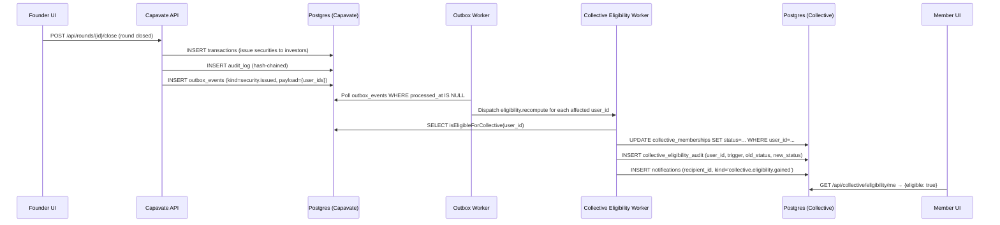
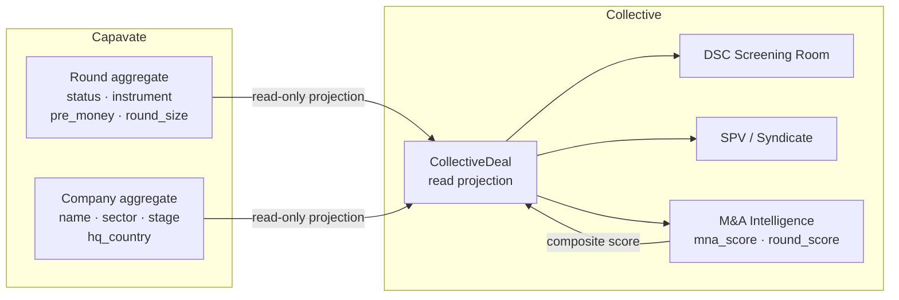
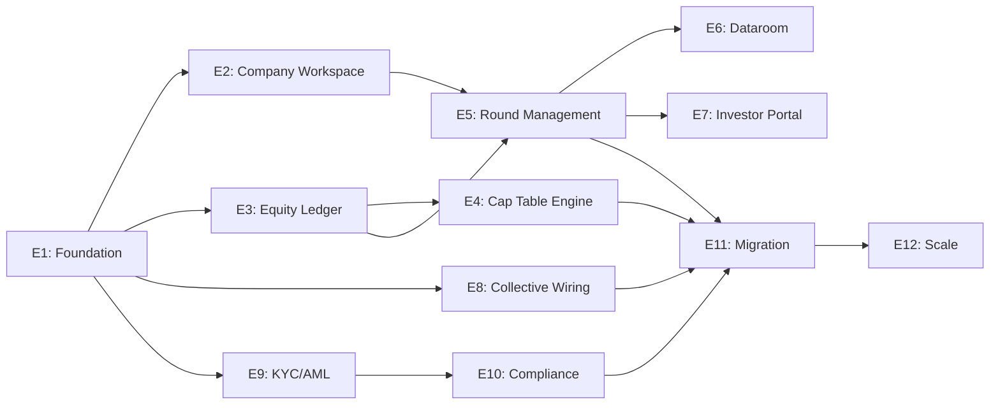
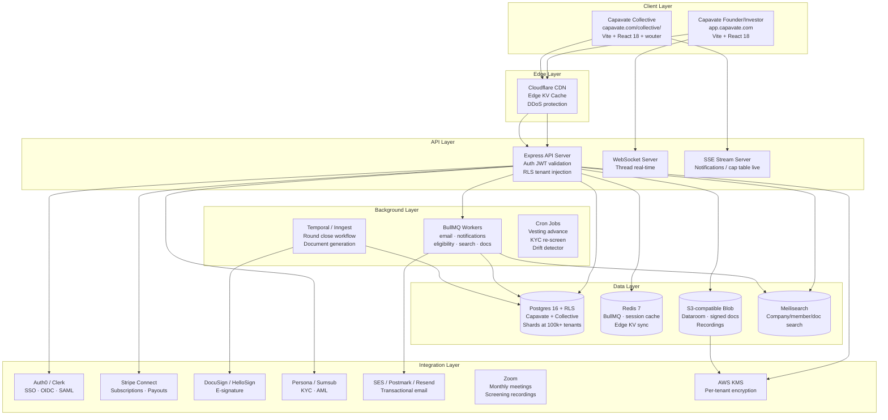
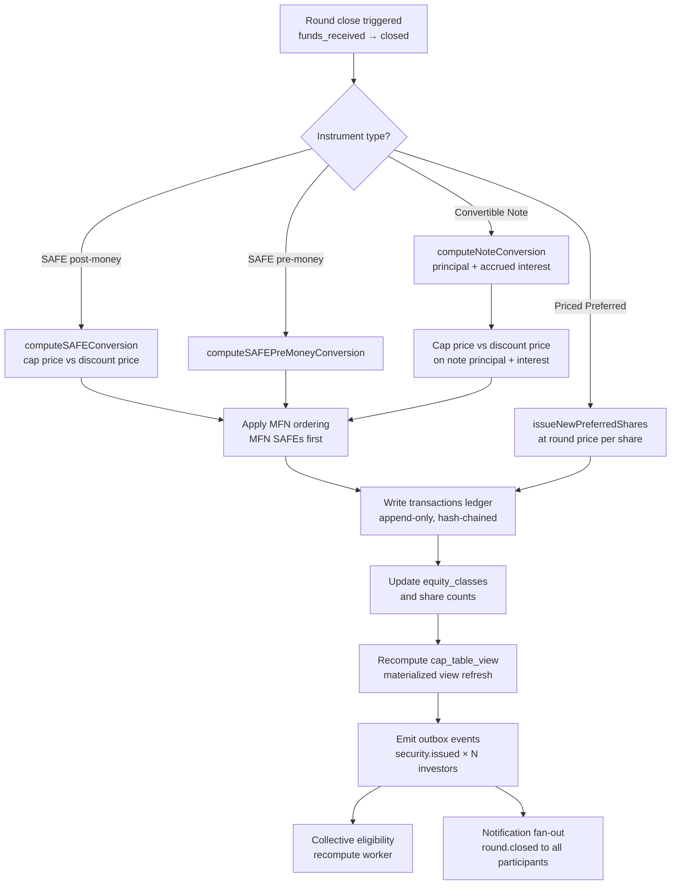
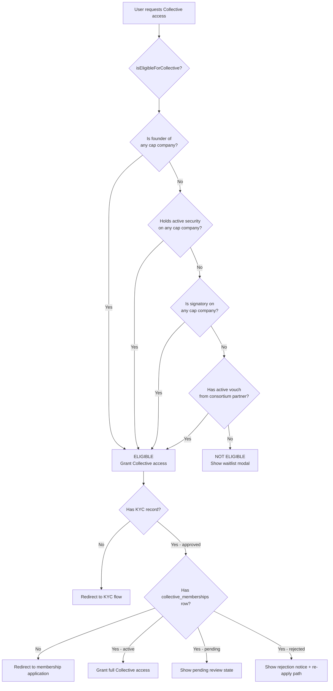
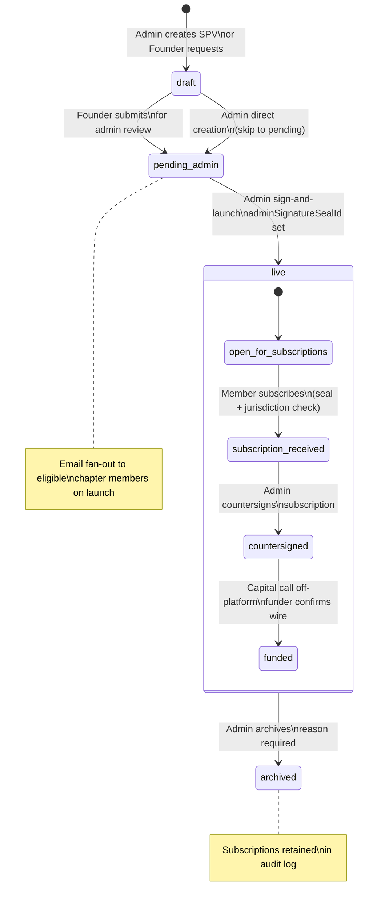

# Capavate Master Build Specification
## R200 v1.0 — Master Build Spec

---

## §0. Document Control

| Field | Value |
|---|---|
| **Version** | R200 v1.0 — Master Build Spec |
| **Date** | 2026-05-08 |
| **Author** | Perplexity Computer for Ozan Isinak (Blueprint Catalyst Limited) |
| **Scope** | Full platform specification for Capavate (founder cap-table + CRM + round management) and Capavate Collective (gated angel investor network). Covers domain model, API surface, jurisdictional compliance, scale architecture, migration, and build plan. |
| **Audience** | Senior full-stack engineers, CTO, Ozan Isinak (product owner) |
| **Status** | Draft for Engineering Review |

### Related Artefacts

| Artefact | Absolute Path |
|---|---|
| R165 Build Spec DOCX | `/home/user/workspace/past_session_contexts/sessions/2026-05-04_2026-05-10/a49fe3b3/ai_outputs/Capavate-Build-Spec-Handoff-R165.docx` |
| R165 Developer Handoff Brief PDF | `/home/user/workspace/past_session_contexts/sessions/2026-05-04_2026-05-10/a49fe3b3/ai_outputs/Capavate-Developer-Handoff-Brief-R165.pdf` |
| R165 Handoff MD | `/home/user/workspace/capavate_parity/r165_handoff.md` |
| R165 Brief TXT | `/home/user/workspace/capavate_parity/r165_brief.txt` |
| Working Brief (R148–R171) | `/home/user/workspace/capavate_working_brief.md` |
| Founder Audit (May 2026) | `/home/user/workspace/capavate_founder_audit.md` |
| Investor Audit (May 2026) | `/home/user/workspace/capavate_investor_audit.md` |
| Product Definition | `/home/user/workspace/capavate_parity/PRODUCT_DEFINITION.md` |
| R148 Member Inventory | `/home/user/workspace/past_session_contexts/sessions/2026-05-04_2026-05-10/a49fe3b3/ai_outputs/capavate-r148-member-inventory.md` |
| R149 DSC Inventory | `/home/user/workspace/past_session_contexts/sessions/2026-05-04_2026-05-10/a49fe3b3/ai_outputs/capavate-r149-dsc-inventory.md` |
| R150 Confirm Coverage | `/home/user/workspace/past_session_contexts/sessions/2026-05-04_2026-05-10/a49fe3b3/ai_outputs/capavate-r150-confirm-coverage-inventory.md` |
| R151 A11y Inventory | `/home/user/workspace/past_session_contexts/sessions/2026-05-04_2026-05-10/a49fe3b3/ai_outputs/capavate-r151-a11y-inventory.md` |
| R152 Empty/Loading Inventory | `/home/user/workspace/past_session_contexts/sessions/2026-05-04_2026-05-10/a49fe3b3/ai_outputs/capavate-r152-empty-loading-inventory.md` |
| R166 SPV Wiring Spec | `/home/user/workspace/past_session_contexts/sessions/2026-05-04_2026-05-10/a49fe3b3/ai_outputs/capavate-avi-spv-wiring-r166.md` |
| R170 Dev Notes | `/home/user/workspace/past_session_contexts/sessions/2026-05-04_2026-05-10/a49fe3b3/ai_outputs/capavate-dev-notes-r170.md` |
| R171 Dev Notes | `/home/user/workspace/past_session_contexts/sessions/2026-05-04_2026-05-10/a49fe3b3/ai_outputs/capavate-dev-notes-r171.md` |

---

## §1. Executive Summary

### 1.1 What We Are Building

Two distinct but federated products under a single identity layer:

**CAPAVATE** is the founder product. A company workspace where founders manage their cap table, run funding rounds, maintain an investor CRM, control a gated dataroom, issue investor reports, and execute document signing. Investors added to a Capavate company gain a read-only/action-gated view of their holdings and pending round invitations. The equity ledger is the authoritative record of every issued security on the platform. [PRODUCT_DEFINITION.md]

**CAPAVATE COLLECTIVE** is the angel investor network product. It is opt-in and gated: a user is eligible to join Collective only if they have a verifiable position in the Capavate equity ledger (as founder, investor, or signatory on at least one company) or are a vouched consortium partner. Collective adds deal sourcing, DSC screening, syndicate/SPV mechanics, M&A intelligence, regional chapters, and monthly investor meetings on top of the social/community layer replicated from Capavate. Collective does NOT own equity — equity always lives in Capavate. [PRODUCT_DEFINITION.md]

### 1.2 Why Now

The live `capavate.com` platform (audited May 8, 2026) has critical functional gaps that block commercial use:

- No standalone cap table page; the cap table widget links to the round list [founder-audit §C]
- No e-signature integration anywhere on the founder side [founder-audit §F]
- All three pre-seeded investor report links return HTTP 404 [founder-audit GAP #1]
- No notification system on the investor side; logout button occupies the notification position [investor-audit GAPS #2, #3]
- Accreditation status is contradicted between the sidebar badge and the profile form [investor-audit GAPS #1]
- DSC is entirely absent from the investor portal [investor-audit §10]
- The current stack is Create React App + Webpack 5 (~1MB bundle), which has reached its practical ceiling at 50k in-memory records [brief §7]
- No Collective deployment — the angel network waitlist is a modal; the full Collective app (79+ routes, 51 providers) exists in-sandbox only [brief §7, R165 brief §1]

The R93+ scale roadmap targets 500k companies / 1M users, requiring a parallel rebuild on the production stack (Vite + React 18 + Postgres 16 + RLS) federated with the live site via SSO and API, with a six-quarter migration window.

### 1.3 Stack and Replacement Decision Summary

Parallel rebuild on R93+ stack. The live capavate.com marketing site (Wix property) is NEVER touched. Collective deploys at `capavate.com/collective/` as a strictly additive routing rule [brief §9]. The new Capavate founder/investor product deploys in parallel; new tenants onboard directly; legacy tenants migrate via dual-write shadow over Q1–Q6.

Core stack (carried from [R165 §3]): Vite + React 18, wouter v3, TanStack Query v5, Tailwind CSS v3 + shadcn/ui, Drizzle ORM, Postgres 16 + RLS, **Fastify 4.x** (decision locked 2026-05-08, see §25.1), Redis + BullMQ, Temporal/Inngest for workflows, Meilisearch, S3-compatible blob storage, Cloudflare CDN, OpenTelemetry + Grafana, Auth0 or Clerk [R165 §4.3], Stripe Connect [R165 §4.4], AWS SES/Postmark/Resend [R165 §1.1].

### 1.4 Success Criteria

| Criterion | Target |
|---|---|
| Scale | 500k companies, 1M users |
| Security | SOC 2 Type II — target 18 months post-launch |
| Jurisdictions (first-class) | US (Delaware C-Corp), Canada (CCPC), UK & EU, Singapore, Hong Kong |
| Instruments (first-class) | Common, Preferred, SAFE, Convertible Debt, Warrant, Option Grant (ESOP/EMI/CSOP) |
| Cap-table API p99 read | <200ms |
| Transaction write p99 | <800ms |
| Availability SLO | 99.95% |
| Broken report links | Fixed as part of cutover [founder-audit GAP #1] |
| Accreditation contradiction | Resolved as single source of truth [investor-audit GAPS #1] |
| Notification system | First-class in-app + email + push [investor-audit GAPS #3] |

---

## §2. Two-Product Architecture (Capavate ↔ Collective)

### 2.1 Bounded Contexts and Canonical Aggregates

#### 2.1.1 Capavate Bounded Context

The Capavate bounded context owns the equity ledger and everything that touches it.

| Aggregate | Root Entity | Invariants |
|---|---|---|
| **Capavate Equity** | `Company` | All share issuances are append-only; total issued ≤ authorized; FD share count is always computable from the transaction log |
| **Capavate CRM** | `InvestorContact` | Contacts belong to exactly one company workspace; CRM contacts may or may not have a `capavate_user_id` |
| **Capavate Round** | `Round` | A round is in exactly one lifecycle state at any time; only one round per company may be in `signing_open` or later simultaneously |
| **Capavate Dataroom** | `Dataroom` | Per-company singleton; document grants are scoped to a (document, grantee) pair; NDA state precedes document access |

Secondary entities within the Capavate context: `Security`, `SecurityDetail` (per-instrument polymorphic), `VestingSchedule`, `Transaction` (append-only ledger), `RoundTerms`, `RoundParticipant`, `InvestorInvitation`, `SoftCircle`, `DocumentGeneration`, `ESignatureEnvelope`, `DataroomGrant`, `DataroomViewLog`, `ValuationRecord`, `RegulatoryFiling`, `InvestorReport`.

#### 2.1.2 Capavate Collective Bounded Context

The Collective bounded context owns the network and deal-flow layer. It reads from Capavate equity state but never writes to it.

| Aggregate | Root Entity | Invariants |
|---|---|---|
| **Collective Membership** | `CollectiveMember` | Every member has a corresponding `capavate_user_id`; membership is active only if eligibility check passes |
| **Collective Deal Sourcing** | `CollectiveDeal` | A CollectiveDeal maps 1:N to Capavate `Company` records; deal-sourcing data is read-only from the equity ledger |
| **Collective Syndicate/SPV** | `Spv` | SPV subscriptions are soft-circle commitments; capital calls happen off-platform [R166 §8] |
| **Collective DSC** | `DscAssignment` | DSC assignments reference a `CollectiveDeal`; scores are private to DSC members and admins |
| **Collective Chapters** | `Chapter` | A chapter has exactly one lead member; chapters are non-overlapping geographic assignments |
| **Collective Communications** | `MessageThread` | Threads are gated by shared cap-table membership or shared round participation (see §2.2) |

Secondary entities: `CollectiveEligibilityAudit`, `DscReview`, `DscVote`, `MaIntelligenceScore`, `MonthlyMeeting`, `ConsortiumPartner`, `PartnerVouch`, `CollectiveApplication`, `SyndicateApplication`.

### 2.2 What Each Context Owns vs. Shares

| Domain Object | Owned By | Notes |
|---|---|---|
| Equity ledger (transactions, securities) | Capavate | Never replicated to Collective |
| Cap table view (read aggregate) | Capavate | Collective may read FD totals for eligibility; never individual holdings |
| Round state | Capavate | Collective reads `round_status`, `instrument`, `pre_money`, `round_size` for deal sourcing only |
| User identity record | Shared Kernel | Single `users` table; both contexts read it |
| Investor invitation | Capavate | Founder → named investor flow only |
| Collective invitation | Collective | Network → cap-table-eligible user flow only |
| Messaging threads | Collective | But gated by Capavate cap-table membership (§2.3) |
| DSC scores | Collective | Never exposed to Capavate; admin-only in Collective |
| Dataroom permissions | Capavate | Never leak into Collective; see §2.6 |
| Accreditation status | Shared Kernel (KYC service) | Single source of truth; resolves [investor-audit GAPS #1] |
| Billing/subscriptions | Shared Kernel (Stripe Connect) | Platform-level subscriptions via Stripe |
| Audit log | Shared Kernel | Append-only hash chain [R165 §12] shared across both products |
| Notifications | Shared Kernel | Single notification table; producers from both contexts |

### 2.3 Shared Kernel

The Shared Kernel is a set of services consumed by both bounded contexts. No business logic lives in the Shared Kernel; it provides technical infrastructure only.

| Service | Responsibilities | Implementation |
|---|---|---|
| **Identity & Auth** | User registration, SSO (SAML/OIDC), MFA, session management, SCIM | Auth0 or Clerk [R165 §4.3] |
| **Audit Log** | Append-only hash-chained `audit_log` table; verify endpoint [R165 §12] | Postgres 16; REVOKE UPDATE/DELETE from app role |
| **Documents** | Template rendering (Handlebars → HTML → PDF), e-signature orchestration, document hash into audit chain | Self-hosted or DocuSign/HelloSign |
| **Communications** | Message threads, social feed posts, real-time SSE/WS delivery | Postgres + Redis pub/sub + SSE |
| **Notifications** | In-app bell, email, push; single `notifications` table [R165 §2.12] | BullMQ + email provider |
| **Billing** | Subscription management, Stripe Connect for partner payouts [R165 §4.4] | Stripe Connect |
| **KYC/AML** | Accreditation verification, PEP/sanctions screening | Persona / Sumsub / Onfido (abstracted) |
| **Storage** | Blob storage for documents, profile images, dataroom files | S3-compatible (AWS S3 / Cloudflare R2) |
| **Search** | Full-text search across companies, members, documents | Meilisearch per region |

### 2.4 Eligibility Gate: Capavate → Collective

A user `U` is eligible for Collective membership if and only if at least one of the following is true:

```
function isEligibleForCollective(userId: string): boolean {
  // Condition A: founder of any Capavate company (any role in [owner, co-founder])
  const isFounder = db.query(
    `SELECT 1 FROM company_members
     WHERE user_id = $1
       AND role IN ('owner', 'co_founder')
       AND status = 'active'
     LIMIT 1`,
    [userId]
  ).rowCount > 0;

  if (isFounder) return true;

  // Condition B: holds any active security on a Capavate company
  const holdsActiveSecurity = db.query(
    `SELECT 1 FROM securities s
     JOIN transactions t ON t.security_id = s.id
     WHERE s.holder_user_id = $1
       AND s.status = 'active'
       AND t.type IN ('issue', 'exercise', 'convert')
     LIMIT 1`,
    [userId]
  ).rowCount > 0;

  if (holdsActiveSecurity) return true;

  // Condition C: signatory on any Capavate company
  const isSignatory = db.query(
    `SELECT 1 FROM company_members
     WHERE user_id = $1
       AND role = 'signatory'
       AND status = 'active'
     LIMIT 1`,
    [userId]
  ).rowCount > 0;

  if (isSignatory) return true;

  // Condition D: vouched consortium partner
  const isVouchedPartner = db.query(
    `SELECT 1 FROM partner_vouches pv
     JOIN consortium_partners cp ON cp.id = pv.partner_id
     WHERE pv.user_id = $1
       AND pv.status = 'active'
       AND cp.status = 'Active'
     LIMIT 1`,
    [userId]
  ).rowCount > 0;

  return isVouchedPartner;
}
```

**Recomputation triggers:** eligibility is recomputed synchronously on any of these events emitted by the Capavate context:
- `security.issued` — new security granted to a user
- `security.cancelled` / `security.transferred` — security removed from a user
- `company_member.role_changed` — founder/signatory role change
- `company_member.removed` — member removed from company
- `partner_vouch.created` / `partner_vouch.revoked` — vouching state change

The recomputation is async-safe via an outbox event on the Capavate side consumed by a Collective eligibility worker. The worker writes to `collective_eligibility_audit` before mutating `collective_memberships.status`.

### 2.5 Data Flow Diagrams

#### 2.5.1 Cap-Table Event → Collective Eligibility Recomputation



#### 2.5.2 Collective Deal Sourcing Reads Capavate Round State



Key invariant: **Collective never writes to the Capavate schema.** The `CollectiveDeal` is a materialized read-model, refreshed by events from Capavate via the outbox worker. Writes (SPV subscriptions, DSC votes, deal decisions) go to Collective tables only.

### 2.6 What Is NOT Shared

The following data objects are strictly private to their owning context and must never leak across the boundary:

| Object | Owner | Why Not Shared |
|---|---|---|
| DSC scoring rows, vote records, committee deliberations | Collective | Regulatory and commercial sensitivity; DSC discussions are confidential [R149] |
| Capavate dataroom access grants and document view logs | Capavate | Per-investor access is a Capavate permission decision made by the founder; Collective membership confers no dataroom rights |
| Individual cap-table holdings (who owns what at what price) | Capavate | Collective only reads FD share count and eligible-member existence, never individual position size |
| Capavate internal CRM notes (founder-added notes on investors) | Capavate | Private founder intelligence |
| Collective M&A algorithm parameters and weight tuning | Collective/Admin | AlgorithmConsole is admin-only; DSC members cannot see tuning [R149] |
| Collective member private network bio and thesis | Collective | Member-controlled visibility; founders cannot read this from Capavate |

### 2.7 Deployment Topology, SSO, Cookie Domain, and CORS

Carried from [R165 §15] with extensions:

- **Collective** deploys at `capavate.com/collective/` as a strictly additive routing rule. The Wix marketing site at `capavate.com` is never touched. [brief §9]
- **Capavate** founder/investor product deploys at `app.capavate.com` (new subdomain for the rebuild) during the dual-run phase (Q1–Q3), then becomes the primary route at `capavate.com/app/` post-cutover (Q4).
- **Cookie domain:** `.capavate.com` — shared session cookie accessible to both `app.capavate.com` and `capavate.com/collective/`. [brief §9]
- **CORS:** The Express server allows `Origin: https://capavate.com` and `Origin: https://app.capavate.com` with `credentials: true`. All other origins are blocked.
- **SSO:** Auth0 (preferred) or Clerk. Both products share a single Auth0 tenant (or Clerk instance). The JWT `aud` claim is `https://collective.capavate.com/api` for Collective API calls and `https://app.capavate.com/api` for Capavate API calls. A single login session grants access to both products; product access is gated by role/eligibility, not by separate auth sessions. [R165 §1.1 JWT_AUDIENCE]
- **Vite base path:** `/collective/` for Collective; `/` (or `/app/`) for Capavate. [R165 §1.2 VITE_DEPLOY_BASE]
- **DKIM/SPF:** Additive TXT entries only; existing DNS records are not modified. Rollback possible via one configuration line. [brief §9]

---

## §3. Product Definition — Capavate (Founder Product)

### 3.1 Personas

| Persona | Definition | Primary Actions |
|---|---|---|
| **Founder** | Company owner or co-founder; has full write access to the company workspace | Create rounds, manage cap table, invite investors, upload dataroom, send reports, sign documents |
| **Co-founder** | Same as Founder for permissions; distinguished only for cap-table position labelling | Same as Founder unless explicitly restricted by the owning founder |
| **Investor (cap-table member)** | A user who has been formally added to the cap table via a round close or direct issuance | View their holdings, view dataroom (if granted), receive reports, sign documents in signing flows |
| **Signatory** | A legal/admin person authorized to countersign company-side documents | E-sign board consents, stockholder consents, subscription agreements |
| **Admin** | Platform admin (Ozan, Avi, Shadie) [brief §2] | Full platform access; can impersonate any company; manage billing; access audit chain |

### 3.2 Core Capabilities

| Capability | Description | Current State |
|---|---|---|
| **Company Workspace** | Multi-founder workspace with company profile, roles, billing | Live but with metadata bug [founder-audit GAP #16] |
| **Cap Table** | Full FD/basic/as-converted views, export CSV/PDF, 409A integration | MISSING standalone page [founder-audit §C] |
| **Round Management** | Round creation wizard, multi-instrument, terms, invitations, soft circles, signing, close, post-close | Partially live; locked tabs [founder-audit §B] |
| **Investor CRM** | Contact directory, pipeline stages, communication log | Live (minimal); no CSV bulk import [founder-audit GAP #6] |
| **Dataroom** | Document slots with exact taxonomy (see §12); per-investor access; watermarking | Live (upload only); no per-investor grants [founder-audit GAP #10] |
| **Investor Reporting** | Structured reports with financial/operational/market/customer sections; sent to cap-table members | Live but report view routes 404 [founder-audit GAP #1] |
| **Communications** | Social feed posts, direct messaging (1:1 threads), shareholder updates | Live (feed only); no private inbox [founder-audit GAP #11] |
| **E-Signature** | Template-generated documents sent via DocuSign/HelloSign/native eIDAS | MISSING [founder-audit GAP #9] |
| **Subscriptions** | Platform billing, plan management | Live (empty, no upgrade path) [founder-audit §J3] |
| **Knowledge Hub** | 660+ educational articles, 17 categories [founder-audit §J4] | Live (read-only) |

### 3.3 Parity Inventory — Route Mapping

The following maps every existing Capavate founder-side route to the new canonical route, identifies functionality to carry forward, and flags gaps to close.

| Existing Route | New Route | Carry Forward | Gaps to Close |
|---|---|---|---|
| `/dashboard` | `/app/dashboard` | Analytics widgets (Cap Table, Round A, CRM, Social), social feed, Investor Reports panel | Fix 404 report links → `/app/reports/{id}`; fix flash of "Name not available"; fix page title "Login Page" bug [founder-audit GAP #14, #17] |
| `/record-round-list` | `/app/rounds` | Round list, empty state, "Start New Funding Round" CTA | Add round status column, instrument type badge, FD cap table link |
| `/createrecord` | `/app/rounds/new` | 5-step wizard structure, founder allocation, round 0 concept | Unlock all tabs without sequential block; add instrument selection (SAFE, Note, Priced); add Rights & Preferences field for preferred share terms; add bulk-founder import |
| `/crm/share-round-toinvestor` | `/app/rounds/{id}/invitations` | Invitation list with investor rows | Fix unresponsive Share Report button; add invitation state column (pending/viewed/accepted/declined/expired/revoked); add resend/revoke/expiry actions; add personal message field; add bulk CSV upload [founder-audit GAP #6, #7, #8] |
| `/crm/investment` | `/app/rounds/{id}/confirmations` | Investment confirmation list | Add filter by status; add "Mark Confirmed" action; add FX capture at time of confirmation |
| `/crm/addnew-investor` | `/app/crm/contacts/new` | Manual entry form (first, last, email) | Add phone, LinkedIn, company, title, notes; add bulk CSV upload [founder-audit GAP #6] |
| `/crm/investor-directory` | `/app/crm/contacts` | Directory list | Fix "Investor Entry" vs "Investor Directory" label inconsistency [founder-audit GAP #22]; add sort, filter by stage, search by name/company |
| `/crm/share-with-investorreport` | `/app/crm/sharing` | Three-section sharing hub | Wire Share Report buttons; add audit trail of who was shared what and when |
| `/crm/investorreport` | `/app/crm/report-log` | Three-section report log | Wire to actual shared content records |
| `/dataroom-Duediligence` | `/app/dataroom` | Exact document slot taxonomy (§12) | Add per-investor access grants; add dynamic watermarking; add view logs; add NDA gate; add time-limited links [founder-audit GAP #10] |
| `/investorlist` | `/app/reports` | Report list | Fix 404 on `/report/{id}` → new route `/app/reports/{id}` [founder-audit GAP #1] |
| `/add-new-investor` | `/app/reports/new` | Structured report form (Financial, Operational, Market, Customer sections) | Add save-as-draft; add send-to-all vs. send-to-selected; add email delivery confirmation |
| `/company-profile` | `/app/company/profile` | 4-step wizard, all fields | Fix "Sector: YES" data quality display [founder-audit GAP #16]; add incorporation jurisdiction selector; add legal entity type |
| `/activity-logs` | `/app/activity` | Audit log view | Wire to actual `audit_log` table [R165 §12] |
| `/subscription` | `/app/billing` | Plan list | Add "Browse Plans" / "Upgrade" CTA; integrate Stripe Customer Portal [founder-audit GAP #12] |
| `/knowledge-hub` | `/app/knowledge-hub` | 660+ articles, 17 categories | Move out of Settings nav to top-level; add search |
| *(missing)* | `/app/cap-table` | — | NEW: Standalone cap table page — FD, basic, as-converted views, export [founder-audit GAP #3] |
| *(missing)* | `/app/cap-table/pro-forma` | — | NEW: Pro-forma modelling, multi-scenario |
| *(missing)* | `/app/valuation` | — | NEW: 409A records, HMRC valuations, FMV history |
| *(missing)* | `/app/filings` | — | NEW: Regulatory filing reminders (Form D, NI 45-106 F1, EMI HMRC, SEIS1/EIS1) |

### 3.4 New Capabilities Not in Current Capavate

The following capabilities are specified for the rebuild but do not exist on `capavate.com` as of May 2026:

#### 3.4.1 Cap Table Page (Critical Gap)

A standalone `/app/cap-table` page with three toggle-able views:
- **Basic** — only fully-issued securities; columns: holder, instrument, shares, ownership %, price per share, total investment
- **Fully Diluted (FD)** — includes all outstanding options, warrants, and unconverted SAFEs/notes on an as-exercised/as-converted basis
- **As-Converted** — SAFEs and convertible notes converted at their modelled trigger (cap/discount) but options/warrants on basic count

All views support export to CSV and PDF. The PDF export includes company name, date, valuation basis, and a disclaimer.

See §10 for full cap table engine specification.

#### 3.4.2 E-Signature

Native e-signature for all Capavate transaction documents (SAFE, Note, SPA, Board Consent, etc.) via DocuSign, HelloSign (now Dropbox Sign), or a native eIDAS-compliant solution for EU/UK issuers. All signed documents are hashed and the hash is appended to the `audit_log` chain. See §13 for full document and e-signature specification.

#### 3.4.3 Per-Investor Dataroom Access Grants with Watermarking

Founders can grant specific investors access to specific documents or folders within the dataroom. Access is logged in `dataroom_view_log`. Dynamic watermarking embeds the viewer's email address and a timestamp watermark into viewed PDFs server-side. See §12 for full dataroom specification.

#### 3.4.4 Notifications

A complete notification system resolving [investor-audit GAPS #3]:
- In-app bell icon with unread count badge
- Email notifications via the configured `EMAIL_PROVIDER` [R165 §1.1]
- Push notifications (web push via Service Worker)
- Notification preferences per user

Notification triggers: new round invitation, investor accepted/declined, soft circle submitted, document ready for signing, document signed, round closed, new investor report, new message, eligibility gained for Collective.

---

## §4. Product Definition — Capavate Collective (Network Product)

### 4.1 Personas

| Persona | Definition |
|---|---|
| **Network Member** | A Capavate-eligible user who has joined Collective and passed the membership application (submitted → reviewing → accepted). Has access to deal room, chapters, calendar, monthly meetings, connections, consortium, profile, personal CRM, ask expert, M&A intelligence. [R148] |
| **DSC Committee Member** | A Network Member invited to the Deal Screening Committee. Sees DSC screening rooms, scoring rows, and voting in addition to all member surfaces. Cannot see admin tools or algorithm tuning. [R149] |
| **Consortium Partner** | An organization (accelerator, law firm, accounting firm, incubator, sector expert) onboarded by admin. Has a dedicated partner workbench, deal routing, external portal, and commission plan. The R110.11 zero-rate principle ensures credit/referral language is never shown to ineligible partners. [brief §2, R165 brief §5] |
| **Chapter Lead** | A Network Member designated as `regional_lead=true` for a specific chapter. Has chapter-management actions in addition to standard member access. |
| **Admin** | Platform admins (Ozan, Avi, Shadie) [brief §2]. Full platform access, seed-replacement console, algorithm tuning, lifecycle policy management, DSC assignment. |

### 4.2 Core Capabilities

| Capability | Description | Source |
|---|---|---|
| **Membership & Eligibility** | Application flow, KYC + accreditation check, eligibility gate from §2.4, tier management, lifecycle enforcement | [R148, brief §4] |
| **Deal Sourcing** | Deal room showing Collective-sourced companies, filtered by tier (Watch/Qualified/Featured/Priority), member interest/decision, chapter, sector | [R148, R149] |
| **Syndicate/SPV** | Soft-circle SPV subscriptions, standalone SPV deal cards, admin sign-and-launch, subscription audit chain [R166, R170] | [R166, R170, R171] |
| **DSC Screening** | Screening rooms per company, scoring rows (composite, M&A, round scores), DSC votes, screening recaps | [R149] |
| **M&A Intelligence** | Composite ranking of companies by M&A readiness; mna_score + round_score drive auto_tier [R149, R165 §2.2] | [R149] |
| **Chapters** | Regional chapter directory, member count, capital deployed YTD, chapter lead assignment | [R165 §2.1] |
| **Monthly Investor Meetings** | Zoom-backed recurring monthly meetings, recording library, RSVP, agenda | [R165 §2.5] |
| **Communications** | Replicated from Capavate: direct messaging (cap-table-gated), social feed posts, follow/unfollow | [PRODUCT_DEFINITION.md] |
| **Knowledge Hub** | Same 660+ article library as Capavate side | [investor-audit §15] |
| **Ask Expert** | Threaded expert consultations routed to consortium partners by category (legal, tax, accounting, M&A, other) | [R148, R165 §2.4] |
| **Personal CRM** | Network-side per-member private rolodex (pcrm_contacts, pcrm_notes, pcrm_tasks) | [R165 §2.10] |
| **Consortium Partners** | Partner directory, vouching system, co-branded landing pages, commission plans | [R165 §2.3, §8–§10] |

### 4.3 Parity Inventory — Investor/Collective Route Mapping

| Existing Capavate Investor Route | New Capavate Route | New Collective Route | Gaps to Close |
|---|---|---|---|
| `/investor/login` | `/app/login` (shared auth) | `/collective/#/login` | Merge auth; remove separate investor login |
| `/investor/dashboard` | `/app/investor/dashboard` | `/collective/#/` | Fix logout button UX trap [investor-audit GAPS #2]; add notification bell |
| `/investor/company-invitation-list` | `/app/investor/invitations` | — | Fix N/A funding round display; add real invitation state machine |
| `/investor/company-invitation-list` (modal) | Modal stays but tabs fix | — | Fix broken tab navigation in Company Invitation modal [investor-audit GAP #15]; wire Cap Table, Investment Terms, Data Room, Your Decision tabs |
| `/investor/company/watch-list` | `/app/investor/portfolio` | — | Reconcile "Investor Round List" vs. social portfolio count [investor-audit GAP #5] |
| `/investor/company-list/archive` | `/app/investor/invitations/archived` | — | — |
| `/investor/contact-connections` | `/app/investor/connections` | `/collective/#/connections` | Wire live data; the Collective connections tab should show Angel Network connections [investor-audit §9] |
| `/investor/discover-companies` | `/app/investor/discover` | `/collective/#/deals` | Differentiate investor discovery (open/all companies) vs. Collective deal room (vetted/scored only) |
| `/investor/knowledge-hub` | `/app/knowledge-hub` | `/collective/#/knowledge-hub` | Consolidate to single shared content source |
| `/investor/profile` Steps 1–3 | `/app/investor/profile` | `/collective/#/profile` | Fix accreditation contradiction [investor-audit GAPS #1]; add KYC verification status display [investor-audit GAP #20]; add URL validation on LinkedIn field [investor-audit GAP #12] |
| *(missing)* | — | `/collective/#/dsc` | NEW: DSC screening rooms, scoring, voting [investor-audit §10] |
| *(missing)* | — | `/collective/#/screening/:id` | NEW: per-company DSC screening room |
| *(missing)* | — | `/collective/#/recaps` | NEW: screening recaps |
| *(missing)* | — | `/collective/#/chapters` | NEW: chapter directory |
| *(missing)* | — | `/collective/#/meetings` | NEW: monthly investor meetings |
| *(missing)* | — | `/collective/#/spv` (admin) | NEW: SPV admin [R171] |
| *(missing)* | — | `/collective/#/syndicates` | NEW: syndicate applications and management |

### 4.4 Eligibility, Registration, KYC, and Accreditation Flow

The registration flow for a new Collective member proceeds in strict sequence:

```
Step 1: Capavate account verification
  ↓ User must have an active Capavate account (or create one first)
Step 2: Eligibility gate check (§2.4)
  ↓ isEligibleForCollective(userId) === true
  ↓ If false → waitlist modal (current live behaviour) [founder-audit §H]
Step 3: Collective membership application
  Fields: thesis, check_size_min, check_size_max, sectors, stages, geographies
  ↓ status = 'submitted'
Step 4: KYC / AML screening
  ↓ Provider: Persona / Sumsub / Onfido / Veriff (abstracted — see §17)
  ↓ PEP/sanctions check: OFAC, UK HMT, EU consolidated, UN, MAS, HKMA
  ↓ Document upload: passport + address proof (minimum)
Step 5: Accreditation verification per jurisdiction
  ↓ US: income >$200k (3yr), net worth >$1M ex-primary residence, or third-party letter
  ↓ Canada: net income >$200k CAD or net assets >$1M CAD [NI 45-106]
  ↓ UK: HNW (income >£100k or assets >£250k) or Sophisticated Investor self-cert
  ↓ EU: professional client per MiFID II
  ↓ SG: Accredited Investor per SFA §4A
  ↓ HK: Professional Investor per SFO s.1 Part 1 Sch 1
  ↓ Status stored as: accreditation_status (verified / self-cert / pending / rejected)
  ↓ This RESOLVES [investor-audit GAPS #1]: single source of truth, sidebar and profile agree
Step 6: Admin review (manual for MVP; auto for KYC-pass at defined thresholds)
  ↓ status = 'reviewing' → 'accepted' | 'rejected' | 'waitlisted'
Step 7: Membership activation
  ↓ collective_memberships.status = 'active'
  ↓ collective_eligibility_audit row inserted
  ↓ Welcome email dispatched via EmailSenderProvider
  ↓ Annual membership fee ($1,200 USD/year [founder-audit §H]) charged via Stripe
```

The accreditation state from Step 5 is the single `accreditation_status` value surfaced in the investor profile sidebar AND the profile Step 2 form. The contradiction in [investor-audit GAPS #1] where the sidebar shows "Accredited Investor" but the profile form shows "No – Non-Accredited" is resolved by reading from the same `kyc_accreditation` table row. The UI never derives accreditation status from two different sources.

---

## §5. Stack and Replacement Decision

### 5.1 Stack Decision

#### [RECOMMEND] Parallel Rebuild on R93+ Stack

**Decision:** Conduct a parallel rebuild of both Capavate and Collective on the R93+ stack, deployed as a new service (`app.capavate.com`) federated with the live site via SSO and a read-shadow API bridge. The live `capavate.com` site is never modified.

**Rationale:**
1. The live stack (Create React App + Webpack 5 + MySQL/Postgres) cannot reach the 500k/1M scale target. The 50k in-memory ceiling on the Collective side is already the documented limit [brief §7].
2. The founder-side gaps (no cap table page, no e-sig, 404 report links, no notification system) are not incremental fixes — they require building new domain aggregates (cap table engine, e-sig orchestration, notification pipeline) that are cleaner to implement against a new Drizzle + Postgres 16 + RLS schema than to bolt onto the existing MySQL schema.
3. The Collective frontend (79+ routes, 51 providers) is already built and tested against the R93+ stack [R165 brief §1]. The job is backend wiring, not frontend rewrite.

**Trade-offs vs. in-place migration:**

| Factor | Parallel Rebuild | In-Place Migration |
|---|---|---|
| Risk to live site | Low (no live modifications) | High (schema migrations on live data) |
| Migration duration | 6 quarters | 4 quarters |
| Cost | Higher (two stacks briefly) | Lower initially |
| Schema quality | Optimal (Postgres 16 + RLS from day one) | Constrained by legacy schema |
| Test coverage | Full e2e test suite from scratch | Incremental, harder to regression-test |

### 5.2 Six-Quarter Migration Plan

| Quarter | Milestone | Activities |
|---|---|---|
| **Q1** | Dual-run identity + seed parity | Stand up `app.capavate.com`. Wire Auth0 SSO. Implement `users`, `companies`, `company_members` tables. Migrate existing user accounts. Seed cap-table data for pilot tenants. Run Collective Providers against Postgres. |
| **Q2** | Read-shadow rounds + cap table | Wire `rounds`, `round_terms`, `securities`, `transactions` tables. Implement cap table read aggregates. Shadow-read Capavate API: compare new cap table output vs. live system row-by-row. Alert on drift > 0.001% per company. |
| **Q3** | Write-shadow with feature flag | Enable write-shadow: all founder actions write to BOTH legacy and new DB. Feature flag `CAPAVATE_PARALLEL_WRITE=true` per tenant. Diff alarms on divergence. Wire dataroom, notifications, e-sig. |
| **Q4** | Cutover for new tenants | All new company registrations go to `app.capavate.com` only. Fix `/report/` broken links [founder-audit GAP #1]. Fix logout button UX trap [investor-audit GAPS #2]. Legacy tenants still on old system. |
| **Q5** | Backfill legacy tenants | Per-tenant migration: lock legacy write → export → import to new schema → re-enable via new app. 10-tenant/week cadence. Comms to all legacy tenants 30 days in advance. |
| **Q6** | Decommission CRA/legacy | Legacy app goes read-only for 90 days (audit purposes). Then shut down. DNS cutover: `capavate.com` routes → `app.capavate.com`. Old CRA stack decommissioned. |

### 5.3 Full Stack Specification

| Layer | Technology | Version | Notes |
|---|---|---|---|
| **Frontend framework** | React | 18.x | Concurrent features enabled |
| **Build tool** | Vite | 5.x | Fast dev loop; base path configurable [R165 §1.2 VITE_DEPLOY_BASE] |
| **Routing** | wouter | v3 | Hash routing for Collective iframe/subpath safety [R165 brief §6] |
| **State (server)** | TanStack Query | v5 | Stub-and-swap pattern; Provider hooks unchanged [R165 brief §8] |
| **Styling** | Tailwind CSS | v3 + shadcn/ui | Token-driven; brand palette Navy #1C2B4A / Hydra Teal #01696F / Plum #9D174D / Reject #B33A2B [R165 brief §3] |
| **ORM** | Drizzle ORM | latest | Schema in `shared/schema.ts`; Zod validators co-located [R165 brief §8] |
| **Database** | Postgres | 16 | RLS for tenant isolation; logical replication for DR; JSON → JSONB; booleans native [R165 §2] |
| **Cache/Queue** | Redis | 7.x + BullMQ | Job queue for notifications, email, eligibility recompute |
| **Workflows** | Temporal / Inngest | — | [RECOMMEND] Temporal for complex multi-step (round close → cap table mutation → eligibility recompute → notification fan-out). Inngest as lighter alternative if Temporal ops overhead is unacceptable. See §25 for trade-off. |
| **Search** | Meilisearch | latest | Per-region deployment; indexes: companies, members, documents |
| **Blob storage** | S3-compatible | — | AWS S3 (default) or Cloudflare R2; KMS-per-tenant encryption for dataroom |
| **CDN** | Cloudflare | — | Edge caching for static assets and read aggregates |
| **Server** | Fastify | 4.x | **Decision locked 2026-05-08.** [R165 brief §3] handlers translate ~1:1 to Fastify (`fastify.get(path, { schema }, handler)`). ~3× Express throughput, native JSON Schema validation per endpoint (critical for cap-table API), first-class TypeScript via `@fastify/type-provider-typebox` or Zod. Migration cost from R165's Express scaffolding: ~1 week. See §25.1 for full rationale. |
| **Observability** | OpenTelemetry + Grafana | — | OTel SDK on client and server; Grafana dashboards; SLO burn rate alerts |
| **Auth** | Auth0 | — | **DECISION LOCKED 2026-05-08.** [R165 §4.3] Auth0 chosen over Clerk for fintech/SOC 2 trajectory: stronger SAML + SCIM + eIDAS-friendly enterprise SSO posture, mature tenant model, granular per-app rules, audit log integration. Clerk's developer UX advantage does not outweigh enterprise SSO requirements at the 500k-tenant scale target. Single Auth0 tenant; per-product application (Capavate, Collective). |
| **Payments** | Stripe Connect | — | Platform account; Connected accounts for partners [R165 §4.4] |
| **Email** | AWS SES / Postmark / Resend | — | `EMAIL_PROVIDER` env var selects adapter [R165 §1.1] |
| **SMS (optional)** | Twilio | — | For MFA SMS; requires `TWILIO_ENABLED=true` [R165 §1.1] |
| **Error tracking** | Sentry | — | Separate projects for client and server [R165 §1.1] |
| **Secrets** | AWS Secrets Manager | — | `SECRETS_BACKEND=aws-secrets-manager` in production [R165 §6] |

---

## §6. Domain Model (Canonical)

### 6.1 Schema Extension Strategy

This section extends [R165 §2] (12 domain spines, full DDL). The R165 schema covers: members, chapters, membership_applications, membership_tiers, viewer_sessions, companies, deal_decisions, deal_interest, deal_activity, deal_stage_overrides, deal_statistics_snapshots, partners, partner_economics, partner_feature_flags, cp_commission_plans, cp_plan_assignments, consortium_applications, consortium_invite_links, distribution_partners, partner_workspace_tasks, ask_threads, ask_messages, ask_outcomes, ask_partner_routing, ask_admin_config, calendar_slots, meeting_schedules, monthly_meetings, screening_rsvps, committee_invites, recording_library, recording_audit_log, payment_gateways, referral_records, commission_records, signature_seals, lifecycle_policies, lifecycle_audit, audit_log, pcrm_contacts, pcrm_notes, pcrm_tasks, email_templates, email_outbox, email_events, notifications, live_events, algorithm_versions.

The tables below are the **additive** equity and Collective-specific tables not covered in R165.

### 6.2 Global Conventions

```sql
-- Every table carries these unless noted:
-- id TEXT PRIMARY KEY  -- CUID2, generated client-side for optimistic UI
-- tenant_id TEXT NOT NULL  -- company_id for Capavate tables; 'platform' for Collective tables
-- created_at TIMESTAMPTZ NOT NULL DEFAULT NOW()
-- updated_at TIMESTAMPTZ NOT NULL DEFAULT NOW()
-- Trigger: set updated_at = NOW() on every UPDATE

-- RLS policy template (Capavate tables):
-- CREATE POLICY tenant_isolation ON <table>
--   USING (tenant_id = current_setting('app.current_tenant_id'));
-- ENABLE ROW LEVEL SECURITY ON <table>;

-- RLS policy template (Collective tables):
-- CREATE POLICY collective_member_isolation ON <table>
--   USING (
--     current_setting('app.current_role') = 'admin'
--     OR EXISTS (
--       SELECT 1 FROM collective_memberships cm
--       WHERE cm.user_id = current_setting('app.current_user_id')
--         AND cm.status = 'active'
--     )
--   );
```

### 6.3 Identity & Company Tables (Capavate Core)

```sql
-- ============================================================
-- USERS (Shared Kernel — replaces R165 stub users table)
-- ============================================================
CREATE TABLE users (
  id              TEXT PRIMARY KEY,            -- CUID2; mirrors Auth0/Clerk sub
  email           TEXT NOT NULL,
  email_verified  BOOLEAN NOT NULL DEFAULT FALSE,
  full_name       TEXT NOT NULL DEFAULT '',
  avatar_url      TEXT,
  phone           TEXT,
  country         TEXT,
  state           TEXT,
  city            TEXT,
  timezone        TEXT NOT NULL DEFAULT 'UTC',
  language        TEXT NOT NULL DEFAULT 'en',
  mfa_enabled     BOOLEAN NOT NULL DEFAULT FALSE,
  last_login_at   TIMESTAMPTZ,
  created_at      TIMESTAMPTZ NOT NULL DEFAULT NOW(),
  updated_at      TIMESTAMPTZ NOT NULL DEFAULT NOW()
);

CREATE UNIQUE INDEX users_email_key ON users (LOWER(email));

-- ============================================================
-- COMPANIES (Capavate — extends R165 companies; adds legal/incorporation fields)
-- ============================================================
CREATE TABLE cap_companies (
  id                       TEXT PRIMARY KEY,
  tenant_id                TEXT NOT NULL GENERATED ALWAYS AS (id) STORED,
  slug                     TEXT NOT NULL UNIQUE,
  name                     TEXT NOT NULL,
  legal_name               TEXT,
  entity_type              TEXT CHECK (entity_type IN
    ('c_corp','llc','lp','llp','ccpc','uk_ltd','uk_plc',
     'sg_private_limited','hk_limited','other')),
  jurisdiction_of_inc      TEXT NOT NULL DEFAULT 'CA',  -- ISO 3166-1 alpha-2
  state_of_inc             TEXT,                         -- for US/CA sub-national
  business_number          TEXT,                         -- EIN/BN/CRN/UEN/etc.
  date_of_incorporation    DATE,
  fiscal_year_end_month    INTEGER NOT NULL DEFAULT 12 CHECK (fiscal_year_end_month BETWEEN 1 AND 12),
  currency                 TEXT NOT NULL DEFAULT 'CAD',  -- ISO 4217
  headliner                TEXT NOT NULL DEFAULT '',
  problem_statement        TEXT NOT NULL DEFAULT '',
  solution_statement       TEXT NOT NULL DEFAULT '',
  sector                   TEXT NOT NULL DEFAULT '',
  industry_tags            JSONB NOT NULL DEFAULT '[]'::jsonb,
  stage                    TEXT NOT NULL DEFAULT 'pre_seed'
    CHECK (stage IN ('pre_seed','seed','series_a','series_b','series_c','growth','ipo')),
  hq_city                  TEXT NOT NULL DEFAULT '',
  hq_country               TEXT NOT NULL DEFAULT '',
  hq_address               TEXT,
  website                  TEXT NOT NULL DEFAULT '',
  employee_count_band      TEXT,
  law_firm                 TEXT,
  auditor                  TEXT,
  regulatory_status        TEXT NOT NULL DEFAULT 'compliant',
  logo_url                 TEXT,
  -- Collective integration
  capavate_collective_id   TEXT,                -- set when company appears in Collective deal room
  collective_vetting_status TEXT NOT NULL DEFAULT 'not_submitted'
    CHECK (collective_vetting_status IN ('not_submitted','pending','in_review','passed','declined')),
  mna_score                INTEGER NOT NULL DEFAULT 0 CHECK (mna_score BETWEEN 0 AND 100),
  round_score              INTEGER NOT NULL DEFAULT 0 CHECK (round_score BETWEEN 0 AND 100),
  -- Lifecycle
  is_active                BOOLEAN NOT NULL DEFAULT TRUE,
  archived_at              TIMESTAMPTZ,
  archive_reason           TEXT,
  founder_tenure_days      INTEGER NOT NULL DEFAULT 180,  -- [brief §8]
  archive_retention_days   INTEGER NOT NULL DEFAULT 3650, -- 10 years [brief §8]
  is_demo                  BOOLEAN NOT NULL DEFAULT FALSE,
  created_at               TIMESTAMPTZ NOT NULL DEFAULT NOW(),
  updated_at               TIMESTAMPTZ NOT NULL DEFAULT NOW()
);

CREATE INDEX cap_companies_sector_idx ON cap_companies (sector);
CREATE INDEX cap_companies_stage_idx ON cap_companies (stage);
CREATE INDEX cap_companies_hq_country_idx ON cap_companies (hq_country);
CREATE INDEX cap_companies_is_demo_idx ON cap_companies (is_demo) WHERE is_demo = TRUE;

-- Row-Level Security
ALTER TABLE cap_companies ENABLE ROW LEVEL SECURITY;
CREATE POLICY cap_companies_tenant ON cap_companies
  USING (
    id IN (
      SELECT company_id FROM company_members
      WHERE user_id = current_setting('app.current_user_id')
    )
    OR current_setting('app.current_role') = 'admin'
  );

-- ============================================================
-- COMPANY MEMBERS (roles within a Capavate company)
-- ============================================================
CREATE TABLE company_members (
  id          TEXT PRIMARY KEY,
  company_id  TEXT NOT NULL REFERENCES cap_companies(id) ON DELETE CASCADE,
  user_id     TEXT NOT NULL REFERENCES users(id),
  role        TEXT NOT NULL CHECK (role IN
    ('owner','co_founder','investor','signatory','observer','admin')),
  status      TEXT NOT NULL DEFAULT 'active'
    CHECK (status IN ('invited','active','suspended','removed')),
  invited_at  TIMESTAMPTZ,
  accepted_at TIMESTAMPTZ,
  removed_at  TIMESTAMPTZ,
  notes       TEXT NOT NULL DEFAULT '',
  created_at  TIMESTAMPTZ NOT NULL DEFAULT NOW(),
  updated_at  TIMESTAMPTZ NOT NULL DEFAULT NOW()
);

CREATE UNIQUE INDEX company_members_unique ON company_members (company_id, user_id)
  WHERE status != 'removed';
CREATE INDEX company_members_company_idx ON company_members (company_id);
CREATE INDEX company_members_user_idx ON company_members (user_id);
```

### 6.4 Equity Instrument Tables

```sql
-- ============================================================
-- EQUITY CLASSES & SHARE AUTHORIZATIONS
-- ============================================================
CREATE TABLE equity_classes (
  id                TEXT PRIMARY KEY,
  company_id        TEXT NOT NULL REFERENCES cap_companies(id) ON DELETE CASCADE,
  name              TEXT NOT NULL,                    -- e.g. 'Class A Common', 'Series A Preferred'
  class_type        TEXT NOT NULL CHECK (class_type IN
    ('common','preferred','warrant','option','phantom')),
  par_value         NUMERIC(20,10) NOT NULL DEFAULT 0,
  currency          TEXT NOT NULL DEFAULT 'USD',
  voting_rights     TEXT NOT NULL DEFAULT 'voting'
    CHECK (voting_rights IN ('voting','non_voting','multiple')),
  votes_per_share   NUMERIC(10,4) NOT NULL DEFAULT 1,
  seniority_rank    INTEGER NOT NULL DEFAULT 0,       -- 0 = most junior; higher = more senior in liq preference
  created_at        TIMESTAMPTZ NOT NULL DEFAULT NOW(),
  updated_at        TIMESTAMPTZ NOT NULL DEFAULT NOW()
);

CREATE INDEX equity_classes_company_idx ON equity_classes (company_id);

CREATE TABLE share_authorizations (
  id                TEXT PRIMARY KEY,
  company_id        TEXT NOT NULL REFERENCES cap_companies(id) ON DELETE CASCADE,
  equity_class_id   TEXT NOT NULL REFERENCES equity_classes(id),
  authorized_shares BIGINT NOT NULL CHECK (authorized_shares > 0),
  authorized_at     TIMESTAMPTZ NOT NULL,
  authorized_by     TEXT NOT NULL DEFAULT '',         -- board resolution reference
  resolution_doc_id TEXT,                             -- references documents.id
  created_at        TIMESTAMPTZ NOT NULL DEFAULT NOW()
);

CREATE INDEX share_authorizations_company_idx ON share_authorizations (company_id);

-- ============================================================
-- SECURITIES (polymorphic header — one row per security instrument)
-- ============================================================
CREATE TABLE securities (
  id                  TEXT PRIMARY KEY,
  company_id          TEXT NOT NULL REFERENCES cap_companies(id) ON DELETE CASCADE,
  equity_class_id     TEXT REFERENCES equity_classes(id),
  holder_user_id      TEXT REFERENCES users(id),      -- nullable for unidentified holders
  holder_name         TEXT NOT NULL DEFAULT '',        -- display name (may be entity name)
  holder_entity       BOOLEAN NOT NULL DEFAULT FALSE,
  holder_entity_name  TEXT,
  instrument          TEXT NOT NULL CHECK (instrument IN
    ('common','preferred','safe','convertible_note','warrant','option_grant')),
  certificate_number  TEXT,
  status              TEXT NOT NULL DEFAULT 'active'
    CHECK (status IN ('active','cancelled','transferred','converted','exercised','expired','forfeited')),
  issue_date          DATE,
  currency            TEXT NOT NULL DEFAULT 'USD',
  issue_price         NUMERIC(20,10),                 -- price per share/unit at issuance
  face_value          NUMERIC(20,10),                 -- for SAFEs/notes: investment amount
  chain_hash          TEXT,                           -- latest transaction hash for this security
  created_at          TIMESTAMPTZ NOT NULL DEFAULT NOW(),
  updated_at          TIMESTAMPTZ NOT NULL DEFAULT NOW()
);

CREATE INDEX securities_company_idx ON securities (company_id);
CREATE INDEX securities_holder_idx ON securities (holder_user_id);
CREATE INDEX securities_instrument_idx ON securities (company_id, instrument);
CREATE INDEX securities_status_idx ON securities (company_id, status);

ALTER TABLE securities ENABLE ROW LEVEL SECURITY;
CREATE POLICY securities_tenant ON securities
  USING (company_id IN (
    SELECT company_id FROM company_members
    WHERE user_id = current_setting('app.current_user_id')
  ) OR current_setting('app.current_role') = 'admin');

-- ============================================================
-- SECURITY DETAIL TABLES (per-instrument polymorphic extensions)
-- ============================================================

-- Common Share Detail
CREATE TABLE security_common (
  security_id       TEXT PRIMARY KEY REFERENCES securities(id) ON DELETE CASCADE,
  shares            BIGINT NOT NULL CHECK (shares > 0),
  equity_class_id   TEXT NOT NULL REFERENCES equity_classes(id),
  vesting_schedule_id TEXT REFERENCES vesting_schedules(id),
  restriction_type  TEXT CHECK (restriction_type IN ('none','lockup','rofr','co_sale','all')),
  lockup_expiry     DATE
);

-- Preferred Share Detail
CREATE TABLE security_preferred (
  security_id              TEXT PRIMARY KEY REFERENCES securities(id) ON DELETE CASCADE,
  shares                   BIGINT NOT NULL CHECK (shares > 0),
  equity_class_id          TEXT NOT NULL REFERENCES equity_classes(id),
  original_issue_price     NUMERIC(20,10) NOT NULL,
  conversion_price         NUMERIC(20,10),             -- set at issuance; adjustable via anti-dilution
  conversion_ratio         NUMERIC(20,10) NOT NULL DEFAULT 1,
  liquidation_preference   NUMERIC(10,4) NOT NULL DEFAULT 1,   -- e.g. 1.0x, 2.0x, 3.0x
  participation_type       TEXT NOT NULL DEFAULT 'non_participating'
    CHECK (participation_type IN ('non_participating','participating','capped_participating')),
  participation_cap        NUMERIC(10,4),               -- cap multiple (e.g. 3.0x) for capped_participating
  anti_dilution_type       TEXT NOT NULL DEFAULT 'none'
    CHECK (anti_dilution_type IN ('none','full_ratchet','broad_based_wa','narrow_based_wa')),
  anti_dilution_base       TEXT,                        -- definition of "broad" or "narrow" base
  dividends_cumulative     BOOLEAN NOT NULL DEFAULT FALSE,
  dividend_rate            NUMERIC(8,6),                -- per annum; 0.08 = 8%
  pro_rata_rights          BOOLEAN NOT NULL DEFAULT FALSE,
  pro_rata_cap_pct         NUMERIC(6,4),
  drag_along               BOOLEAN NOT NULL DEFAULT FALSE,
  tag_along                BOOLEAN NOT NULL DEFAULT FALSE,
  rofr_right               BOOLEAN NOT NULL DEFAULT FALSE,
  co_sale_right            BOOLEAN NOT NULL DEFAULT FALSE,
  voting_agreement_ref     TEXT
);

-- SAFE Detail [YC SAFE v1.2]
CREATE TABLE security_safe (
  security_id         TEXT PRIMARY KEY REFERENCES securities(id) ON DELETE CASCADE,
  safe_type           TEXT NOT NULL CHECK (safe_type IN ('post_money','pre_money')),
  investment_amount   NUMERIC(20,2) NOT NULL CHECK (investment_amount > 0),
  valuation_cap       NUMERIC(20,2),                   -- NULL = uncapped
  discount_rate       NUMERIC(6,4),                    -- 0.20 = 20% discount
  mfn_clause          BOOLEAN NOT NULL DEFAULT FALSE,  -- most-favoured-nation
  pro_rata_side_letter BOOLEAN NOT NULL DEFAULT FALSE,
  conversion_trigger  TEXT NOT NULL DEFAULT 'equity_financing'
    CHECK (conversion_trigger IN ('equity_financing','liquidity_event','dissolution','change_of_control')),
  converted_at        TIMESTAMPTZ,
  conversion_round_id TEXT REFERENCES rounds(id),
  converted_shares    BIGINT,
  converted_price     NUMERIC(20,10),
  converted_instrument TEXT CHECK (converted_instrument IN ('preferred','common'))
);

-- Convertible Debt Detail [NVCA model note]
CREATE TABLE security_convertible_debt (
  security_id         TEXT PRIMARY KEY REFERENCES securities(id) ON DELETE CASCADE,
  principal_amount    NUMERIC(20,2) NOT NULL CHECK (principal_amount > 0),
  interest_rate       NUMERIC(6,4) NOT NULL DEFAULT 0, -- per annum; 0.06 = 6%
  interest_accrual    TEXT NOT NULL DEFAULT 'simple'
    CHECK (interest_accrual IN ('simple','compound')),
  valuation_cap       NUMERIC(20,2),
  discount_rate       NUMERIC(6,4),
  maturity_date       DATE NOT NULL,
  conversion_floor    NUMERIC(20,10),
  default_interest    NUMERIC(6,4),                   -- rate on overdue amounts
  converted_at        TIMESTAMPTZ,
  conversion_round_id TEXT REFERENCES rounds(id),
  converted_shares    BIGINT,
  converted_price     NUMERIC(20,10),
  repaid_at           TIMESTAMPTZ,
  repaid_amount       NUMERIC(20,2)
);

-- Warrant Detail
CREATE TABLE security_warrant (
  security_id        TEXT PRIMARY KEY REFERENCES securities(id) ON DELETE CASCADE,
  shares_underlying  BIGINT NOT NULL CHECK (shares_underlying > 0),
  equity_class_id    TEXT NOT NULL REFERENCES equity_classes(id),
  exercise_price     NUMERIC(20,10) NOT NULL,
  expiry_date        DATE,
  vest_immediately   BOOLEAN NOT NULL DEFAULT TRUE,
  vesting_schedule_id TEXT REFERENCES vesting_schedules(id),
  exercised_shares   BIGINT NOT NULL DEFAULT 0,
  exercised_at       TIMESTAMPTZ,
  cashless_exercise  BOOLEAN NOT NULL DEFAULT FALSE
);

-- Option Grant Detail [ASC 718; IFRS 2; HMRC EMI]
CREATE TABLE security_option_grant (
  security_id          TEXT PRIMARY KEY REFERENCES securities(id) ON DELETE CASCADE,
  plan_type            TEXT NOT NULL CHECK (plan_type IN
    ('iso','nso','emi','csop','esop','phantom','sar')),
  shares               BIGINT NOT NULL CHECK (shares > 0),
  equity_class_id      TEXT NOT NULL REFERENCES equity_classes(id),
  exercise_price       NUMERIC(20,10) NOT NULL,            -- strike price
  fmv_at_grant         NUMERIC(20,10) NOT NULL,            -- 409A or HMRC valuation
  valuation_id         TEXT REFERENCES valuation_records(id),
  grant_date           DATE NOT NULL,
  expiry_date          DATE,                                -- typically 10yr from grant; 90 days on leaver for EMI [EMI legislation]
  vesting_schedule_id  TEXT REFERENCES vesting_schedules(id),
  vested_shares        BIGINT NOT NULL DEFAULT 0,
  exercised_shares     BIGINT NOT NULL DEFAULT 0,
  forfeited_shares     BIGINT NOT NULL DEFAULT 0,
  -- US-specific [ASC 718]
  iso_limit_remaining  NUMERIC(20,2),                      -- $100k ISO limit tracker per [ASC 718]
  -- UK-specific [EMI legislation]
  emi_approved         BOOLEAN NOT NULL DEFAULT FALSE,
  emi_agreement_date   DATE,
  emi_notification_ref TEXT,                                -- HMRC notification reference
  emi_disqualify_date  TIMESTAMPTZ,                         -- date EMI status lost
  -- CA-specific [CCPC rules]
  ccpc_eligible        BOOLEAN NOT NULL DEFAULT FALSE,
  -- SEIS/EIS [EMI legislation]
  seis_eligible        BOOLEAN NOT NULL DEFAULT FALSE,
  eis_eligible         BOOLEAN NOT NULL DEFAULT FALSE
);

-- ============================================================
-- VESTING SCHEDULES
-- ============================================================
CREATE TABLE vesting_schedules (
  id                  TEXT PRIMARY KEY,
  company_id          TEXT NOT NULL REFERENCES cap_companies(id) ON DELETE CASCADE,
  name                TEXT NOT NULL,
  vesting_type        TEXT NOT NULL CHECK (vesting_type IN ('time','milestone','hybrid')),
  total_periods       INTEGER NOT NULL,                    -- e.g. 48 for 4-year monthly
  period_unit         TEXT NOT NULL DEFAULT 'months'
    CHECK (period_unit IN ('days','months','years')),
  cliff_periods       INTEGER NOT NULL DEFAULT 12,         -- 12 = 1-year cliff (default)
  cliff_pct           NUMERIC(6,4) NOT NULL DEFAULT 0.25,  -- 25% vests at cliff
  remaining_pct       NUMERIC(6,4) NOT NULL DEFAULT 0.75,  -- linear over remaining periods
  acceleration_type   TEXT NOT NULL DEFAULT 'none'
    CHECK (acceleration_type IN ('none','single_trigger','double_trigger')),
  acceleration_pct    NUMERIC(6,4) NOT NULL DEFAULT 0,
  custom_schedule     JSONB,                               -- [{period: N, pct: X}] for milestone vesting
  created_at          TIMESTAMPTZ NOT NULL DEFAULT NOW(),
  updated_at          TIMESTAMPTZ NOT NULL DEFAULT NOW()
);

CREATE INDEX vesting_schedules_company_idx ON vesting_schedules (company_id);

-- ============================================================
-- TRANSACTIONS (append-only equity ledger)
-- ============================================================
CREATE TABLE transactions (
  id              TEXT PRIMARY KEY,
  company_id      TEXT NOT NULL REFERENCES cap_companies(id),
  security_id     TEXT NOT NULL REFERENCES securities(id),
  type            TEXT NOT NULL CHECK (type IN (
    'issue',           -- new security issued
    'transfer',        -- holder transfer
    'cancel',          -- cancelled (all shares)
    'exercise',        -- option/warrant exercised
    'convert',         -- SAFE/note converted to equity
    'repurchase',      -- company buys back
    'repurchase_for_cause', -- bad leaver repurchase
    'forfeit',         -- unvested options forfeited on leaver
    'adjust',          -- anti-dilution adjustment
    'split',           -- stock split
    'reverse_split'    -- reverse stock split
  )),
  quantity        BIGINT,                              -- shares; NULL for monetary-amount-only records
  amount          NUMERIC(20,2),                       -- monetary amount (for SAFEs, notes, repurchases)
  price_per_unit  NUMERIC(20,10),
  from_user_id    TEXT REFERENCES users(id),           -- NULL for issuances
  to_user_id      TEXT REFERENCES users(id),           -- NULL for cancellations
  round_id        TEXT REFERENCES rounds(id),          -- set when transaction is part of a round
  effective_date  DATE NOT NULL,
  memo            TEXT NOT NULL DEFAULT '',
  document_id     TEXT,                                -- references documents.id
  -- Hash chain [R165 §12]
  prev_tx_hash    TEXT,                                -- hash of previous transaction for this security
  this_tx_hash    TEXT NOT NULL,
  hmac_key_id     TEXT NOT NULL,
  created_by      TEXT NOT NULL REFERENCES users(id),
  created_at      TIMESTAMPTZ NOT NULL DEFAULT NOW()
);

-- Append-only: revoke mutation rights from app role
REVOKE UPDATE, DELETE ON transactions FROM capavate_app;

CREATE INDEX transactions_company_idx ON transactions (company_id, effective_date DESC);
CREATE INDEX transactions_security_idx ON transactions (security_id, effective_date DESC);
CREATE INDEX transactions_round_idx ON transactions (round_id);
CREATE UNIQUE INDEX transactions_hash_unique ON transactions (this_tx_hash);

ALTER TABLE transactions ENABLE ROW LEVEL SECURITY;
CREATE POLICY transactions_tenant ON transactions
  USING (company_id IN (
    SELECT company_id FROM company_members
    WHERE user_id = current_setting('app.current_user_id')
  ) OR current_setting('app.current_role') = 'admin');
```

### 6.5 Round Management Tables

```sql
-- ============================================================
-- ROUNDS
-- ============================================================
CREATE TABLE rounds (
  id                  TEXT PRIMARY KEY,
  company_id          TEXT NOT NULL REFERENCES cap_companies(id) ON DELETE CASCADE,
  name                TEXT NOT NULL,                      -- e.g. 'Seed', 'Series A'
  round_type          TEXT NOT NULL CHECK (round_type IN (
    'incorporation','pre_seed','seed','series_a','series_b',
    'series_c','series_d','bridge','safe_round','convertible_note_round',
    'secondary','ipo_prep','other'
  )),
  status              TEXT NOT NULL DEFAULT 'draft' CHECK (status IN (
    'draft','terms_set','invitations_sent','soft_circle_open',
    'soft_circle_closed','docs_generated','signing_open','signed',
    'funds_received','closed','post_close_reporting',
    'amended','paused','cancelled','partial_close'
  )),
  target_raise        NUMERIC(20,2),
  currency            TEXT NOT NULL DEFAULT 'USD',
  fx_rate_to_usd      NUMERIC(20,10) NOT NULL DEFAULT 1,  -- snapshot at close
  fx_snapshot_at      TIMESTAMPTZ,
  pre_money_valuation NUMERIC(20,2),
  post_money_valuation NUMERIC(20,2),                     -- computed at close
  round_size_closed   NUMERIC(20,2) NOT NULL DEFAULT 0,   -- running total of confirmed commitments
  investor_count      INTEGER NOT NULL DEFAULT 0,
  lead_investor_id    TEXT REFERENCES users(id),
  notes               TEXT NOT NULL DEFAULT '',
  idempotency_key     TEXT UNIQUE,                        -- client-generated; prevents duplicate closes
  closed_at           TIMESTAMPTZ,
  cancelled_at        TIMESTAMPTZ,
  cancel_reason       TEXT,
  created_at          TIMESTAMPTZ NOT NULL DEFAULT NOW(),
  updated_at          TIMESTAMPTZ NOT NULL DEFAULT NOW()
);

CREATE INDEX rounds_company_status_idx ON rounds (company_id, status);
ALTER TABLE rounds ENABLE ROW LEVEL SECURITY;
CREATE POLICY rounds_tenant ON rounds
  USING (company_id IN (
    SELECT company_id FROM company_members
    WHERE user_id = current_setting('app.current_user_id')
  ) OR current_setting('app.current_role') = 'admin');

-- ============================================================
-- ROUND TERMS (instrument-specific terms per round)
-- ============================================================
CREATE TABLE round_terms (
  id                  TEXT PRIMARY KEY,
  round_id            TEXT NOT NULL UNIQUE REFERENCES rounds(id) ON DELETE CASCADE,
  instrument          TEXT NOT NULL CHECK (instrument IN (
    'safe_post_money','safe_pre_money','convertible_note',
    'priced_common','priced_preferred','warrant_only'
  )),
  -- SAFE fields [YC SAFE v1.2]
  safe_type           TEXT CHECK (safe_type IN ('post_money','pre_money')),
  valuation_cap       NUMERIC(20,2),
  discount_rate       NUMERIC(6,4),
  mfn                 BOOLEAN NOT NULL DEFAULT FALSE,
  pro_rata_right      BOOLEAN NOT NULL DEFAULT FALSE,
  -- Convertible Note fields [NVCA]
  principal_amount    NUMERIC(20,2),
  interest_rate       NUMERIC(6,4),
  maturity_months     INTEGER,
  conversion_discount NUMERIC(6,4),
  conversion_cap      NUMERIC(20,2),
  -- Priced round fields
  share_price         NUMERIC(20,10),
  pre_money_cap       NUMERIC(20,2),
  equity_class_id     TEXT REFERENCES equity_classes(id),
  -- Preferred terms [NVCA]
  liquidation_pref    NUMERIC(10,4) NOT NULL DEFAULT 1,
  participation_type  TEXT NOT NULL DEFAULT 'non_participating'
    CHECK (participation_type IN ('non_participating','participating','capped_participating')),
  participation_cap   NUMERIC(10,4),
  anti_dilution_type  TEXT NOT NULL DEFAULT 'broad_based_wa'
    CHECK (anti_dilution_type IN ('none','full_ratchet','broad_based_wa','narrow_based_wa')),
  esop_pool_pct       NUMERIC(6,4),                       -- option pool size as % of post-money
  esop_pool_timing    TEXT CHECK (esop_pool_timing IN ('pre_money','post_money')),
  -- Rights
  pro_rata_rights     BOOLEAN NOT NULL DEFAULT FALSE,
  information_rights  BOOLEAN NOT NULL DEFAULT TRUE,
  board_seat          BOOLEAN NOT NULL DEFAULT FALSE,
  board_observer      BOOLEAN NOT NULL DEFAULT FALSE,
  voting_agreement    BOOLEAN NOT NULL DEFAULT FALSE,
  rofr_co_sale        BOOLEAN NOT NULL DEFAULT FALSE,
  drag_along          BOOLEAN NOT NULL DEFAULT FALSE,
  created_at          TIMESTAMPTZ NOT NULL DEFAULT NOW(),
  updated_at          TIMESTAMPTZ NOT NULL DEFAULT NOW()
);

-- ============================================================
-- ROUND PARTICIPANTS
-- ============================================================
CREATE TABLE round_participants (
  id              TEXT PRIMARY KEY,
  round_id        TEXT NOT NULL REFERENCES rounds(id) ON DELETE CASCADE,
  investor_user_id TEXT REFERENCES users(id),
  investor_name   TEXT NOT NULL DEFAULT '',             -- display name (entity or individual)
  investor_entity BOOLEAN NOT NULL DEFAULT FALSE,
  commitment_amount NUMERIC(20,2) NOT NULL DEFAULT 0,
  currency        TEXT NOT NULL DEFAULT 'USD',
  security_id     TEXT REFERENCES securities(id),       -- set at close
  status          TEXT NOT NULL DEFAULT 'soft_circle'
    CHECK (status IN ('soft_circle','confirmed','signed','funded','cancelled')),
  role            TEXT NOT NULL DEFAULT 'investor'
    CHECK (role IN ('investor','observer','lead')),
  is_lead         BOOLEAN NOT NULL DEFAULT FALSE,
  signed_at       TIMESTAMPTZ,
  funded_at       TIMESTAMPTZ,
  created_at      TIMESTAMPTZ NOT NULL DEFAULT NOW(),
  updated_at      TIMESTAMPTZ NOT NULL DEFAULT NOW()
);

CREATE INDEX round_participants_round_idx ON round_participants (round_id);
CREATE INDEX round_participants_investor_idx ON round_participants (investor_user_id);
```

### 6.6 Dataroom Tables

```sql
-- ============================================================
-- DATAROOMS (per-company singleton)
-- ============================================================
CREATE TABLE datarooms (
  id              TEXT PRIMARY KEY,
  company_id      TEXT NOT NULL UNIQUE REFERENCES cap_companies(id) ON DELETE CASCADE,
  nda_required    BOOLEAN NOT NULL DEFAULT FALSE,
  nda_template_id TEXT,                               -- references document_templates.id
  watermark_enabled BOOLEAN NOT NULL DEFAULT TRUE,
  watermark_fields JSONB NOT NULL DEFAULT '["email","timestamp","ip"]'::jsonb,
  created_at      TIMESTAMPTZ NOT NULL DEFAULT NOW(),
  updated_at      TIMESTAMPTZ NOT NULL DEFAULT NOW()
);

-- ============================================================
-- DATAROOM DOCUMENTS (slots — exact taxonomy from [founder-audit §D])
-- ============================================================
CREATE TABLE dataroom_documents (
  id              TEXT PRIMARY KEY,
  dataroom_id     TEXT NOT NULL REFERENCES datarooms(id) ON DELETE CASCADE,
  category        TEXT NOT NULL CHECK (category IN (
    'management_team','product_or_service','sales_and_marketing',
    'technology_it','operations','regulatory_compliance',
    'legal','financials','press_and_pr','miscellaneous','term_sheet'
  )),
  slot_name       TEXT NOT NULL,                      -- exact slot label from [founder-audit §D]
  file_key        TEXT,                               -- S3 object key; NULL = not yet uploaded
  file_name       TEXT,
  file_size_bytes BIGINT,
  mime_type       TEXT,
  version         INTEGER NOT NULL DEFAULT 1,
  previous_version_id TEXT REFERENCES dataroom_documents(id),
  sha256_hash     TEXT,                               -- integrity check on upload
  kms_key_id      TEXT NOT NULL DEFAULT 'tenant-default', -- per-tenant KMS key
  legal_hold      BOOLEAN NOT NULL DEFAULT FALSE,
  legal_hold_reason TEXT,
  uploaded_at     TIMESTAMPTZ,
  uploaded_by     TEXT REFERENCES users(id),
  created_at      TIMESTAMPTZ NOT NULL DEFAULT NOW(),
  updated_at      TIMESTAMPTZ NOT NULL DEFAULT NOW()
);

CREATE INDEX dataroom_documents_dataroom_idx ON dataroom_documents (dataroom_id, category);

-- ============================================================
-- DATAROOM ACCESS GRANTS (per-investor, per-document or per-category)
-- ============================================================
CREATE TABLE dataroom_grants (
  id              TEXT PRIMARY KEY,
  dataroom_id     TEXT NOT NULL REFERENCES datarooms(id) ON DELETE CASCADE,
  grantee_user_id TEXT NOT NULL REFERENCES users(id),
  scope           TEXT NOT NULL CHECK (scope IN ('full_dataroom','category','document')),
  category        TEXT,                               -- NULL when scope = 'full_dataroom' or 'document'
  document_id     TEXT REFERENCES dataroom_documents(id),
  expires_at      TIMESTAMPTZ,
  nda_signed_at   TIMESTAMPTZ,
  nda_document_id TEXT,
  granted_by      TEXT NOT NULL REFERENCES users(id),
  revoked_at      TIMESTAMPTZ,
  revoked_by      TEXT REFERENCES users(id),
  created_at      TIMESTAMPTZ NOT NULL DEFAULT NOW(),
  updated_at      TIMESTAMPTZ NOT NULL DEFAULT NOW()
);

CREATE INDEX dataroom_grants_dataroom_idx ON dataroom_grants (dataroom_id);
CREATE INDEX dataroom_grants_grantee_idx ON dataroom_grants (grantee_user_id);

-- ============================================================
-- DATAROOM VIEW LOG
-- ============================================================
CREATE TABLE dataroom_view_logs (
  id              TEXT PRIMARY KEY,
  document_id     TEXT NOT NULL REFERENCES dataroom_documents(id),
  grant_id        TEXT NOT NULL REFERENCES dataroom_grants(id),
  viewer_user_id  TEXT NOT NULL REFERENCES users(id),
  ip_address      INET,
  user_agent      TEXT,
  viewed_at       TIMESTAMPTZ NOT NULL DEFAULT NOW(),
  download        BOOLEAN NOT NULL DEFAULT FALSE
);

-- Append-only
REVOKE UPDATE, DELETE ON dataroom_view_logs FROM capavate_app;
CREATE INDEX dataroom_view_logs_document_idx ON dataroom_view_logs (document_id, viewed_at DESC);
CREATE INDEX dataroom_view_logs_viewer_idx ON dataroom_view_logs (viewer_user_id, viewed_at DESC);
```

### 6.7 Valuation, Regulatory Filing, KYC Tables

```sql
-- ============================================================
-- VALUATION RECORDS
-- ============================================================
CREATE TABLE valuation_records (
  id                  TEXT PRIMARY KEY,
  company_id          TEXT NOT NULL REFERENCES cap_companies(id),
  valuation_type      TEXT NOT NULL CHECK (valuation_type IN
    ('409a','hmrc_vss','ca_409a_equivalent','sg_iras','internal','investor_led')),
  fmv_per_share       NUMERIC(20,10) NOT NULL,
  common_fmv          NUMERIC(20,10) NOT NULL,           -- 409A common stock FMV
  preferred_fmv       NUMERIC(20,10),
  enterprise_value    NUMERIC(20,2),
  equity_value        NUMERIC(20,2),
  effective_date      DATE NOT NULL,
  expiry_date         DATE,                               -- 409A typically 12 months or until material event
  provider            TEXT NOT NULL DEFAULT '',           -- e.g. 'Carta', 'KPMG', 'internal'
  report_doc_id       TEXT,
  approved_by         TEXT REFERENCES users(id),
  approved_at         TIMESTAMPTZ,
  created_at          TIMESTAMPTZ NOT NULL DEFAULT NOW(),
  updated_at          TIMESTAMPTZ NOT NULL DEFAULT NOW()
);

CREATE INDEX valuation_records_company_idx ON valuation_records (company_id, effective_date DESC);

-- ============================================================
-- REGULATORY FILINGS
-- ============================================================
CREATE TABLE regulatory_filings (
  id              TEXT PRIMARY KEY,
  company_id      TEXT NOT NULL REFERENCES cap_companies(id),
  round_id        TEXT REFERENCES rounds(id),
  filing_type     TEXT NOT NULL CHECK (filing_type IN (
    'form_d','ni_45_106_f1','emi_hmrc_notification',
    'seis1','eis1','advance_assurance_uk',
    'acra_bizfile','sg_mas_filing','hk_cr_filing',
    'blue_sky','finra_5123','other'
  )),
  jurisdiction    TEXT NOT NULL,
  due_date        DATE,
  filed_date      DATE,
  status          TEXT NOT NULL DEFAULT 'pending'
    CHECK (status IN ('pending','filed','overdue','waived','n_a')),
  filing_reference TEXT,                               -- e.g. SEC accession number
  document_id     TEXT,
  notes           TEXT NOT NULL DEFAULT '',
  created_at      TIMESTAMPTZ NOT NULL DEFAULT NOW(),
  updated_at      TIMESTAMPTZ NOT NULL DEFAULT NOW()
);

CREATE INDEX regulatory_filings_company_idx ON regulatory_filings (company_id, status);

-- ============================================================
-- KYC / AML RECORDS
-- ============================================================
CREATE TABLE kyc_records (
  id                    TEXT PRIMARY KEY,
  user_id               TEXT NOT NULL REFERENCES users(id),
  provider              TEXT NOT NULL CHECK (provider IN
    ('persona','sumsub','onfido','veriff','manual')),
  provider_inquiry_id   TEXT UNIQUE,
  status                TEXT NOT NULL DEFAULT 'pending'
    CHECK (status IN ('pending','processing','approved','rejected','expired','flagged')),
  rejection_reason      TEXT,
  pep_hit               BOOLEAN NOT NULL DEFAULT FALSE,
  sanctions_hit         BOOLEAN NOT NULL DEFAULT FALSE,
  sanctions_lists       JSONB NOT NULL DEFAULT '[]'::jsonb,  -- which lists triggered
  reviewed_at           TIMESTAMPTZ,
  next_review_at        TIMESTAMPTZ,                         -- re-screening cadence
  raw_response          JSONB NOT NULL DEFAULT '{}'::jsonb,
  created_at            TIMESTAMPTZ NOT NULL DEFAULT NOW(),
  updated_at            TIMESTAMPTZ NOT NULL DEFAULT NOW()
);

CREATE INDEX kyc_records_user_idx ON kyc_records (user_id, created_at DESC);

CREATE TABLE kyc_accreditation (
  id                    TEXT PRIMARY KEY,
  user_id               TEXT NOT NULL REFERENCES users(id),
  jurisdiction          TEXT NOT NULL,                        -- ISO 3166 country code
  accreditation_type    TEXT NOT NULL CHECK (accreditation_type IN (
    'income_200k','net_worth_1m','third_party_letter',
    'self_cert_hnw_uk','self_cert_sophisticated_uk',
    'professional_client_eu','accredited_sg','professional_investor_hk',
    'institutional','other'
  )),
  status                TEXT NOT NULL DEFAULT 'pending'
    CHECK (status IN ('pending','verified','self_cert','rejected','expired')),
  verified_at           TIMESTAMPTZ,
  expires_at            TIMESTAMPTZ,
  supporting_doc_ids    JSONB NOT NULL DEFAULT '[]'::jsonb,
  verified_by           TEXT REFERENCES users(id),
  created_at            TIMESTAMPTZ NOT NULL DEFAULT NOW(),
  updated_at            TIMESTAMPTZ NOT NULL DEFAULT NOW()
);

CREATE UNIQUE INDEX kyc_accreditation_user_jurisdiction ON kyc_accreditation
  (user_id, jurisdiction) WHERE status IN ('verified','self_cert');
```

### 6.8 Collective-Specific Tables

```sql
-- ============================================================
-- COLLECTIVE MEMBERSHIPS
-- ============================================================
CREATE TABLE collective_memberships (
  id                TEXT PRIMARY KEY,
  user_id           TEXT NOT NULL UNIQUE REFERENCES users(id),
  status            TEXT NOT NULL DEFAULT 'pending'
    CHECK (status IN ('pending','active','suspended','revoked','expired')),
  tier_id           TEXT REFERENCES membership_tiers(id),
  annual_fee_usd    NUMERIC(10,2) NOT NULL DEFAULT 1200,
  stripe_subscription_id TEXT,
  joined_at         TIMESTAMPTZ,
  expires_at        TIMESTAMPTZ,
  renewed_at        TIMESTAMPTZ,
  suspended_at      TIMESTAMPTZ,
  suspended_reason  TEXT,
  chapter_id        TEXT REFERENCES chapters(id),
  activity_tier     TEXT NOT NULL DEFAULT 'Emerging'
    CHECK (activity_tier IN ('Emerging','Active','Prolific','Anchor')),
  dsc_member        BOOLEAN NOT NULL DEFAULT FALSE,
  regional_lead     BOOLEAN NOT NULL DEFAULT FALSE,
  created_at        TIMESTAMPTZ NOT NULL DEFAULT NOW(),
  updated_at        TIMESTAMPTZ NOT NULL DEFAULT NOW()
);

ALTER TABLE collective_memberships ENABLE ROW LEVEL SECURITY;
CREATE POLICY collective_memberships_self ON collective_memberships
  USING (user_id = current_setting('app.current_user_id')
    OR current_setting('app.current_role') = 'admin');

-- ============================================================
-- COLLECTIVE ELIGIBILITY AUDIT
-- ============================================================
CREATE TABLE collective_eligibility_audit (
  id              TEXT PRIMARY KEY,
  user_id         TEXT NOT NULL REFERENCES users(id),
  trigger_event   TEXT NOT NULL,                      -- e.g. 'security.issued', 'company_member.removed'
  trigger_payload JSONB NOT NULL DEFAULT '{}'::jsonb,
  old_status      TEXT,
  new_status      TEXT,
  is_eligible     BOOLEAN NOT NULL,
  evaluated_at    TIMESTAMPTZ NOT NULL DEFAULT NOW()
);

-- Append-only
REVOKE UPDATE, DELETE ON collective_eligibility_audit FROM capavate_app;
CREATE INDEX collective_eligibility_audit_user_idx ON collective_eligibility_audit
  (user_id, evaluated_at DESC);

-- ============================================================
-- SPV / SYNDICATES [R166, R170, R171]
-- ============================================================
CREATE TABLE spvs (
  id                    TEXT PRIMARY KEY,
  name                  TEXT NOT NULL,
  slug                  TEXT NOT NULL UNIQUE,
  sponsor_label         TEXT NOT NULL DEFAULT '',
  founder_member_id     TEXT REFERENCES collective_memberships(user_id),
  lead_chapter_id       TEXT REFERENCES chapters(id),
  short_description     TEXT NOT NULL DEFAULT '',
  long_description      TEXT NOT NULL DEFAULT '',
  -- Fees [R171]
  upfront_fee_usd       NUMERIC(14,2) NOT NULL DEFAULT 0,
  raise_pct             NUMERIC(6,4) NOT NULL DEFAULT 0,
  carry_pct             NUMERIC(6,4) NOT NULL DEFAULT 0,
  -- Sizing [R171]
  target_raise_usd      NUMERIC(14,2),
  min_check_usd         NUMERIC(14,2) NOT NULL DEFAULT 25000,
  max_check_usd         NUMERIC(14,2),
  holding_period_months INTEGER,
  -- Status [R166]
  status                TEXT NOT NULL DEFAULT 'draft'
    CHECK (status IN ('draft','pending_admin','live','archived')),
  admin_signed_at       TIMESTAMPTZ,
  launched_at           TIMESTAMPTZ,
  admin_signature_seal_id TEXT REFERENCES signature_seals(id),
  -- Assignments [R171]
  is_standalone_deal    BOOLEAN NOT NULL DEFAULT FALSE,
  deal_company_ids      JSONB NOT NULL DEFAULT '[]'::jsonb,  -- Capavate company ids
  all_chapters          BOOLEAN NOT NULL DEFAULT TRUE,
  chapter_ids           JSONB NOT NULL DEFAULT '[]'::jsonb,
  all_sectors           BOOLEAN NOT NULL DEFAULT TRUE,
  sector_ids            JSONB NOT NULL DEFAULT '[]'::jsonb,
  supported_jurisdictions JSONB NOT NULL DEFAULT '["CA","US","UK","SG","HK"]'::jsonb,
  -- Fund profile (standalone) [R171]
  vintage_year          INTEGER,
  strategy              TEXT,
  target_moic           NUMERIC(6,2),
  is_seed               BOOLEAN NOT NULL DEFAULT FALSE,
  created_at            TIMESTAMPTZ NOT NULL DEFAULT NOW(),
  updated_at            TIMESTAMPTZ NOT NULL DEFAULT NOW()
);

CREATE INDEX spvs_status_idx ON spvs (status);

-- ============================================================
-- SPV SUBSCRIPTIONS [R166]
-- ============================================================
CREATE TABLE spv_subscriptions (
  id                  TEXT PRIMARY KEY,
  spv_id              TEXT NOT NULL REFERENCES spvs(id),
  member_user_id      TEXT NOT NULL REFERENCES users(id),
  amount_usd          NUMERIC(14,2) NOT NULL CHECK (amount_usd > 0),
  jurisdiction        TEXT NOT NULL,
  signer_name         TEXT NOT NULL,
  seal_id             TEXT NOT NULL REFERENCES signature_seals(id),
  status              TEXT NOT NULL DEFAULT 'pending'
    CHECK (status IN ('pending','countersigned','withdrawn','funded')),
  countersigned_at    TIMESTAMPTZ,
  countersigned_by    TEXT REFERENCES users(id),
  funded_at           TIMESTAMPTZ,
  withdrawn_at        TIMESTAMPTZ,
  withdrawal_reason   TEXT,
  created_at          TIMESTAMPTZ NOT NULL DEFAULT NOW(),
  updated_at          TIMESTAMPTZ NOT NULL DEFAULT NOW()
);

CREATE INDEX spv_subscriptions_spv_idx ON spv_subscriptions (spv_id);
CREATE INDEX spv_subscriptions_member_idx ON spv_subscriptions (member_user_id);

-- ============================================================
-- DSC REVIEWS & VOTES
-- ============================================================
CREATE TABLE dsc_reviews (
  id                TEXT PRIMARY KEY,
  company_id        TEXT NOT NULL REFERENCES cap_companies(id),
  deal_collective_id TEXT,                             -- if sourced through Collective deal room
  screening_date    DATE,
  status            TEXT NOT NULL DEFAULT 'assigned'
    CHECK (status IN ('assigned','in_review','voted','passed','declined','deferred')),
  composite_score   NUMERIC(6,2),
  mna_score         NUMERIC(6,2),
  round_score       NUMERIC(6,2),
  auto_tier         TEXT CHECK (auto_tier IN ('Watch','Qualified','Featured','Priority')),
  recap_recording_id TEXT REFERENCES recording_library(id),
  created_at        TIMESTAMPTZ NOT NULL DEFAULT NOW(),
  updated_at        TIMESTAMPTZ NOT NULL DEFAULT NOW()
);

CREATE TABLE dsc_votes (
  id              TEXT PRIMARY KEY,
  review_id       TEXT NOT NULL REFERENCES dsc_reviews(id) ON DELETE CASCADE,
  reviewer_user_id TEXT NOT NULL REFERENCES users(id),
  decision        TEXT NOT NULL CHECK (decision IN ('Recommend','Neutral','Pass')),
  sector_fit      INTEGER CHECK (sector_fit BETWEEN 1 AND 5),
  team_quality    INTEGER CHECK (team_quality BETWEEN 1 AND 5),
  market_size     INTEGER CHECK (market_size BETWEEN 1 AND 5),
  traction        INTEGER CHECK (traction BETWEEN 1 AND 5),
  deal_terms      INTEGER CHECK (deal_terms BETWEEN 1 AND 5),
  comment         TEXT NOT NULL DEFAULT '',
  voted_at        TIMESTAMPTZ NOT NULL DEFAULT NOW(),
  created_at      TIMESTAMPTZ NOT NULL DEFAULT NOW()
);

-- DSC votes are strictly private to DSC members and admins [R149]
ALTER TABLE dsc_votes ENABLE ROW LEVEL SECURITY;
CREATE POLICY dsc_votes_dsc_only ON dsc_votes
  USING (
    reviewer_user_id = current_setting('app.current_user_id')
    OR current_setting('app.current_role') = 'admin'
    OR EXISTS (
      SELECT 1 FROM collective_memberships cm
      WHERE cm.user_id = current_setting('app.current_user_id')
        AND cm.dsc_member = TRUE
    )
  );

-- ============================================================
-- M&A INTELLIGENCE SCORES
-- ============================================================
CREATE TABLE ma_intelligence_scores (
  id                TEXT PRIMARY KEY,
  company_id        TEXT NOT NULL REFERENCES cap_companies(id),
  algorithm_version_id TEXT NOT NULL REFERENCES algorithm_versions(id),
  mna_score         INTEGER NOT NULL DEFAULT 0 CHECK (mna_score BETWEEN 0 AND 100),
  round_score       INTEGER NOT NULL DEFAULT 0 CHECK (round_score BETWEEN 0 AND 100),
  composite_score   INTEGER NOT NULL DEFAULT 0 CHECK (composite_score BETWEEN 0 AND 100),
  factor_breakdown  JSONB NOT NULL DEFAULT '{}'::jsonb,
  computed_at       TIMESTAMPTZ NOT NULL DEFAULT NOW()
);

CREATE INDEX ma_intelligence_scores_company_idx ON ma_intelligence_scores
  (company_id, computed_at DESC);

-- ============================================================
-- CONSORTIUM PARTNERS (extends R165 partners table)
-- ============================================================
CREATE TABLE consortium_partner_vouches (
  id              TEXT PRIMARY KEY,
  partner_id      TEXT NOT NULL REFERENCES partners(id),
  user_id         TEXT NOT NULL REFERENCES users(id),
  vouched_by      TEXT NOT NULL REFERENCES users(id),
  vouch_weight    INTEGER NOT NULL DEFAULT 1 CHECK (vouch_weight BETWEEN 1 AND 5),
  status          TEXT NOT NULL DEFAULT 'active'
    CHECK (status IN ('active','revoked')),
  revoked_at      TIMESTAMPTZ,
  revoked_reason  TEXT,
  created_at      TIMESTAMPTZ NOT NULL DEFAULT NOW(),
  updated_at      TIMESTAMPTZ NOT NULL DEFAULT NOW()
);

CREATE UNIQUE INDEX consortium_partner_vouches_unique ON consortium_partner_vouches
  (partner_id, user_id) WHERE status = 'active';
```

### 6.9 ER Diagram

```mermaid
erDiagram
    users {
        text id PK
        text email UK
        text full_name
        boolean mfa_enabled
    }
    cap_companies {
        text id PK
        text slug UK
        text entity_type
        text jurisdiction_of_inc
        text currency
    }
    company_members {
        text id PK
        text company_id FK
        text user_id FK
        text role
        text status
    }
    equity_classes {
        text id PK
        text company_id FK
        text class_type
        text name
    }
    securities {
        text id PK
        text company_id FK
        text holder_user_id FK
        text instrument
        text status
    }
    security_safe {
        text security_id PK_FK
        text safe_type
        numeric investment_amount
        numeric valuation_cap
        numeric discount_rate
    }
    security_preferred {
        text security_id PK_FK
        bigint shares
        numeric liquidation_preference
        text anti_dilution_type
    }
    security_option_grant {
        text security_id PK_FK
        text plan_type
        bigint shares
        date grant_date
        text plan_type
    }
    transactions {
        text id PK
        text company_id FK
        text security_id FK
        text type
        bigint quantity
        text this_tx_hash UK
    }
    rounds {
        text id PK
        text company_id FK
        text status
        text round_type
        numeric target_raise
    }
    round_terms {
        text id PK
        text round_id FK_UK
        text instrument
        numeric valuation_cap
    }
    datarooms {
        text id PK
        text company_id FK_UK
        boolean nda_required
    }
    dataroom_grants {
        text id PK
        text dataroom_id FK
        text grantee_user_id FK
        text scope
    }
    collective_memberships {
        text id PK
        text user_id FK_UK
        text status
        text tier_id FK
    }
    spvs {
        text id PK
        text slug UK
        text status
        numeric min_check_usd
    }
    spv_subscriptions {
        text id PK
        text spv_id FK
        text member_user_id FK
        numeric amount_usd
    }
    dsc_reviews {
        text id PK
        text company_id FK
        text status
        numeric composite_score
    }
    dsc_votes {
        text id PK
        text review_id FK
        text reviewer_user_id FK
        text decision
    }
    audit_log {
        bigint id PK
        text actor_id
        text event_kind
        text resource_id
        text this_row_hash UK
    }

    users ||--o{ company_members : "belongs to"
    cap_companies ||--o{ company_members : "has"
    cap_companies ||--o{ equity_classes : "defines"
    cap_companies ||--o{ securities : "issues"
    cap_companies ||--o{ rounds : "runs"
    securities ||--o| security_safe : "detail"
    securities ||--o| security_preferred : "detail"
    securities ||--o| security_option_grant : "detail"
    securities ||--o{ transactions : "ledger"
    rounds ||--o| round_terms : "has"
    cap_companies ||--o| datarooms : "has"
    datarooms ||--o{ dataroom_grants : "grants"
    users ||--o| collective_memberships : "has"
    spvs ||--o{ spv_subscriptions : "receives"
    cap_companies ||--o{ dsc_reviews : "reviewed in"
    dsc_reviews ||--o{ dsc_votes : "receives"
```

---

## §7. Equity Instruments — Full Behavioural Spec

### 7.1 Common Share

**Definition:** A residual equity interest with no special economic rights. The lowest seniority class in a liquidation waterfall. Founders, employees (post-exercise), and some early-stage angels hold common.

**Standard references:** Delaware General Corporation Law §151; NVCA model charter §A.

**Required fields:**
- `shares`: BIGINT — number of shares
- `equity_class_id`: reference to `equity_classes` with `class_type = 'common'`
- `vesting_schedule_id`: optional; typically required for founder/employee grants
- `restriction_type`: ROFR/Co-Sale rights

**Lifecycle state machine:**
```
draft → issued → [vesting] → fully_vested
                           → forfeited (unvested portion on leaver)
              → transferred (via ROFR or arm's-length)
              → repurchased (company buys back at FMV or original cost)
              → repurchased_for_cause (bad-leaver; at lower of FMV or original cost)
              → cancelled (board approval required)
```

**Conversion:** Common does not convert. On a merger/acquisition, common participates after preferred preferences are satisfied (see §7.2 dilution waterfall).

**Validation rules:**
- Total issued common + all classes ≤ `share_authorizations.authorized_shares` for the class
- Vesting schedule, if present, must belong to the same `company_id`
- Repurchase price for cause cannot exceed par value unless board resolution specifies otherwise

**Test cases:**
1. Issue 5,000,000 common Class A to Founder at $0.0001 par value; confirm `transactions` ledger has a single `issue` row; confirm FD count increases by 5,000,000
2. Add 4-year / 1-cliff vesting schedule; confirm 25% cliffs at month 12 and linear monthly thereafter; confirm `vested_shares` on `security_option_grant` (for option exercise model) or `vesting_schedule.cliff_pct`
3. Founder leaves at month 18; confirm forfeit transaction for unvested shares; confirm FD count decreases
4. Transfer 100,000 shares via ROFR: existing investors offered at transfer price; no transfer if ROFR exercised by a qualified shareholder within 30 days
5. Company repurchases 500,000 shares from departing co-founder; confirm `repurchase` transaction; confirm company-held treasury shares tracked separately (not as issued)

---

### 7.2 Preferred Share

**Definition:** A class of equity with superior economic rights over common: liquidation preference, anti-dilution protection, dividend rights, and (often) pro-rata participation rights. Standard in priced venture rounds. [NVCA model charter]

**Standard references:** NVCA Model Legal Documents (Series A Term Sheet, Certificate of Incorporation); BVCA (UK equivalent); IFRS 9 classification; ASC 480 (mezzanine classification for mandatorily redeemable preferred).

**Required fields (see `security_preferred`):**
- `original_issue_price`, `liquidation_preference` (default 1x), `participation_type`, `anti_dilution_type`

**Lifecycle state machine:**
```
draft → issued → active
              → converted_to_common (on IPO or founder conversion)
              → redeemed (mandatory redemption clause)
              → cancelled (with board consent)
       active: anti_dilution_adjusted (adjustment event changes conversion price)
               dividend_accrued (if cumulative)
               pro_rata_exercised (investor exercises follow-on right)
```

**Conversion math — Series A example with broad-based weighted average anti-dilution:**

Scenario: Series A issued at $1.00/share. Company later issues Series B at $0.80/share (down round). Broad-based weighted average adjusts Series A conversion price.

```
Let:
  CP_old  = $1.00  (old conversion price, Series A)
  A       = 10,000,000  (shares outstanding before new issuance, broad-based: includes all common, options, warrants)
  P       = $0.80  (price of new shares, Series B)
  N       = 2,000,000   (new shares issued in Series B)

Broad-based weighted average formula:
  CP_new = CP_old × (A + (P × N / CP_old)) / (A + N)
  CP_new = $1.00 × (10,000,000 + (0.80 × 2,000,000 / 1.00)) / (10,000,000 + 2,000,000)
  CP_new = $1.00 × (10,000,000 + 1,600,000) / 12,000,000
  CP_new = $1.00 × 11,600,000 / 12,000,000
  CP_new = $0.9667

Series A investor held 1,000,000 preferred shares. Old conversion ratio = 1.00 / 1.00 = 1:1.
New conversion ratio = $1.00 / $0.9667 = 1.0345:1.
Series A holder now converts 1,000,000 preferred into 1,034,500 common on IPO/conversion event.
```

**Full-ratchet anti-dilution (narrower investor protection):**
```
CP_new = P (the new lower price, regardless of how many new shares are issued)
→ Series A CP_new = $0.80; conversion ratio = 1.00/0.80 = 1.25:1
```

**Liquidation waterfall — 1x non-participating preferred:**
```
Let:
  Proceeds = $20M (acquisition price)
  Series A preferred: 1,000,000 shares, 1x liq pref at $1.00 = $1M preference
  Common: 9,000,000 shares outstanding (post-conversion FD)
  Preferred converts into 1,000,000 common for math

  Option A (take preference): Series A takes $1M; remaining $19M to common
  Option B (convert to common and participate): Series A converts, gets 1/10 of $20M = $2M
  Series A chooses Option B (higher). Non-participating preferred always chooses the better of (preference) vs (converted participation).
```

**Participating preferred example:**
```
  Participating preferred: Series A takes $1M preference FIRST, then also participates
  pro-rata in remaining proceeds as common.
  Series A: $1M pref + (1/10 × $19M) = $1M + $1.9M = $2.9M
  → Participating preferred is always strictly better for investors; founders/common get less.
```

**Validation rules:**
- `seniority_rank` must be unique per company or explicitly documented if tied
- `pro_rata_cap_pct` required when `participation_type = 'capped_participating'`
- `anti_dilution_base` required when `anti_dilution_type IN ('broad_based_wa','narrow_based_wa')`

**Test cases (see Appendix A1 for full worked example):**
1. Series A at $1.00, broad-based anti-dilution: down-round Series B at $0.80 → confirm adjusted conversion price $0.9667
2. 1x non-participating preferred in $20M acquisition: confirm preferred takes preference if preferred ≤ converted value, else converts and participates
3. Participating preferred with 3x cap: confirm cap applies (investor receives max 3x original investment from preference + participation combined)
4. Drag-along: 75% of preferred + 50% of common vote to approve sale; confirm non-consenting shareholders are bound
5. Tag-along: founder receives acquisition offer; preferred investors exercise right to participate at same price/terms pro-rata

---

### 7.3 SAFE (Simple Agreement for Future Equity)

**Definition:** A convertible instrument that grants the right to receive equity in a future priced round, at a discount or valuation cap. Originally developed by YC; now the dominant pre-seed/seed instrument in the US and increasingly elsewhere. [YC SAFE v1.2]

**Standard references:** YC SAFE v1.2 — post-money (default since 2018) and pre-money (legacy); NVCA seed-stage guidance.

**Post-money vs. pre-money distinction [YC SAFE v1.2]:**
- **Post-money SAFE**: Investor's ownership percentage is calculated on the post-money capitalization (cap table after the SAFE converts). Ownership = investment / post-money cap. More predictable for investor; reduces dilution uncertainty.
- **Pre-money SAFE**: Investor's ownership is calculated on the pre-money cap table at conversion. Investment / (pre-money cap + all SAFEs converting in this round). Less predictable; can result in unexpected dilution.

**Lifecycle state machine:**
```
draft → active
active:
  → MFN_triggered  (if mfn_clause = true and company issues a new SAFE on better terms)
  → converted_preferred  (equity financing trigger: round at or above min raise threshold)
  → converted_common     (liquidity event: IPO/acquisition before qualified financing)
  → repaid               (dissolution event)
  → expired              (if explicit expiry date set)
MFN_triggered → amended (SAFE terms updated to match new SAFE terms)
```

**Conversion math — post-money SAFE:**
```
Scenario:
  SAFE: $500,000 invested, $5M valuation cap, 20% discount
  Priced Seed round: $2M raised at $8M pre-money, $10M post-money
  New share price at Seed: $8M pre / shares_outstanding_pre

  SAFE converts at the LOWER of:
    (a) Cap price: $5M cap / shares_outstanding_pre (the "cap conversion price")
    (b) Discount price: Seed price × (1 - 0.20) = Seed price × 0.80

  Let shares_outstanding_pre = 10,000,000
  Cap price = $5,000,000 / 10,000,000 = $0.50/share
  Seed price = $8,000,000 / 10,000,000 = $0.80/share
  Discount price = $0.80 × 0.80 = $0.64/share

  SAFE conversion price = min($0.50, $0.64) = $0.50 (cap applies)
  SAFE converts into: $500,000 / $0.50 = 1,000,000 preferred shares

  Post-money ownership:
    Total post-money shares = 10,000,000 (existing) + 1,000,000 (SAFE) + 2,500,000 (Seed at $0.80) = 13,500,000
    SAFE holder ownership = 1,000,000 / 13,500,000 = 7.41%
```

**MFN clause:** If `mfn_clause = true`, when the company issues a new SAFE to another investor on better terms (lower cap or higher discount), the MFN SAFE automatically receives the same terms. The `MFN_triggered` event amends the original SAFE via a `transactions.adjust` record.

**Validation rules:**
- `investment_amount > 0`
- Either `valuation_cap IS NOT NULL` or `discount_rate IS NOT NULL` (or both)
- `discount_rate` must be between 0 and 1 exclusive
- `safe_type IN ('post_money','pre_money')` required [YC SAFE v1.2]
- Cannot convert until a qualified financing trigger or liquidity event

**Test cases:**
1. Post-money SAFE $500k @ $5M cap converts in Seed $2M @ $8M pre → confirm 1,000,000 shares at $0.50 (cap applies over discount) — matches Appendix A1
2. Pre-money SAFE $100k @ $4M cap, 20% discount: Seed $1M @ $6M pre → calculate share count under pre-money method
3. MFN SAFE: original SAFE at $5M cap, company issues new SAFE at $4M cap → MFN SAFE automatically adjusts to $4M cap; confirm `transactions.adjust` row
4. Dissolution before qualified financing: SAFE investor recovers investment amount before common; confirm `repaid` transaction
5. Multiple SAFEs converting in same round: MFN ordering applies (MFN SAFEs must convert on best available terms; non-MFN SAFEs convert on their own terms)

---

### 7.4 Convertible Debt

**Definition:** A loan that converts into equity at a future event, with accrued interest. Carries a maturity date and often default interest rate. Standard for bridge financings; increasingly displaced by SAFEs for early stage. [NVCA model bridge note]

**Standard references:** NVCA Model Bridge Loan Agreement; SEC Rule 4(a)(2) / Regulation D for US issuance.

**Required fields:** `principal_amount`, `interest_rate`, `maturity_date`, `conversion_cap` and/or `conversion_discount`

**Lifecycle state machine:**
```
draft → active (issued)
active:
  → interest_accruing (periodic; tracked in transactions as 'adjust' with amount = accrued interest)
  → maturity_approaching  (within 30 days of maturity_date; notification triggered)
  → converted_preferred (equity financing: converts principal + accrued interest into equity)
  → repaid (cash repaid at or after maturity)
  → defaulted (maturity date passed, not converted or repaid)
```

**Conversion math:**
```
Scenario: $250k principal, 6% simple interest, $5M cap, 20% discount
  Accrued for 18 months: $250,000 × 0.06 × 1.5 = $22,500
  Total conversion amount: $272,500
  Series A: $10M raised at $40M pre (shares_pre = 8,000,000 → price = $5.00/share)
  
  Cap price: $5,000,000 / 8,000,000 = $0.625/share
  Discount price: $5.00 × 0.80 = $4.00/share
  Conversion price = min($0.625, $4.00) = $0.625

  Shares = $272,500 / $0.625 = 436,000 preferred shares
```
*(Full end-to-end scenario in Appendix A5.)*

**Validation rules:**
- `interest_rate ≥ 0`
- `maturity_date > issue_date`
- Accrued interest computed at conversion uses `effective_date` of the conversion transaction
- Cannot convert after maturity without extension (recorded as a `transactions.adjust` extending maturity)

**Test cases:**
1. $250k, 20% discount, $5M cap, 6% simple interest, 18mo → Series A at $40M pre → confirm 436,000 shares (Appendix A5)
2. Note hits maturity date without conversion; confirm `defaulted` state; confirm default interest rate applies from maturity date
3. Note extends by 6 months via extension agreement; confirm `transactions.adjust` records new `maturity_date`
4. Note converts at discount only (no cap): $100k, 20% discount, Series A at $1.00/share → $0.80 conversion price → 125,000 shares
5. Multiple convertible notes converting: notes with different caps convert at their respective prices; confirm per-note transaction records

---

### 7.5 Warrant

**Definition:** An option-like instrument granting the right (not obligation) to purchase equity at a fixed exercise price, typically issued to lenders, service providers, or as part of a bridge financing. [NVCA standard warrant certificate]

**Standard references:** NVCA warrant; DGCL §157.

**Lifecycle state machine:**
```
draft → issued → active
active:
  → exercised (full or partial exercise; creates equity transaction)
  → expired (past expiry_date without exercise)
  → cashless_exercised (net share settlement: holder receives shares = (FMV - exercise_price) × shares / FMV)
  → cancelled (mutual agreement)
```

**Conversion/exercise math:**
```
Cash exercise: holder pays exercise_price × shares_to_exercise → receives that many shares
Cashless exercise: shares_net = shares × (FMV - exercise_price) / FMV
  Example: 100,000 warrants, $0.50 exercise price, $2.00 FMV
  shares_net = 100,000 × ($2.00 - $0.50) / $2.00 = 75,000 shares (no cash changes hands)
```

**Test cases:**
1. Issue 100k warrants at $0.50; exercise 50k at $0.50 with cash; confirm `exercise` transaction for 50k shares
2. Cashless exercise of remaining 50k at $2.00 FMV → net 37,500 shares
3. Warrants expire unexercised; confirm `expired` status; confirm no FD count change
4. Anti-dilution: some warrant agreements contain price adjustment provisions; confirm adjustment on down-round if specified in `security_warrant` custom terms
5. Warrant issued as part of convertible note bridge: warrant terms tied to note; confirm joint instrument creation in round

---

### 7.6 Option Grant (ESOP / EMI / CSOP)

**Definition:** A grant of options to purchase equity (usually common) at a fixed exercise price set equal to FMV at grant date, subject to vesting. Governed by an option plan (ESOP in the US; EMI or CSOP in the UK; employee stock option plan in Canada and Singapore). [ASC 718; IFRS 2; HMRC EMI rules]

**Standard references:**
- **US ISO/NSO**: IRC §422 (ISO); $100k ISO limit per [ASC 718]; 90-day post-termination exercise period for ISO
- **UK EMI** [EMI legislation]: £250k market value of unexercised EMI options per employee; company must be qualifying (independent, ≤250 employees, gross assets ≤£30M); 90-day exercise window on leaving employment; HMRC notification required within 92 days of grant
- **UK CSOP**: £60k annual limit; no employee-count restriction
- **SEIS/EIS**: SEIS £250k company lifetime limit; EIS £5M/year; option grants are not SEIS/EIS shares themselves but the resulting exercise may qualify

**Lifecycle state machine:**
```
draft → granted
granted:
  → vesting (periodic; vested_shares increments per schedule)
  → cliff_reached (first vesting milestone)
  → fully_vested
  → exercised (full or partial; creates common share transaction)
  → expired (past expiry_date; typically 10yr from grant for ISO; sooner on leaver)
  → forfeited (leaver forfeits unvested; unvested_shares returned to pool)
  → repurchased (early exercise + company buy-back)
  → emi_disqualified (EMI status lost due to disqualifying event) [EMI legislation]
```

**Accounting — ASC 718 (US) / IFRS 2 (international):**

The fair value of options is measured at grant date using Black-Scholes or binomial model. The expense is recognized over the vesting period:
```
Grant date: 100,000 options, FMV at grant $0.50, exercise price $0.50
Black-Scholes fair value per option: $0.15 (illustrative)
Total grant-date fair value: $15,000
Vesting: 4 years monthly → expense $15,000 / 48 = $312.50/month
```

**ISO $100k limit [ASC 718]:** No more than $100,000 worth of ISO options (valued at grant FMV) may first become exercisable in any calendar year. Options above this limit are treated as NSOs. The `iso_limit_remaining` field tracks the running per-employee balance.

**EMI grant notification [EMI legislation]:** HMRC must be notified within 92 days of EMI grant via the ERS online service. The `emi_notification_ref` field stores the HMRC reference. Failure to notify within 92 days disqualifies EMI status.

**Worked example — EMI grant:**
```
Grant date: 2026-01-15
Employee: Software Engineer
Options: 10,000 EMI options
Exercise price: £0.25/share (HMRC valuation: £0.25 FMV)
Vesting: 4yr / 1yr cliff, monthly after cliff
HMRC notification: must be filed by 2026-04-16 (92 days)
EMI qualifying conditions checked:
  - Company has <250 employees ✓
  - Company gross assets <£30M ✓
  - Options per employee <£250k market value ✓
  - Employee works >25 hours/week or 75% of working time ✓
On EMI notification: HMRC confirms and issues valuation agreement
On exercise: employee pays £0.25/share; no income tax if price = FMV at grant
If options exercised >90 days after leaving employment → lose EMI status, treated as NSO equivalent
```

**83(b) election [US]:** For early exercise of unvested options (where permitted), employees may file an 83(b) election within 30 days of exercise to recognize ordinary income at current FMV rather than at vesting. The platform captures the election date and tracks the 30-day window.

**Validation rules:**
- `exercise_price ≥ fmv_at_grant × 0.99` (within 1% tolerance for FMV; must equal FMV for ISO/EMI)
- `grant_date` must have an associated `valuation_records` row no older than 12 months (US 409A) or as required by HMRC
- EMI: `emi_approved = true` requires `emi_agreement_date IS NOT NULL` and `emi_notification_ref IS NOT NULL` and grant date within HMRC validity window
- ISO: `iso_limit_remaining ≥ 0` after grant

**Test cases:**
1. EMI grant 10,000 options at £0.25; confirm HMRC notification due date (grant + 92 days); confirm `emi_approved = false` until notification filed
2. ISO grant $100k limit: employee already has $80k in vesting ISO grants; new $30k grant → $20k ISO + $10k NSO automatically (ISO limit exceeded)
3. 4yr/1yr cliff vesting: employee leaves at month 18; confirm 25% cliff (12mo) + 6/36 = 16.67% of remaining = 12.5% incremental; total 37.5% vested; 62.5% forfeited → `forfeit` transaction
4. Early exercise + 83(b): employee exercises unvested options at grant FMV; 83(b) filed within 30 days; confirm election recorded; confirm no further income tax on vesting
5. Options expire 90 days post-termination (ISO rule): confirm `expired` status; confirm no transaction; confirm unvested options return to pool

---

## §8. Round Lifecycle State Machine

### 8.1 Canonical States

```mermaid
stateDiagram-v2
    [*] --> draft : Founder creates round
    draft --> terms_set : Round terms saved (instrument, valuation, size)
    terms_set --> invitations_sent : First investor invitation dispatched
    invitations_sent --> soft_circle_open : Soft-circle window opened
    soft_circle_open --> soft_circle_closed : Founder closes soft-circle window
    soft_circle_closed --> docs_generated : Subscription documents generated
    docs_generated --> signing_open : DocuSign/HelloSign envelopes sent
    signing_open --> signed : All required signatories have signed
    signed --> funds_received : Founder records wire confirmation(s)
    funds_received --> closed : Round formally closed; cap table mutated
    closed --> post_close_reporting : Post-close investor reports dispatched
    post_close_reporting --> [*]

    draft --> amended : Terms changed pre-invitations
    terms_set --> amended : Terms changed after setting
    invitations_sent --> paused : Founder pauses fundraise
    paused --> invitations_sent : Founder resumes
    soft_circle_open --> cancelled : Founder cancels round
    signing_open --> partial_close : Some but not all signed + funded (tranche closing)
    partial_close --> signing_open : Additional investors still signing
    partial_close --> closed : Final tranche closes

    note right of cancelled
      Compensating action: revoke all
      pending invitations; notify investors
    end note
    note right of partial_close
      Common in Series A with syndicated
      investors; first closing + subsequent
      closings within 6 months
    end note
```



### 8.2 Transition Rules

| Transition | Required Actor | Idempotency Key | Events Emitted | Compensating Action | SLA |
|---|---|---|---|---|---|
| `draft → terms_set` | Founder/Admin | `round_id + 'terms_set'` | `round.terms_set` | Revert to draft, keep fields | None |
| `terms_set → invitations_sent` | Founder/Admin | `round_id + investor_id + 'invite'` | `invitation.sent` per investor | Revoke all invitations | None |
| `invitations_sent → soft_circle_open` | Founder/Admin | `round_id + 'soft_circle_open'` | `round.soft_circle_opened` | Close soft circle | None |
| `soft_circle_open → soft_circle_closed` | Founder/Admin | `round_id + 'soft_circle_closed'` | `round.soft_circle_closed`; notify investors | Re-open window | None |
| `soft_circle_closed → docs_generated` | System (async) | `round_id + 'docs_generated'` | `round.docs_generated`; `document.created` per investor | Delete generated documents | 5 min max |
| `docs_generated → signing_open` | Founder/Admin | `round_id + 'signing_open'` | `esignature.envelopes_sent`; notify investors | Void envelopes | None |
| `signing_open → signed` | System (e-sig webhook) | `envelope_id + 'completed'` | `round.fully_signed` | N/A (webhooks are idempotent) | Webhook within 24hr |
| `signed → funds_received` | Founder | `round_id + wire_ref` | `round.funds_received` | Mark as pending wire | None |
| `funds_received → closed` | Founder/Admin | `round_id + 'closed'` | `round.closed`; `security.issued` per participant; `collective_eligibility.recompute` | Reopen for correction (admin only, with audit trail) | Atomic |
| `closed → post_close_reporting` | System (scheduled + Founder) | `round_id + 'post_close_reporting'` | `investor_report.sent` | — | 48hr after close |

### 8.3 Outbox Events

Every state transition emits an outbox event (persisted to `live_events` before the state column is updated). The outbox worker processes events after the state mutation is committed, ensuring at-least-once delivery.

```typescript
interface RoundStateTransitionEvent {
  type: 'round.state_transition';
  roundId: string;
  companyId: string;
  fromState: RoundStatus;
  toState: RoundStatus;
  actor: { userId: string; role: string };
  idempotencyKey: string;
  occurredAt: string; // ISO 8601
  payload: Record<string, unknown>;
}
```

---

## §9. Investor Invitation Subsystem

### 9.1 Founder Side

**Entry point:** `/app/rounds/{id}/invitations` — replaces `/crm/share-round-toinvestor` [founder-audit §E2]

**Single-add flow:**
1. Founder clicks "Invite Investor" 
2. Modal: search existing CRM contacts (by name/email) OR enter new email + name
3. Optional: select role (Investor | Observer), add personal message (max 1000 chars), set expiry (default: round.soft_circle_open end + 30 days)
4. Submit → `POST /api/rounds/{id}/invitations` → invitation created with `status = 'pending'`
5. Email dispatched via `EmailSenderProvider` using template `round_invitation` [R165 §3.12]
6. Toast: "Invitation sent to {name}" (no DELIVERY_PENDING_SUFFIX once email pipeline is live)

**Bulk CSV import [NEW — fixes founder-audit GAP #6]:**
```
CSV format:
  first_name, last_name, email, role, personal_message
  "Jane","Smith","jane@firm.com","investor","Looking forward to connecting"
  "Bob","Jones","bob@fund.io","observer",""

Server validation:
  - email: valid RFC 5322 format, not already invited to this round
  - role: must be 'investor' or 'observer'
  - max 200 rows per upload
  - duplicate emails within same CSV: last row wins
```

**Invitation state machine:**
```
pending → viewed (investor opens the invitation email or clicks the invitation link)
       → accepted (investor explicitly accepts)
       → declined (investor explicitly declines)
       → expired (expiry_date passed without action)
       → revoked (founder revokes before investor action)

viewed → accepted | declined | soft_circled (investor commits amount)
accepted → soft_circled → confirmed (founder confirms)
                       → signed
                       → funded
```

**Actions per invitation (founder view):**
- **Resend**: only in `pending` or `viewed` state; re-sends email with same link; increments `resend_count`
- **Revoke**: available until `signed`; sets `revoked_at`, notifies investor
- **View details**: always; shows investor's decision tab content including soft-circle amount
- **Expiry**: auto-transitions to `expired` on `expiry_date`; cron job runs at 00:00 UTC daily

### 9.2 Investor Side

**Entry point:** `/app/investor/invitations` — replaces `/investor/company-invitation-list` [investor-audit §4]

**Company Invitation Modal — 5 tabs [fixing broken tabs from investor-audit §4A]:**

| Tab | Content | Wiring Status |
|---|---|---|
| **Overview** | Company profile, legal entity, problem/solution, competitive landscape, stats cards | LIVE (partial) — fix null fields |
| **Cap Table** | FD cap table snapshot at time of invitation (read-only view) | BROKEN → wire to `/api/rounds/{id}/captable-snapshot` |
| **Investment Terms** | Instrument type, valuation, round size, discount/cap, rights | BROKEN → wire to `round_terms` data |
| **Data Room** | Documents available to this investor (per `dataroom_grants`) | BROKEN → wire to `/api/dataroom/{id}/grants/{investor_id}` |
| **Your Decision** | Soft-circle form, accept/decline buttons, request-info button | BROKEN → wire to `/api/rounds/{id}/invitations/{id}/decision` |

**"Your Decision" tab fields:**
- Accept / Decline radio
- If accepted: Investment amount (numeric + currency)
- Soft-circle type: Definite commitment | Indication of interest | Conditional
- Personal note to founder (max 500 chars)
- Submit action → `PATCH /api/rounds/{id}/invitations/{id}/decision`

### 9.3 Email Contract

Using [R165 §3.12 EmailSenderProvider] and SES env vars from [R165 §1.1]:

| Template ID | Trigger | Recipients | Key Variables |
|---|---|---|---|
| `round_invitation` | Invitation created/resent | Investor | company_name, founder_name, round_name, instrument, personal_message, cta_url, expiry_date |
| `invitation_accepted` | Investor accepts | Founder | investor_name, investor_email, company_name, round_name, committed_amount |
| `invitation_declined` | Investor declines | Founder | investor_name, company_name, round_name, decline_note |
| `soft_circle_submitted` | Investor soft-circles | Founder | investor_name, committed_amount, currency, round_name |
| `invitation_expiry_warning` | 48hr before expiry | Investor | company_name, round_name, expiry_date, cta_url |
| `round_closed` | Round closed | All round_participants | company_name, round_name, amount_closed, security_type, cap_table_cta |

### 9.4 Invitation State Machine (Code)

```typescript
type InvitationStatus =
  | 'pending'
  | 'viewed'
  | 'accepted'
  | 'declined'
  | 'expired'
  | 'revoked'
  | 'soft_circled'
  | 'confirmed'
  | 'signed'
  | 'funded';

const VALID_TRANSITIONS: Record<InvitationStatus, InvitationStatus[]> = {
  pending:       ['viewed', 'expired', 'revoked'],
  viewed:        ['accepted', 'declined', 'soft_circled', 'expired', 'revoked'],
  accepted:      ['soft_circled', 'revoked'],
  soft_circled:  ['confirmed', 'revoked'],
  confirmed:     ['signed', 'revoked'],
  signed:        ['funded'],
  funded:        [],
  declined:      ['revoked'],       // founder can revoke even after decline (cleanup)
  expired:       ['revoked'],
  revoked:       [],
};

function transition(
  current: InvitationStatus,
  next: InvitationStatus,
  actor: { role: 'founder' | 'investor' | 'admin' }
): void {
  if (!VALID_TRANSITIONS[current].includes(next)) {
    throw new Error(`Invalid transition: ${current} → ${next}`);
  }
  // Emit audit_log event + outbox event
}
```

### 9.5 Notification System (NEW — fixing investor-audit GAPS #3)

Notifications are delivered via three channels: in-app (bell icon), email, and web push.

**In-app delivery:**
- The `notifications` table [R165 §2.12] is the source of truth
- A bell icon with unread count badge is added to the investor top bar (replaces the current logout-as-notification-position trap [investor-audit GAPS #2])
- The logout button moves to a profile dropdown under the user avatar
- SSE endpoint: `GET /api/notifications/stream` (text/event-stream) delivers new notifications in real time
- Mark-all-read: `POST /api/notifications/read-all`

**Email delivery:**
- Every `notifications` row with `email_enabled = true` triggers an entry in `email_outbox` via BullMQ
- Email template: `notification_digest` (for batch) or per-kind template for high-priority notifications

**Push delivery:**
- Web Push API (Service Worker); push subscription stored in `push_subscriptions` table
- Payload: `{ title, body, link }` — links to the relevant page

**Notification kinds:**
```typescript
type NotificationKind =
  | 'round.invitation_received'
  | 'round.invitation_accepted'
  | 'round.invitation_declined'
  | 'round.soft_circle_received'
  | 'round.document_ready_to_sign'
  | 'round.document_signed'
  | 'round.closed'
  | 'dataroom.access_granted'
  | 'dataroom.document_uploaded'
  | 'investor_report.published'
  | 'message.received'
  | 'collective.eligibility_gained'
  | 'collective.membership_approved'
  | 'spv.launched'
  | 'spv.subscription_countersigned';
```

---

## §10. Cap Table Engine

### 10.1 Pro-Forma Modelling

The cap table engine operates on the append-only `transactions` ledger. All read aggregates are computed queries — the cap table is never stored as a mutable snapshot. This ensures the cap table is always derivable from the transaction history.

**Three views:**

```typescript
interface CapTableView {
  asOf: string;             // ISO 8601 date
  viewType: 'basic' | 'fully_diluted' | 'as_converted';
  currency: string;
  totalSharesBasic: bigint;
  totalSharesFD: bigint;
  totalSharesAsConverted: bigint;
  rows: CapTableRow[];
  summary: {
    founders: CapTableSummaryGroup;
    investors: CapTableSummaryGroup;
    esopPool: { allocated: bigint; unallocated: bigint; totalAuthorized: bigint };
    safeHolders: CapTableSummaryGroup;
    noteHolders: CapTableSummaryGroup;
    warrants: CapTableSummaryGroup;
  };
  totalInvested: Decimal;   // sum of all investment amounts (face value for SAFEs/notes)
  latestFMV: Decimal;
  latestValuationDate: string | null;
}

interface CapTableRow {
  holderId: string;
  holderName: string;
  holderType: 'founder' | 'employee' | 'investor' | 'esop_pool';
  instrument: string;
  className: string;
  sharesBasic: bigint | null;
  sharesFD: bigint | null;
  sharesAsConverted: bigint | null;
  ownershipBasic: Decimal | null;
  ownershipFD: Decimal | null;
  ownershipAsConverted: Decimal | null;
  investmentAmount: Decimal | null;
  pricePerShare: Decimal | null;
  vestedShares: bigint | null;
  unvestedShares: bigint | null;
}
```

**Pro-forma scenario modelling:**
- Add a "New Round" scenario: input proposed raise amount, instrument, valuation cap/pre-money
- Engine computes the diluted cap table post-round including SAFE conversions, new investor shares, ESOP top-up
- Multiple scenarios stored in `captable_scenarios` (not committed to the ledger; ephemeral)

### 10.2 Conversion Engine

**SAFE/CD conversion ordering (critical for multi-instrument rounds):**

MFN SAFEs convert first on their amended terms. Then non-MFN SAFEs convert at their respective caps/discounts. Then convertible notes (principal + accrued interest). Ordering matters because each conversion increases the denominator for subsequent conversions.

```typescript
function convertSAFEsInRound(
  safes: SecuritySafe[],
  priceRound: Decimal,  // new round price per share
  sharesPreMoney: bigint
): ConversionResult[] {
  // 1. Apply MFN: all MFN SAFEs adopt the best cap/discount among the MFN group
  const mfnSafes = safes.filter(s => s.mfn_clause);
  const bestCap = Math.min(...mfnSafes.map(s => s.valuation_cap ?? Infinity));
  const bestDiscount = Math.max(...mfnSafes.map(s => s.discount_rate ?? 0));
  mfnSafes.forEach(s => {
    if (s.valuation_cap > bestCap) s = { ...s, valuation_cap: bestCap };
    if (s.discount_rate < bestDiscount) s = { ...s, discount_rate: bestDiscount };
  });
  
  // 2. Convert each SAFE: price = min(cap_price, discount_price)
  return safes.map(safe => {
    const capPrice = safe.valuation_cap
      ? new Decimal(safe.valuation_cap).div(sharesPreMoney.toString())
      : null;
    const discountPrice = safe.discount_rate
      ? priceRound.mul(1 - safe.discount_rate)
      : null;
    const conversionPrice = [capPrice, discountPrice]
      .filter(p => p !== null)
      .reduce((a, b) => a!.lt(b!) ? a : b, null) ?? priceRound;
    const shares = new Decimal(safe.investment_amount).div(conversionPrice).floor();
    return { securityId: safe.security_id, conversionPrice, shares };
  });
}
```

### 10.3 Dilution Waterfall

The liquidation waterfall computes per-holder proceeds for a given exit value, accounting for liquidation preferences, participation, and caps.

```typescript
function computeWaterfall(
  exitValue: Decimal,
  holders: { security: Security; preferred?: SecurityPreferred }[]
): WaterfallResult[] {
  let remaining = exitValue;
  const results: Record<string, Decimal> = {};

  // Step 1: Senior debt and payables (off-platform; assumed paid externally)

  // Step 2: Preferred shares — ordered by seniority_rank DESC (most senior first)
  const preferredBySeniority = holders
    .filter(h => h.preferred)
    .sort((a, b) => (b.preferred!.seniority_rank ?? 0) - (a.preferred!.seniority_rank ?? 0));

  for (const h of preferredBySeniority) {
    const pref = h.preferred!;
    const preference = new Decimal(pref.original_issue_price)
      .mul(pref.liquidation_preference)
      .mul(h.security.shares ?? 0);
    
    const canTake = Decimal.min(preference, remaining);
    results[h.security.holder_user_id ?? h.security.id] = (results[...] ?? new Decimal(0)).add(canTake);
    remaining = remaining.sub(canTake);
  }

  // Step 3: Remaining proceeds distributed to all holders (preferred participates if participating)
  // Non-participating preferred: choose max(preference already received, convert + participate)
  // Participating preferred: keep preference + participate pro-rata in remaining
  // Capped participating: keep preference + participate until cap is reached
  
  // ... (full waterfall math in reference implementation)

  return Object.entries(results).map(([holderId, proceeds]) => ({
    holderId,
    proceeds,
    returnMultiple: proceeds.div(holderCostBasis(holderId)),
  }));
}
```

### 10.4 ESOP Top-Up Logic

When a priced round includes an ESOP pool, the pool is calculated either pre-money or post-money depending on the term sheet.

```
Pre-money pool: pool shares are issued BEFORE the new investors' shares are counted
  ESOP_shares = (post_money_shares × esop_pct) - pre_round_ESOP_shares
  The effect is that existing shareholders AND new investors both dilute for the ESOP

Post-money pool: pool shares issued AFTER investors' shares
  ESOP_shares = (post_money_shares_including_new_investors × esop_pct) - pre_round_ESOP_shares
  The effect is that only existing shareholders dilute for the ESOP
  → More investor-friendly; used in standard NVCA docs

Example (post-money, 10% ESOP, $2M raise at $8M pre):
  Pre_round shares: 10,000,000
  New investor shares: $2,000,000 / ($8M/10M) = 2,500,000
  Post-money pre-ESOP: 12,500,000
  ESOP target: 10% of fully-diluted post-ESOP = X
  X = (12,500,000 + X) × 0.10 → X = 1,250,000 / 0.90 ≈ 1,388,889 new ESOP shares
```

### 10.5 409A / HMRC Valuation Integration

- **US [ASC 718]:** Every option grant triggers a check: is there a valid 409A valuation (FMV ≥ 6 months old + no material events)? If not, the platform surfaces a warning: "Your most recent 409A valuation is {N} months old. A new 409A is required before issuing options." Options cannot be formally issued (status remains `draft`) until a valid `valuation_records` row exists.
- **UK [EMI legislation]:** HMRC Shares Valuation division must approve the market value for unrestricted market value (UMV) calculations before EMI grants. The `valuation_records.valuation_type = 'hmrc_vss'` stores the HMRC approval reference.
- **CA / SG / HK:** `valuation_type IN ('ca_409a_equivalent','sg_iras','internal')` — no mandatory third-party requirement for private companies in most cases, but best practice is annual.

### 10.6 Currency and FX

All monetary amounts on securities are stored in the instrument's native currency (`securities.currency`). The tenant base currency is `cap_companies.currency`. USD is the universal reporting currency for cross-company analytics.

- `fx_snapshots` table stores daily mid-market rates (source: ECB / OpenExchangeRates)
- At round close, `rounds.fx_rate_to_usd` and `rounds.fx_snapshot_at` are stamped
- Cap table aggregates show three currency columns: native, base, USD
- SAFEs and notes denominated in non-USD currencies convert at the FX rate at issue date; conversion on priced round uses the FX rate at the conversion date

### 10.7 Rounding and Precision

```sql
-- Share counts: integer only; no fractional shares
-- Monetary amounts: NUMERIC(20,2) for display; NUMERIC(20,10) for price-per-unit
-- Intermediate calculations: NUMERIC(38,8) minimum precision (Postgres supports up to 131072 digits)
-- Ownership percentages: computed as (shares::NUMERIC / total_shares::NUMERIC) × 100
--   → always re-computed from integer share counts; never stored
-- Anti-dilution adjustments: computed to NUMERIC(38,8); rounded to NUMERIC(20,10) for storage

-- Rounding rule for share allocations:
-- SAFE conversion: FLOOR (investor receives at most conversion_amount / price, rounded down)
-- Note conversion: FLOOR (same)
-- Option grants: exact integer
-- ESOP top-up: CEILING (pool size rounds up to next whole share)
```

### 10.8 Reconciliation Job

A scheduled job runs nightly to detect drift between:
1. The sum of all `transactions.quantity WHERE type IN ('issue')` per security vs. `securities.face_value` / implied share count
2. The computed FD count from the transaction ledger vs. the materialized `cap_table_snapshots` view (if materialised)
3. The sum of `round_participants.commitment_amount` vs. `rounds.round_size_closed`

Drift alarm triggers a `live_events` row with `kind = 'cap_table.drift_detected'` and notifies the admin via the notification system.

---

## §11. Soft-Circle → Signing → Funding → Cap Table Update

### 11.1 Soft-Circle Commitment

**Investor action:** On the "Your Decision" tab of the Company Invitation Modal [investor-audit §7], the investor fills in:
- Investment amount (numeric field, min = $1, validated against `round_terms.min_check_usd`)
- Commitment type: Definite | Indication of interest | Conditional
- Personal note

On submit: `POST /api/rounds/{round_id}/invitations/{invitation_id}/soft-circle`
- Creates `round_participants` row with `status = 'soft_circle'`
- Emits `soft_circle.submitted` event → notification to founder
- Updates `rounds.round_size_closed` (running total of soft-circles)
- Fires `round.soft_circle_received` notification to founder

**Founder view (fixing investor-audit §7 broken state):**
The "Investment Soft Circle" section on the invitation modal now shows each investor's commitment amount, commitment type, date, and actions (Request Confirm / Accept / Reject). These data were visible but empty in the May 2026 audit [investor-audit §7].

### 11.2 Founder Confirmation

**Endpoint:** `POST /api/rounds/{round_id}/invitations/{invitation_id}/confirm`

The founder reviews the soft circle and explicitly confirms the investor is invited to proceed to documentation. This changes `round_participants.status` from `soft_circle` to `confirmed`.

The founder can also:
- Adjust the confirmed investment amount (negotiate down from soft-circle amount)
- Reject a soft-circle (sets `status = 'cancelled'` with a reason)

### 11.3 Document Generation

Once a participant is `confirmed`, document generation is triggered automatically (or manually for bulk). The generation pipeline:

1. Identify the applicable template set from `round_terms.instrument`:
   - `safe_post_money` → SAFE Agreement (post-money) + optional Side Letter
   - `safe_pre_money` → SAFE Agreement (pre-money) + optional Side Letter
   - `convertible_note` → Convertible Promissory Note + Note Purchase Agreement
   - `priced_preferred` → Stock Purchase Agreement + Investors' Rights Agreement + Voting Agreement + ROFR & Co-Sale + Board Consent

2. Merge investor and round data into Handlebars templates (see §13)

3. Render HTML → PDF via headless Chrome or Puppeteer

4. Hash the PDF (SHA-256) and store hash in `documents.sha256_hash`

5. Emit `round.docs_generated` → notification to investor

### 11.4 E-Signature

**Supported providers (in order of recommendation):**
1. **DocuSign** (US default): envelope-based; full audit trail; eIDAS-qualified for EU
2. **Dropbox Sign (HelloSign)** (simpler API; lower cost): suitable for US/CA/UK
3. **Native eIDAS-compliant QES** [RECOMMEND for EU founders]: for transactions involving EU-resident investors where Qualified Electronic Signatures are required. See §25 for open provider decision.

**Signing flow:**
```
1. Platform creates signing envelope via DocuSign/HelloSign API
2. Each signatory receives an email with a signing link
3. Investor signs (confirms identity, reviews document, places signature)
4. Company signatory (founder or designated signatory) countersigns
5. Completed envelope webhook → POST /webhooks/esignature
6. Platform stores:
   - Signed PDF in S3 (dataroom/signing/ prefix)
   - Audit hash appended to audit_log chain [R165 §12]
   - signature_seals row (document_kind='subscription-doc')
   - documents row updated with signed_at, signed_url
7. round_participants.status → 'signed'
8. Notification to both parties: "Document signed by all parties"
```

**Native eIDAS flow (EU):** Uses an approved EU Trust Service Provider (TSP) for Qualified Electronic Signatures. The signer verifies identity via eIDAS-compliant ID verification (eID + bank-grade ID). Hash of the signed document is registered with the TSP's timestamp authority (RFC 3161).

**Fixes:** This closes the gap documented in [founder-audit GAP #9]: "No e-signature integration visible anywhere in the company-side interface."

### 11.5 Funding Capture

Capital calls happen off-platform per [R166 §8]. The platform records:

```sql
CREATE TABLE funding_records (
  id                TEXT PRIMARY KEY,
  round_id          TEXT NOT NULL REFERENCES rounds(id),
  participant_id    TEXT NOT NULL REFERENCES round_participants(id),
  amount            NUMERIC(20,2) NOT NULL,
  currency          TEXT NOT NULL,
  fx_rate_to_usd    NUMERIC(20,10) NOT NULL DEFAULT 1,
  payment_method    TEXT NOT NULL CHECK (payment_method IN
    ('wire','ach','check','interac_etransfer','crypto_usdc','other')),
  bank_reference    TEXT,                         -- wire confirmation / EFT reference
  confirmation_doc_id TEXT,                       -- uploaded bank statement or wire confirmation
  received_at       DATE NOT NULL,
  notes             TEXT NOT NULL DEFAULT '',
  recorded_by       TEXT NOT NULL REFERENCES users(id),
  created_at        TIMESTAMPTZ NOT NULL DEFAULT NOW()
);
```

Future integration: Plaid / Teller / Finch for automated bank reconciliation (deferred to v1.1 per [R166 §8]).

### 11.6 Cap Table Mutation (Atomic)

Round close is a single atomic database transaction:

```sql
BEGIN;

-- 1. Update round status
UPDATE rounds SET status = 'closed', closed_at = NOW() WHERE id = $round_id;

-- 2. For each confirmed participant: issue security
INSERT INTO securities (...) VALUES (...) RETURNING id;
INSERT INTO security_safe / security_preferred / security_convertible_debt (...);

-- 3. Insert transaction record (append-only ledger)
INSERT INTO transactions (type = 'issue', ..., this_tx_hash = compute_hash(...));

-- 4. Update company_members for new investors
INSERT INTO company_members (role = 'investor', ...) ON CONFLICT DO NOTHING;

-- 5. Audit log entry (hash-chained)
INSERT INTO audit_log (..., this_row_hash = hmac(prev_hash || event_data));

-- 6. Outbox event for Collective eligibility recompute
INSERT INTO outbox_events (kind = 'security.issued', payload = {user_ids: [...]});

-- 7. Outbox event for notification fan-out
INSERT INTO outbox_events (kind = 'round.closed', payload = {...});

COMMIT;
```

The `collective_eligibility.recompute` is processed asynchronously by the outbox worker after commit. This ensures:
- If the commit fails, no Collective eligibility changes occur
- If the outbox worker fails, the recompute is retried (at-least-once semantics via BullMQ)
- The Capavate equity ledger is the authority; Collective reads the result after recompute

---

## §12. Dataroom

### 12.1 Document Slot Taxonomy (EXACT — match current Capavate)

The following slot taxonomy is carried verbatim from [founder-audit §D] and must not be modified. Category names and slot names are immutable contract; IDs in the `category` column of `dataroom_documents` map to them.

| Category Key | Display Name | Slots |
|---|---|---|
| `management_team` | Management Team | Advisory Board Information, Detailed Bios And Resumes, Organizational Chart |
| `product_or_service` | Product Or Service Offering | Intellectual Property (Patents, Trademarks, Copyrights), Product Description And Specifications, Product Development Roadmaps, R&D Documentation |
| `sales_and_marketing` | Sales And Marketing | Competitor Analysis, Customer Acquisition Costs, Customer Demographics, Customer Testimonials And Case Studies, Major Customer Contracts, Market Entry Strategies, Market Size And Growth Trends, Marketing Strategies And Campaigns, Sales Reports And Forecasts, Vendor And Supplier Agreements |
| `technology_it` | Technology / IT | Data Privacy Policies, Disaster Recovery Plans, IT Systems And Software Structure, Security Protocols |
| `operations` | Operations | Production Processes, Quality Control Measures, Supply Chain |
| `regulatory_compliance` | Regulatory / Compliance | Environmental Compliance Documents, ESG (Environmental, Social, Governance) Reports, Health And Safety Records, Industry-Specific Regulations, Licenses And Permits |
| `legal` | Legal | Articles Of Incorporation And Bylaws, Insurance Policies, Litigation History, Risk Assessment Reports |
| `financials` | Financials | Accounts Receivable And Payable Aging Reports, Audit Reports, Capitalization Table, Financial Projections And Budgets, Historical Financial Statements (Income Statements, Balance Sheets, Cash Flow Statements) |
| `press_and_pr` | Press And Public Relations | Awards And Recognitions, Media Coverage, Press Releases, Social Media Presence |
| `miscellaneous` | Miscellaneous | Any Other Pertinent Information Not Covered Above, FAQs, Glossary Of Terms, Upload Company Logo |
| `term_sheet` | Term Sheet | Term Sheets And Investment Agreements |

### 12.2 Per-Investor Access Grants

A founder grants an investor (or a group) access to the dataroom at one of three scopes:

| Scope | Effect |
|---|---|
| `full_dataroom` | Investor sees all documents with any `file_key IS NOT NULL` |
| `category` | Investor sees all uploaded documents in the specified category |
| `document` | Investor sees exactly the specified document |

**Grant creation:** `POST /api/dataroom/{id}/grants`
```json
{
  "grantee_user_id": "user_xxx",
  "scope": "category",
  "category": "financials",
  "expires_at": "2026-12-31T23:59:59Z",
  "nda_required": true
}
```

**NDA gate:** If `datarooms.nda_required = true`, the investor must countersign the NDA before any document is downloadable. NDA signing uses the standard e-sig flow (§11.4). `dataroom_grants.nda_signed_at` is set on completion.

**Time-limited links:** Download URLs are pre-signed S3 URLs with a 1-hour TTL. Longer durations are not permitted. Each download generates a `dataroom_view_logs` row.

### 12.3 Dynamic Watermarking

Watermarking is applied server-side on PDF download, before the pre-signed URL is generated. The watermark text is:

```
{viewer_email} | Downloaded: {ISO 8601 timestamp} | Confidential — Capavate
```

Implementation: Puppeteer adds a semi-transparent overlay on each page. The watermark is embedded in the PDF rendering layer, not as an annotation that can be removed with standard PDF editors.

The watermark fields are configurable per dataroom via `datarooms.watermark_fields`: `["email","timestamp","ip"]` (default: all three).

### 12.4 Legal Hold

When a regulatory investigation or legal proceeding is flagged, a founder or admin may place a document on legal hold:
- `dataroom_documents.legal_hold = true`, `legal_hold_reason = '...'`
- Legal-hold documents cannot be deleted or versioned-over (the write is rejected at the API layer)
- Legal hold is recorded in `audit_log`

### 12.5 Version History

Every document upload creates a new `dataroom_documents` row with `version = version + 1` and `previous_version_id` pointing to the previous version. The latest version is identified by `WHERE previous_version_id IS NULL AND file_key IS NOT NULL` (latest active) or by `ORDER BY version DESC LIMIT 1` per slot. Previous versions are retained but not served to investors unless explicitly granted access to a specific version.

---

## §13. Documents and E-Signature

### 13.1 Template Engine

**Pipeline:** Handlebars template (Markdown with YAML front matter) → compile → inject merge variables → render HTML → headless Chrome PDF export.

**Template storage:** `document_templates` table (separate from `email_templates`):
```sql
CREATE TABLE document_templates (
  id            TEXT PRIMARY KEY,
  name          TEXT NOT NULL UNIQUE,
  slug          TEXT NOT NULL UNIQUE,
  jurisdiction  TEXT NOT NULL DEFAULT 'US',
  instrument    TEXT,                           -- links to round_terms.instrument
  version       INTEGER NOT NULL DEFAULT 1,
  template_html TEXT NOT NULL,                 -- Handlebars source
  variables     JSONB NOT NULL DEFAULT '[]'::jsonb,  -- expected merge keys
  legal_notice  TEXT NOT NULL DEFAULT '',
  active        BOOLEAN NOT NULL DEFAULT TRUE,
  counsel_review_date DATE,
  created_at    TIMESTAMPTZ NOT NULL DEFAULT NOW(),
  updated_at    TIMESTAMPTZ NOT NULL DEFAULT NOW()
);
```

### 13.2 Required Templates

| Template Slug | Description | Jurisdiction | Standard |
|---|---|---|---|
| `safe_post_money` | SAFE Agreement (post-money) | US | [YC SAFE v1.2] |
| `safe_pre_money` | SAFE Agreement (pre-money) | US | [YC SAFE v1.2] |
| `convertible_note` | Convertible Promissory Note | US | [NVCA] |
| `note_purchase_agreement` | Note Purchase Agreement | US | [NVCA] |
| `stock_purchase_agreement` | Stock Purchase Agreement (Series A/B) | US | [NVCA] |
| `investors_rights_agreement` | Investors' Rights Agreement | US | [NVCA] |
| `voting_agreement` | Voting Agreement | US | [NVCA] |
| `rofr_co_sale` | ROFR and Co-Sale Agreement | US | [NVCA] |
| `board_consent` | Board Consent (written consent of directors) | US/CA | DGCL / CBCA |
| `stockholder_consent` | Stockholder Consent | US | DGCL |
| `side_letter` | Side Letter (investor-specific rights) | US | Custom |
| `option_grant_notice` | Stock Option Grant Notice | US | [ASC 718] |
| `exercise_notice` | Option Exercise Notice | US | [ASC 718] |
| `83b_election` | Section 83(b) Election | US | IRC §83(b) |
| `emi_option_agreement` | EMI Option Agreement | UK | [EMI legislation] |
| `seis1_compliance` | SEIS1 Compliance Statement | UK | HMRC SEIS |
| `eis1_compliance` | EIS1 Compliance Statement | UK | HMRC EIS |
| `safe_ca` | SAFE (Canadian CCPC-adapted) | CA | [NI 45-106] |
| `subscription_agreement_sg` | Subscription Agreement | SG | [ACRA] |

### 13.3 Document Hash Chain

Every generated and signed document is appended to the audit chain:
1. PDF generated → SHA-256 hash computed → `documents.sha256_hash` stored
2. Hash appended to `audit_log` entry (`resource_kind = 'document'`, `event_kind = 'generated'`)
3. On signing completion: signed PDF re-hashed → new audit_log entry (`event_kind = 'signed'`)
4. This creates a tamper-evident chain: if the document changes post-signing, the hash will not match the audit log

---

## §14. Collective Module — Full Spec

### 14.1 Eligibility Model

See §2.4 for the gate logic. The eligibility model is evaluated per-user and cached in `collective_eligibility_audit`. The cache TTL is 15 minutes for real-time checks; the authoritative recompute is triggered by the outbox worker on cap-table events.

**Admin trigger for manual recompute:** `POST /api/collective/eligibility/recompute` — triggers a full re-evaluation for all users (run after data migrations). Rate-limited to 1/hour for non-emergency use.

### 14.2 Cap-Table-Gated Communications

Messages in Collective are not a free-for-all social network. A message thread between User A and User B is only visible/creatable if:

```typescript
function canCommunicate(userA: string, userB: string): boolean {
  // Condition 1: They share at least one cap table
  const shareCapTable = db.query(`
    SELECT 1 FROM company_members cm1
    JOIN company_members cm2 ON cm1.company_id = cm2.company_id
    WHERE cm1.user_id = $1 AND cm2.user_id = $2
      AND cm1.status = 'active' AND cm2.status = 'active'
    LIMIT 1
  `, [userA, userB]).rowCount > 0;
  if (shareCapTable) return true;

  // Condition 2: They share a round_participants set
  const shareRound = db.query(`
    SELECT 1 FROM round_participants rp1
    JOIN round_participants rp2 ON rp1.round_id = rp2.round_id
    WHERE rp1.investor_user_id = $1 AND rp2.investor_user_id = $2
    LIMIT 1
  `, [userA, userB]).rowCount > 0;
  if (shareRound) return true;

  // Condition 3: Both are in the same DSC committee (for DSC-related discussions)
  const shareDSC = db.query(`
    SELECT 1 FROM committee_invites ci1
    JOIN committee_invites ci2 ON ci1.committee = ci2.committee
    WHERE ci1.member_id = $1 AND ci2.member_id = $2
      AND ci1.status = 'accepted' AND ci2.status = 'accepted'
    LIMIT 1
  `, [userA, userB]).rowCount > 0;
  return shareDSC;
}
```

The `canCommunicate` check runs at thread-creation time and is logged. Once a thread exists, it persists even if the shared cap-table connection is later severed (to preserve conversation history).

### 14.3 Registration Flow (Detailed)

See §4.4 for the full flow. The registration UI sequence:

```
/collective/#/register/step-1  → Eligibility check (auto, server-side)
/collective/#/register/step-2  → Application form (thesis, check size, sectors)
/collective/#/register/step-3  → KYC document upload (passport + address proof)
/collective/#/register/step-4  → Accreditation verification (jurisdiction-specific form)
/collective/#/register/step-5  → Payment (Stripe; $1,200 USD/year)
/collective/#/register/step-6  → Admin review queue
/collective/#/register/pending → Confirmation + status polling
```

**KYC provider integration (see §17 for full spec):**
- Persona (default): iframe-embedded; returns `inquiry_id`; webhook on completion
- Fallback: Sumsub, Onfido, Veriff via adapter pattern
- Manual: Admin can mark KYC as approved for known individuals (vouched partners)

**Accreditation contradiction resolution [investor-audit GAPS #1]:**
The `kyc_accreditation` table is the single source of truth. The investor profile sidebar reads `kyc_accreditation.status` directly. The profile Step 2 form `Accredited Status` dropdown is read-only when `status IN ('verified','rejected')`; it shows the KYC-verified value and links to the verification documents. This eliminates the contradiction observed in the May 2026 audit.

### 14.4 Syndicate / SPV Mechanics

Carried forward and extended from [R166, R170, R171]:

**Soft-circle SPV (round-attached):** An SPV created by a consortium partner or lead investor to aggregate capital into a named company's round. The SPV is linked to a `cap_companies` record. Members subscribe to the SPV via `SpvSubscriptionModal`; subscriptions are soft circles until admin countersigns.

**Standalone SPV (fund-style) [R170]:** An SPV with `is_standalone_deal = true` appears as its own deal card in the Collective deal room. Members can browse and subscribe independently of any specific company round.

**SPV Lifecycle [R166]:**
```
draft → pending_admin (founder/partner submits for review)
pending_admin → live (admin signs and launches; sign-and-launch endpoint)
live → archived (admin archives)

On sign-and-launch:
  - Admin signature seal created
  - Email fan-out to eligible chapter members [R166 §5]
  - SPV deal card appears in deal room
  - Notification dispatched: 'spv.launched'

On subscription:
  - Server re-validates eligibility (jurisdiction check + accreditation) [R166 §2]
  - Subscription seal created (client-side SHA-256 chain) [R166 §3]
  - 5-minute replay window enforced [R166 §3]
  - Subscriptions visible to: subscriber, other subscribers (reciprocity gate), admin [R170]
```

**Capital call:** Off-platform. The platform records the intent (subscription amount, signer, seal) but the actual wire transfer and LP waterfall are managed externally by the founder. [R166 §8]

### 14.5 DSC Screening Rooms, Scoring, Voting

Carried forward from [R149]:

**DSC workflow:**
1. Admin assigns a company to DSC review: `dsc_assignments` row → `dsc_reviews` row created
2. DSC members assigned to the review receive notifications
3. Each DSC member reviews company materials in the screening room at `/collective/#/screening/{review_id}`
4. DSC member votes via `dsc_votes`: decision (Recommend/Neutral/Pass) + 5-dimension scoring (sector_fit, team_quality, market_size, traction, deal_terms)
5. Composite score computed: weighted average of all DSC votes
6. Admin approves tier: overrides `auto_tier` via `deal_stage_overrides` if needed
7. Screening recap recorded + recording uploaded to `recording_library`

**Scoring access control:**
- `dsc_votes` content visible only to: the reviewing DSC member (their own vote), other DSC members in the same review, admins [R149]
- `AlgorithmConsole` is admin-only; DSC members cannot see algorithm tuning weights [R149]
- Non-DSC members see only the resulting `auto_tier` and composite score (not breakdown)

### 14.6 M&A Intelligence Ranking

**Algorithm [R149]:** The `AlgorithmsProvider` maintains versioned scoring algorithms. The live algorithm version (`algorithm_versions.is_live = true`) computes `mna_score`, `round_score`, and `composite_score` for each company.

**Score inputs:**
- `mna_score`: factors include company maturity, IP ownership, revenue traction, market size, strategic buyer landscape, exit comparables
- `round_score`: factors include round terms attractiveness, check size fit with Collective members, valuation reasonableness, timing in fundraise cycle
- `composite_score`: configurable weighted blend; admin tunes via AlgorithmConsole

**Auto-tier mapping:**
```
composite_score 0–24  → 'Watch'
composite_score 25–49 → 'Qualified'
composite_score 50–74 → 'Featured'
composite_score 75–100 → 'Priority'
```

Tier overrides by admin are recorded in `deal_stage_overrides` with mandatory reason field.

### 14.7 Consortium Partners — Vouching, Economics, Co-branded Landing

Carried from [R165 §8–§10]:

**Partner types:** Accelerator, law firm, accounting firm, incubator, sector expert

**Vouching weight:** A `partner_vouch` record assigns a weight (1–5) to a user, enabling them to join Collective via consortium partner eligibility (Condition D in §2.4). Higher weight from recognized partners carries more authority. Admin reviews and approves vouch-based applications.

**Commission plans [R165 §2.3]:** `cp_commission_plans` defines base rate (bps) and tier curve. Plans are assigned to partners via `cp_plan_assignments`. Commissions are earned when a referred company closes a round; recorded in `commission_records`; paid via Stripe Connect transfer.

**Co-branded landing:** `GET /collective/#/register?cp={partner_slug}` serves a co-branded registration page using `partners.branding.logoUrl`, `primaryColor`, `accentColor`. Attribution is recorded in `referral_records` with `lock-once` mode (first referral wins).

### 14.8 Chapters, Regional Leadership, Monthly Meetings

**Chapters [R165 §2.1]:** Geographic groupings of Collective members. Each chapter has a `lead_member_id`. The chapter lead has moderation rights within their chapter's deal room slice. Chapter stats: `member_count`, `capital_deployed_ytd`.

**Monthly investor meetings [R165 §2.5]:** Zoom-backed recurring events stored in `monthly_meetings`. One meeting per calendar month (`occurs_on DATE UNIQUE`). Admin creates the Zoom meeting; `zoom_meeting_id` and `zoom_join_url` stored. Recording uploaded via Zoom recording.completed webhook [R165 §1.1 ZOOM_WEBHOOK_SECRET_TOKEN] → `recording_library`.

### 14.9 Founder Lifecycle Integration

**6-month dashboard tenure [brief §8]:** A company founder's access to the Collective founder workbench (`/collective/#/founder/*`) is active for `founder_tenure_days = 180` days from the company's application date. After 180 days, the founder's route group downgrades to standard member view; the company record remains visible but the founder-specific controls (update company profile, manage SPV, apply for screening) are hidden.

**Archived companies [brief §8]:** When a company leaves the platform or the founder is removed, the company record is soft-deleted (`is_active = false`, `archived_at = NOW()`). The record is retained for `archive_retention_days = 3650` (10 years) in the backend, invisible to all users. After 10 years, the record is eligible for hard deletion per lifecycle policy.

**Lifecycle policy precedence [brief §8]:** Company override > group rule (cohort/chapter/sector/stage/tier/ad-hoc) > platform default. Resolved by `resolveForCompany()` per [brief §5].

---

## §15. Jurisdictional Compliance Matrix

### 15.1 United States

**Entity structure:** Delaware C-Corp is the standard. The platform supports incorporation via `entity_type = 'c_corp'` and `jurisdiction_of_inc = 'US'` + `state_of_inc = 'DE'`.

**Securities law:**
- **Regulation D 506(b):** No general solicitation; up to 35 non-accredited sophisticated investors + unlimited accredited. Requires Form D filing within 15 days of first sale. [FINRA Rule 5123 — broker-dealer notification if applicable]
- **Regulation D 506(c):** General solicitation permitted; all investors must be verified accredited. More burdensome accreditation verification (must obtain documentation, not just self-cert).
- **Regulation CF:** Crowdfunding exemption; $5M/12 months via a registered portal. Not a primary use case for Capavate but `round_type` allows it.
- **Regulation A+ Tier 1/2:** Tier 1 ≤$20M/12mo; Tier 2 ≤$75M/12mo (with SEC qualification). Flagged in the platform as an advanced instrument; counsel required.

**Accredited investor verification [investor-audit GAPS #1 fix]:**
- Self-certification form (Reg D 506(b) default): investor checks box attesting income/net worth
- Third-party verification letter (for 506(c)): attorney, CPA, RIA, or broker letter confirming accredited status
- Platform stores verification documents in `kyc_accreditation.supporting_doc_ids`

**Form D filing reminder:**
- Platform generates a Form D filing reminder notification 10 days before the 15-day deadline
- `regulatory_filings` row with `filing_type = 'form_d'`, `due_date = first_sale_date + 15 days`
- Platform does NOT file Form D automatically; it reminds founders and stores the accession number

**409A / ASC 718:**
- Annual 409A is flagged as a reminder if `valuation_records` is >12 months old
- Material events (new financing round, ESOP top-up >5% of fully diluted) trigger mid-year 409A requirement notification
- [ASC 718] stock-based compensation expense: platform exports grant-date fair value and monthly expense schedule as a CSV for the company's accountant

**ISO vs. NSO [ASC 718]:**
- ISO: employee only; exercise price ≥ FMV at grant; $100k annual limit per employee; held >1yr from exercise + >2yr from grant for preferential capital gains treatment
- NSO: no restrictions on recipient; no $100k limit; ordinary income at exercise
- Platform automatically classifies options as ISO or NSO based on the $100k limit check

**83(b) election deadline:** The platform captures the option exercise date for early-exercised options and computes the 83(b) deadline (exercise_date + 30 days). A notification is sent within 24 hours of early exercise. The 30-day deadline is not extendable.

**Blue Sky:** State securities filings. Platform generates Form D with state codes included; founders are prompted to file with required states. `regulatory_filings` rows created per state with `filing_type = 'blue_sky'`.

### 15.2 Canada

**CCPC (Canadian Controlled Private Corporation):**
- The platform tracks `entity_type = 'ccpc'` status; CCPC benefits include SR&ED (Scientific Research & Experimental Development) credits and favourable stock option taxation for employees
- `cap_companies.jurisdiction_of_inc = 'CA'` + CCPC flag controls available templates and tax treatment

**NI 45-106 Prospectus Exemptions [NI 45-106]:**
- Accredited Investor (AI) exemption: most common; investor must qualify per NI 45-106 s.1.1 (income >$200k or net assets >$1M CAD)
- Offering Memorandum (OM) exemption: available in all provinces; requires prescribed OM form
- Family, Friends, Business Associates (FFBA) exemption
- Platform generates NI 45-106 F1 report for AI exemption: filed 10 days after distribution. `regulatory_filings.filing_type = 'ni_45_106_f1'`

**OSC reporting:** Ontario Securities Commission requires Form 45-106F1 (Report of Exempt Distribution). Platform generates reminder 5 days before due date.

**FINTRAC KYC:** Financial Transactions and Reports Analysis Centre of Canada requires KYC for financial intermediaries. For companies raising capital, the standard accreditation KYC process satisfies this obligation for the platform's purposes.

**T2057/T2058 rollovers:** Section 85 rollovers (T2057 for individuals, T2058 for partnerships) allow deferral of capital gains on transfer of assets to a corporation. The platform flags when a founder is transferring pre-existing assets to a new CCPC: "If you are rolling assets into this company, consult your tax advisor about a Section 85 election."

**SR&ED flag:** The platform adds a passive flag on CCPC companies: "This company may be eligible for SR&ED credits. Consult your tax advisor." No SR&ED computation is performed in-platform.

### 15.3 UK and EU

**EMI (Enterprise Management Incentives) [EMI legislation]:**
- Qualifying conditions checked at grant: company independent, ≤250 full-time-equivalent employees, gross assets ≤£30M, employee works qualifying hours
- Option limit: £250,000 per employee (market value at grant)
- Company-wide limit: £3M unexercised EMI options outstanding
- HMRC notification: must be filed within 92 days of grant date; failure disqualifies EMI status
- 90-day exercise window: on leaving employment; exercise after 90 days loses EMI status (treated as unapproved)
- Platform automatically flags EMI status risk when approaching 90-day post-termination window
- EMI Advance Assurance: founders can apply to HMRC before granting; platform generates the application letter

**CSOP (Company Share Option Plan):**
- £60k annual grant limit per employee (from April 2023)
- No employee-count restriction (unlike EMI)
- Platform supports `plan_type = 'csop'` in `security_option_grant`

**SEIS / EIS:**
- **SEIS** [EMI legislation SEIS]: Company must have <25 employees, gross assets <£350k, ≤3 years trading; investor gets 50% income tax relief on up to £200k/year; CGT exemption on 3-year hold
- **EIS**: Company <250 employees, gross assets <£15M; 30% income tax relief on up to £1M/year (£2M for KIC); CGT deferral
- Platform generates SEIS1 and EIS1 compliance certificates; stores in `regulatory_filings`
- Advance Assurance workflow: platform provides template letter to HMRC SIEIS team

**GDPR [EU GDPR / UK GDPR post-Brexit]:**
- Lawful basis for processing investor data: contract (investors in a round) or legitimate interests (investors in the CRM)
- DPA (Data Processing Agreement) templates available for companies using Capavate as a data processor
- EU representative required if the company has no EU establishment but processes EU resident data
- Standard Contractual Clauses (SCCs) for any data transfers to non-EEA countries
- **Right to erasure vs. 10-year audit retention conflict:** Resolved via pseudonymisation. When a user exercises their right to erasure, personal identifiers (name, email, address) are replaced with a pseudonym in all user-facing tables. The `audit_log` and `transactions` ledger retain the pseudonymised `actor_id` (which is an internal UUID, not a name). The hash chain remains intact. This satisfies both GDPR erasure requirements and the audit retention obligation. The pseudonymisation mapping is stored in a separate table with restricted access. [RECOMMEND — see §25]

**Companies House SH01/SH02:**
- SH01 (Return of Allotment of Shares): required within 1 month of allotment for UK limited companies
- SH02 (Notice of Consolidation, Sub-Division etc.): for stock splits
- Platform generates filing reminders: `regulatory_filings.filing_type = 'acra_bizfile'` → for UK, separate `companies_house_sh01` type
- [RECOMMEND]: Add `companies_house` as a `filing_type` option

**AIFMD threshold:** If a Collective SPV aggregates capital from EU investors and exceeds EUR 100M AUM (or EUR 500M unleveraged closed-end), it falls under AIFMD. The platform flags this threshold via `spvs.target_raise_usd` and warns the admin when the EUR equivalent approaches the threshold.

### 15.4 APAC

**Singapore [ACRA]:**
- Company structure: Singapore Private Limited (Pte. Ltd.) via ACRA Bizfile registration
- ECI (Estimated Chargeable Income): annual filing requirement; platform provides reminder
- IRAS Section 13H: tax exemption for approved venture capital funds; flag available for qualifying SPVs
- MAS licensing: SPVs exceeding the threshold must obtain a Capital Markets Services (CMS) licence (LFMC = Licensed Fund Management Company) or qualify for a Registered Fund Management Company (RFMC, ≤30 accredited investors, AUM ≤S$250M) or VCC (Variable Capital Company) structure
- Platform flag: when `spvs.target_raise_usd > equivalent of S$250M`, admin is warned to seek MAS legal advice

**Hong Kong:**
- Companies Registry: incorporation of private limited companies
- SFC Type 1 (dealing in securities), Type 4 (advising on securities), Type 9 (asset management) licensing may apply to Collective SPVs. Platform flags: "If this SPV constitutes a collective investment scheme, SFC authorization may be required."
- No capital gains tax in Hong Kong — platform notes this as a jurisdiction benefit for HK-resident investors

**China:**
- SAFE (State Administration of Foreign Exchange) foreign exchange registration: required for Chinese individuals or entities investing offshore. Platform flag: "Chinese resident investors require ODI (Overseas Direct Investment) approval from NDRC/MOFCOM before investing in offshore entities."
- FDI catalogue: certain sectors restricted for foreign investment. The platform includes a disclaimer that founders in restricted sectors must obtain special approval.
- Capital controls: Chinese investors cannot freely remit >USD 50k/year without regulatory approval. Platform cannot enforce this but flags the requirement in the investor KYC flow for Chinese-resident investors.
- WFOE (Wholly Foreign-Owned Enterprise): if a Collective company operates in China as a WFOE, additional compliance requirements apply. Platform adds a flag on `cap_companies` for WFOE status.
- Data residency: Chinese user data must be stored on servers in China (Cybersecurity Law Art. 37, Data Security Law). [RECOMMEND] Capavate must either: (a) exclude Chinese users from the platform, or (b) provision a China-specific cluster (cn-north-1) with data residency. This is an open decision — see §25.

**India:**
- FEMA (Foreign Exchange Management Act): foreign investment requires RBI approval in certain sectors. Platform adds Indian-investor-specific disclaimer in KYC flow.
- AIF (Alternative Investment Fund): Category I (angel/venture), Category II (PE/debt), Category III (hedge) — registered with SEBI. SPVs marketed to Indian investors may need to be structured as SEBI-registered AIFs.
- RBI ODI/FDI: Indian residents investing abroad require ODI approval. Platform flags the requirement in the KYC flow for India-resident investors.

---

## §16. Payments and Banking

### 16.1 No On-Platform Escrow in v1.0

Per [R166 §8] and [brief §8], capital calls happen off-platform. The founder runs the bank account; the platform records intent and confirmation. Escrow/trustee/custodian functionality is deferred to v1.1.

**What the platform records:**
- `funding_records`: wire reference, bank confirmation upload, received date, amount, currency
- Manual reconciliation: founder marks investment as `funded` in `round_participants`
- Document: wire confirmation uploaded to `dataroom_documents` under `financials` category

**Future automation (v1.1):** Plaid, Teller, or Finch integration for automated bank reconciliation. `payment_gateways.provider = 'plaid'` reserved for this.

### 16.2 Stripe Connect for Fees and Subscriptions [R165 §4.4]

**Platform fee collection:**
- Capavate platform subscription (Capavate product): billed monthly/annually via Stripe Customer Portal
- Collective membership fee ($1,200 USD/year [founder-audit §H]): billed annually via Stripe Checkout
- SPV upfront fee: billed to founder at SPV launch via Stripe Invoice

**Partner payouts (Stripe Connect):**
- Commission records (`commission_records`) trigger Stripe Connect transfers to the partner's connected account
- `payment_gateways.external_account_id = acct_xxx` (Stripe Connect account ID)
- Transfer initiated by admin after `commission_records.status = 'approved'`

**Environment variables [R165 §1.1]:** `STRIPE_SECRET_KEY`, `STRIPE_WEBHOOK_SECRET`, `STRIPE_CONNECT_CLIENT_ID`

### 16.3 Multi-Currency Settlement

- Stripe supports multi-currency billing in most markets
- Collective membership fee is USD-denominated for simplicity; non-USD members pay in USD
- SPV subscriptions are USD-denominated for cross-border consistency [R166 §8]
- Capavate subscription pricing may be localized (CAD for Canada, GBP for UK) — [RECOMMEND] use Stripe's presentment currency feature

### 16.4 Future: Mercury / Modern Treasury / Brex

Noted for v1.1 roadmap as potential banking-as-a-service integrations for founder account management. No current dependency.

---

## §17. KYC / AML and Accreditation

### 17.1 Provider Abstraction

The KYC/AML provider is abstracted behind a standard interface to allow provider switching without front-end changes:

```typescript
interface KycProvider {
  createInquiry(params: {
    userId: string;
    email: string;
    countryCode: string;
    fields: ('government_id' | 'selfie' | 'address_proof' | 'income_proof')[];
  }): Promise<{ inquiryId: string; iframeUrl: string }>;

  getInquiryStatus(inquiryId: string): Promise<{
    status: 'pending' | 'approved' | 'rejected' | 'expired';
    pepHit: boolean;
    sanctionsHit: boolean;
    sanctionsLists: string[];
    rawResponse: Record<string, unknown>;
  }>;

  handleWebhook(payload: unknown, signature: string): KycWebhookEvent;
}

// Concrete implementations:
class PersonaKycProvider implements KycProvider { ... }
class SumsubKycProvider implements KycProvider { ... }
class OnfidoKycProvider implements KycProvider { ... }
class VeriffKycProvider implements KycProvider { ... }
class ManualKycProvider implements KycProvider { ... }  // admin manual approval
```

**Default provider:** Persona (most comprehensive; best developer experience; native iframe embedding). Fallback: Sumsub for APAC-heavy deployments (better coverage in SG/HK/IN/CN).

### 17.2 PEP / Sanctions Screening

Screening lists checked on every KYC approval:
- **OFAC SDN** (US): Office of Foreign Assets Control Specially Designated Nationals
- **UK HMT Financial Sanctions**: HM Treasury consolidated list
- **EU Consolidated Sanctions List**: EU Council Regulation 2580/2001 + sector-specific lists
- **UN Security Council Sanctions**: 1267 / 1988 / 1718 committees
- **MAS Terrorist Designation List** (SG): Monetary Authority of Singapore
- **HKMA Sanctions List** (HK): Hong Kong Monetary Authority

PEP (Politically Exposed Person) screening: Persons who hold or have held prominent public functions (heads of state, senior politicians, senior government officials, senior judicial/military officers, senior executives of state-owned enterprises, board members of political parties).

Screening is performed at:
1. Initial KYC application
2. Annual re-screening: `kyc_records.next_review_at` is set to `now() + 1 year` on approval; a cron job triggers re-screening when this date passes
3. Material event trigger: admin can manually trigger re-screening

**Hit handling:**
- Automatic flag: `kyc_records.pep_hit = true` or `sanctions_hit = true`
- Admin review required before `status = 'approved'`
- Sanctions hit: automatic rejection; `status = 'rejected'`, `rejection_reason = 'Sanctions hit: {list}'`; no manual override available
- PEP hit: admin manual review; enhanced due diligence (additional source of funds documentation)

### 17.3 Accreditation Per Jurisdiction

See §15 for jurisdiction-specific thresholds. The `kyc_accreditation` table stores one row per `(user_id, jurisdiction)` pair. A user may have accreditation records for multiple jurisdictions (e.g., a US/UK dual resident).

**Single source of truth fix [investor-audit GAPS #1]:**
Both the investor portal sidebar and the investor profile form read from `kyc_accreditation WHERE user_id = $current_user AND jurisdiction = $user_primary_jurisdiction ORDER BY created_at DESC LIMIT 1`. There is no second copy of this data; the contradiction is structurally impossible once this schema is in place.

### 17.4 Re-screening Cadence

| Event | Action |
|---|---|
| Initial KYC completion | `next_review_at = now() + 1 year` |
| Annual re-screening | Automated Persona/Sumsub re-check; notify admin if status changes |
| Sanctions list update | Platform subscribes to OFAC/HMT/EU delta feeds; triggers re-screen for any name/nationality match |
| Large transaction (>$100k USD equivalent) | Enhanced due diligence trigger; admin notified |
| User changes country of tax residency | Re-screen for new jurisdiction; accreditation status for new jurisdiction set to 'pending' |

---

## §18. API Surface

### 18.1 Overview

The full API surface builds on [R165 §3] (16 provider-mapped endpoint sets). The tables below define the additional surfaces for the new Capavate equity/round/dataroom capabilities and the Collective-specific additions.

All endpoints:
- Require `Authorization: Bearer {jwt}` header (Auth0/Clerk JWT)
- Must validate `aud` claim matches the API audience [R165 §1.1]
- Non-GET mutations must include `Idempotency-Key: {uuid}` header for safe retries
- Return `application/json`
- Error format: `{ error: string; code: string; details?: unknown }`

### 18.2 Cap Table Endpoints

| Method | Path | Auth Scope | Request | Response |
|---|---|---|---|---|
| `GET` | `/api/captable/{company_id}` | `company:read` | `?view=basic|fd|as_converted&as_of=YYYY-MM-DD` | `CapTableView` |
| `GET` | `/api/captable/{company_id}/pro-forma` | `company:read` | body: `ProFormaScenario` | `CapTableView` |
| `GET` | `/api/captable/{company_id}/export` | `company:read` | `?format=csv|pdf&view=...` | binary file |
| `GET` | `/api/captable/{company_id}/waterfall` | `company:read` | `?exit_value=NNNN&currency=USD` | `WaterfallResult[]` |

### 18.3 Securities Endpoints

| Method | Path | Auth Scope | Request | Response |
|---|---|---|---|---|
| `GET` | `/api/securities` | `company:read` | `?company_id=&instrument=&status=` | `Security[]` |
| `GET` | `/api/securities/{id}` | `company:read` | — | `Security & SecurityDetail` |
| `POST` | `/api/securities` | `company:write` | `CreateSecurityBody` | `Security` |
| `PATCH` | `/api/securities/{id}` | `company:write` | `Partial<SecurityDetail>` | `Security` |
| `POST` | `/api/securities/{id}/cancel` | `company:admin` | `{ reason: string }` | `Security` |
| `GET` | `/api/securities/{id}/transactions` | `company:read` | — | `Transaction[]` |
| `POST` | `/api/securities/{id}/vesting/advance` | `system` | `{ as_of: string }` | `VestingStatus` |

### 18.4 Round Endpoints (extends R165 §3)

| Method | Path | Auth Scope | Request | Response |
|---|---|---|---|---|
| `GET` | `/api/rounds` | `company:read` | `?company_id=&status=` | `Round[]` |
| `POST` | `/api/rounds` | `company:write` | `CreateRoundBody` | `Round` |
| `PATCH` | `/api/rounds/{id}` | `company:write` | `Partial<Round>` | `Round` |
| `POST` | `/api/rounds/{id}/state` | `company:write` | `{ to: RoundStatus; idempotency_key: string }` | `Round` |
| `GET` | `/api/rounds/{id}/invitations` | `company:read` | — | `Invitation[]` |
| `POST` | `/api/rounds/{id}/invitations` | `company:write` | `CreateInvitationBody` | `Invitation` |
| `POST` | `/api/rounds/{id}/invitations/bulk` | `company:write` | `{ csv_content: string }` | `{ created: number; errors: BulkError[] }` |
| `PATCH` | `/api/rounds/{id}/invitations/{inv_id}` | `company:write` | `{ status, expiry_at, personal_message }` | `Invitation` |
| `POST` | `/api/rounds/{id}/invitations/{inv_id}/resend` | `company:write` | `{}` | `{ queued: true }` |
| `POST` | `/api/rounds/{id}/invitations/{inv_id}/revoke` | `company:write` | `{ reason?: string }` | `Invitation` |
| `POST` | `/api/rounds/{id}/invitations/{inv_id}/decision` | `investor:write` | `DecisionBody` | `Invitation` |
| `GET` | `/api/rounds/{id}/soft-circles` | `company:read` | — | `RoundParticipant[]` |
| `POST` | `/api/rounds/{id}/soft-circles` | `investor:write` | `SoftCircleBody` | `RoundParticipant` |
| `PATCH` | `/api/rounds/{id}/soft-circles/{p_id}` | `company:write` | `{ status, confirmed_amount }` | `RoundParticipant` |
| `GET` | `/api/rounds/{id}/documents` | `company:read` | — | `RoundDocument[]` |
| `POST` | `/api/rounds/{id}/documents/generate` | `company:write` | `{ participant_ids: string[] }` | `{ job_id: string }` |
| `GET` | `/api/rounds/{id}/captable-snapshot` | `company:read` | — | `CapTableView` |

### 18.5 Dataroom Endpoints (extends `/api/user/dataroom`)

| Method | Path | Auth Scope | Request | Response |
|---|---|---|---|---|
| `GET` | `/api/dataroom/{company_id}` | `company:read` | — | `Dataroom & { documents: DataroomDocument[] }` |
| `POST` | `/api/dataroom/{company_id}/documents` | `company:write` | `multipart/form-data (file + metadata)` | `DataroomDocument` |
| `PATCH` | `/api/dataroom/{company_id}/documents/{doc_id}` | `company:write` | `Partial<DataroomDocument>` | `DataroomDocument` |
| `DELETE` | `/api/dataroom/{company_id}/documents/{doc_id}` | `company:admin` | — | `{ deleted: true }` |
| `GET` | `/api/dataroom/{company_id}/grants` | `company:read` | `?grantee_user_id=` | `DataroomGrant[]` |
| `POST` | `/api/dataroom/{company_id}/grants` | `company:write` | `CreateGrantBody` | `DataroomGrant` |
| `DELETE` | `/api/dataroom/{company_id}/grants/{grant_id}` | `company:write` | — | `{ revoked: true }` |
| `GET` | `/api/dataroom/{company_id}/documents/{doc_id}/download` | `investor:read (with grant)` | — | Redirect to pre-signed S3 URL (1hr TTL) |
| `GET` | `/api/dataroom/{company_id}/view-logs` | `company:read` | `?doc_id=&grantee_id=` | `DataroomViewLog[]` |

### 18.6 Collective Eligibility Endpoint

| Method | Path | Auth Scope | Request | Response |
|---|---|---|---|---|
| `GET` | `/api/collective/eligibility/me` | `user:read` | — | `{ eligible: boolean; reasons: string[] }` |
| `POST` | `/api/collective/eligibility/recompute` | `admin` | `{ user_id?: string }` | `{ queued: true; count: number }` |

### 18.7 Collective DSC Endpoints

| Method | Path | Auth Scope | Request | Response |
|---|---|---|---|---|
| `GET` | `/api/collective/dsc/reviews` | `dsc:read` | `?status=` | `DscReview[]` |
| `GET` | `/api/collective/dsc/reviews/{id}` | `dsc:read` | — | `DscReview & { votes: DscVote[] }` |
| `POST` | `/api/collective/dsc/reviews` | `admin` | `{ company_id, screening_date }` | `DscReview` |
| `POST` | `/api/collective/dsc/reviews/{id}/vote` | `dsc:write` | `VoteBody` | `DscVote` |
| `PATCH` | `/api/collective/dsc/reviews/{id}/vote` | `dsc:write` | `Partial<VoteBody>` | `DscVote` |
| `POST` | `/api/collective/dsc/reviews/{id}/close` | `admin` | `{ outcome: string }` | `DscReview` |

### 18.8 SPV Endpoints (from R166)

All SPV endpoints at `/api/spv/*` carry forward exactly as specified in [R166 §1]:

`GET /api/spv`, `GET /api/spv/:id`, `POST /api/spv`, `PATCH /api/spv/:id`, `POST /api/spv/:id/submit-for-admin`, `POST /api/spv/:id/sign-and-launch`, `POST /api/spv/:id/archive`, `POST /api/spv/:id/assign-deal`, `DELETE /api/spv/:id/assign-deal/:dealId`, `POST /api/spv/:id/subscribe`, `GET /api/spv/:id/subscriptions`, `GET /api/spv/:id/audit`

### 18.9 Notification Endpoints (NEW)

| Method | Path | Auth Scope | Request | Response |
|---|---|---|---|---|
| `GET` | `/api/notifications` | `user:read` | `?limit=50&before=cursor&unread_only=false` | `{ items: Notification[]; cursor?: string; unread_count: number }` |
| `GET` | `/api/notifications/stream` | `user:read` | — | `text/event-stream` (SSE) |
| `POST` | `/api/notifications/{id}/read` | `user:write` | — | `{ read: true }` |
| `POST` | `/api/notifications/read-all` | `user:write` | — | `{ count: number }` |
| `GET` | `/api/notifications/preferences` | `user:read` | — | `NotificationPreferences` |
| `PATCH` | `/api/notifications/preferences` | `user:write` | `Partial<NotificationPreferences>` | `NotificationPreferences` |
| `POST` | `/api/notifications/push-subscription` | `user:write` | `PushSubscription` | `{ id: string }` |
| `DELETE` | `/api/notifications/push-subscription/{id}` | `user:write` | — | `{ deleted: true }` |

### 18.10 Webhooks (from R165 §5)

| Provider | Inbound Path | Verification |
|---|---|---|
| Stripe | `/webhooks/stripe` | `stripe-signature` header + `STRIPE_WEBHOOK_SECRET` |
| Zoom (recording.completed) | `/webhooks/zoom` | `X-Zm-Signature` + `ZOOM_WEBHOOK_SECRET_TOKEN` |
| SES bounce/complaint | `/webhooks/email-events` | SNS + DKIM |
| DocuSign | `/webhooks/docusign` | HMAC + `DOCUSIGN_HMAC_KEY` |
| HelloSign | `/webhooks/hellosign` | `HelloSign-Signature` header |
| KYC provider | `/webhooks/kyc` | Provider-specific HMAC |
| Persona | `/webhooks/persona` | `Persona-Signature` header |

### 18.11 SSE / WebSocket for Live Cap Table and Thread Updates

**SSE for notifications:** `GET /api/notifications/stream` — returns `text/event-stream`. Events: `notification` (new notification), `ping` (keepalive every 30s).

**SSE for cap table live updates:** `GET /api/captable/{company_id}/stream` — pushes `captable.updated` events when any transaction is committed to the company's ledger. Consumers (React TanStack Query) invalidate the relevant query keys on receiving this event.

**WebSocket for message threads:** `WS /api/ws/threads/{thread_id}` — real-time message delivery within a conversation thread. Auth: JWT token passed as query param `?token=...` (cannot set headers in WS upgrades from browser).

---

## §19. Web and Mobile UI Surface

### 19.1 Information Architecture per Persona

#### Capavate — Founder View (`/app/*`)

```
/app/dashboard          → Overview, round widgets, CRM, social feed
/app/cap-table          → FD/basic/as-converted views, export
/app/cap-table/pro-forma → Scenario modelling
/app/rounds             → Round list
/app/rounds/new         → Round creation wizard
/app/rounds/{id}        → Round detail, state machine controls
/app/rounds/{id}/invitations → Invitation management
/app/rounds/{id}/documents → Generated docs, signing status
/app/crm/contacts       → Investor CRM directory
/app/crm/contacts/new   → Add investor (manual + CSV)
/app/crm/sharing        → Sharing hub
/app/dataroom           → Dataroom with full slot taxonomy
/app/reports            → Investor report list
/app/reports/new        → Create investor report
/app/reports/{id}       → View/edit report (fixes 404 [founder-audit GAP #1])
/app/valuation          → 409A / HMRC valuation records
/app/filings            → Regulatory filing reminders
/app/company/profile    → Company profile 4-step wizard
/app/billing            → Subscription management
/app/activity           → Audit log (wired to audit_log table)
/app/knowledge-hub      → 660+ articles
```

#### Capavate — Investor View (`/app/investor/*`)

```
/app/investor/dashboard      → Portfolio stats, report count, ownership distribution
/app/investor/invitations    → Incoming round invitations with 5-tab modal
/app/investor/portfolio      → Active cap-table positions
/app/investor/invitations/archived → Archived invitations
/app/investor/connections    → Cap-table and network connections
/app/investor/discover       → Discover companies (27 currently [investor-audit §13])
/app/investor/profile        → Profile wizard (Steps 1-3), with KYC status badge
/app/knowledge-hub           → (shared with founder)
```

#### Collective (`/collective/#/*`)

Carries forward all 79+ routes from [R165 brief §6]. Key additions:
```
/collective/#/          → Dashboard with notification bell, no accidental logout
/collective/#/deals     → Deal room (company cards by tier)
/collective/#/deals/:id → Company deal detail / Standalone SPV detail
/collective/#/dsc       → DSC screening queue (dsc-member + admin only)
/collective/#/screening/:id → Screening room per company
/collective/#/recaps    → Screening recaps
/collective/#/chapters  → Chapter directory
/collective/#/meetings  → Monthly meetings + Zoom links
/collective/#/spv       → SPV admin (admin only) [R171]
/collective/#/profile   → Member profile (with KYC status badge, no accreditation contradiction)
/collective/#/register/* → Membership registration wizard (Steps 1-6)
```

### 19.2 Design Tokens

Carried from [R165 brief §3] (non-negotiable):

| Token | Hex | Role |
|---|---|---|
| Navy | `#1C2B4A` | Primary text, headers, navbar |
| Hydra Teal | `#01696F` | Links, CTAs, accents, active states |
| Plum | `#9D174D` | DSC Committee surfaces, note callouts |
| Reject | `#B33A2B` | Destructive states, error alerts, warnings |
| Neutral Light | `#F8F9FA` | Page backgrounds |
| Neutral Mid | `#E5E7EB` | Borders, dividers |
| Neutral Dark | `#374151` | Secondary text |

### 19.3 Mobile Strategy

- **v1.0:** Responsive baseline — all routes functional at 375px width (iPhone SE) and above; no native mobile app
- **v1.1 (deferred):** React Native app sharing the same TanStack Query / Provider architecture; Provider hooks are identical, only the rendering layer changes
- **Accessibility:** WCAG 2.2 AA mandatory for all web surfaces [R151]

### 19.4 Key Screens

| Screen | Critical UX Fix |
|---|---|
| Investor dashboard | Move logout to profile dropdown; add bell icon for notifications [investor-audit GAPS #2, #3] |
| Company invitation modal | Fix tab navigation so all 5 tabs load distinct content [investor-audit GAP #15] |
| Investor profile Step 2 | Show KYC-verified accreditation status (read-only); no contradiction [investor-audit GAPS #1] |
| Dashboard investor reports panel | Fix 404 links → `/app/reports/{id}` [founder-audit GAP #1] |
| Cap table widget | Link to `/app/cap-table` (new standalone page) not round list [founder-audit GAP #3] |
| Round wizard | All 5 tabs accessible; no sequential block; instrument selection on Tab 1 |
| CRM investor add | Add CSV bulk import button [founder-audit GAP #6] |
| Invitation list | Show status badges (pending/viewed/accepted/declined/expired/revoked); add resend/revoke [founder-audit GAPS #7, #8] |

---

## §20. Non-Functional Requirements

### 20.1 Security

**Target:** SOC 2 Type II (target 18 months post-launch). ISO 27001 future roadmap.

| Control | Specification |
|---|---|
| Encryption at rest | AES-256-GCM via KMS-per-tenant. Each Capavate company has its own KMS key for dataroom documents. Collective member data uses platform-level KMS key. Postgres data-at-rest: cloud provider disk encryption (AWS EBS) |
| Encryption in transit | TLS 1.3 minimum. HSTS with max-age=31536000. HSTS preloading for `capavate.com`. No TLS 1.0/1.1 |
| Secret management | AWS Secrets Manager (`SECRETS_BACKEND=aws-secrets-manager`). Rotation cadence: SESSION_SECRET 90 days; AUDIT_HASH_CHAIN_KEY 180 days; auth credentials on compromise + scheduled 365 days [R165 §6] |
| SAST | Semgrep or SonarCloud in CI/CD. Block merges with HIGH severity findings |
| DAST | OWASP ZAP automated scan on each release candidate |
| SCA | Dependabot or Snyk. Auto-PRs for patch versions; manual review for minor/major |
| Pen test | Annual external pen test by qualified firm. Report remediation within 30 days |
| API rate limiting | 100 requests/minute per user; 1000/minute per IP; 10 requests/minute for auth endpoints |
| CORS | Only `capavate.com` origins allowed with credentials |
| Content Security Policy | `default-src 'self'; script-src 'self'; frame-src 'none'` (with necessary additions for Stripe, Auth0 iframes) |

### 20.2 Identity

| Control | Specification |
|---|---|
| SSO | SAML 2.0 and OIDC (via Auth0 / Clerk) |
| SCIM | SCIM 2.0 for enterprise customer directory sync (v1.1) |
| MFA | TOTP (authenticator app) mandatory for admin, founder, investor roles. WebAuthn/FIDO2 passkeys as alternative. SMS MFA (Twilio) optional; not mandatory |
| Session management | JWT with 1-hour expiry + refresh token (7-day); refresh token rotation; session revocation via `viewer_sessions.revoked_at` [R165 §2.1] |
| JIT provisioning | Consortium partners via SSO federation; `viewer_sessions` row created on first login if partner `slug` matches |

### 20.3 Authorization

**RBAC + ABAC** via a policy engine:

[RECOMMEND] **Cedar** (AWS Cedar policy language): open-source, strongly typed, analysis-capable policies; suitable for complex multi-tenant authorization. See §25 for Cedar vs. OpenFGA trade-off.

**Policy layering:**
1. Row-Level Security (Postgres RLS) as the last line of defence — even if application code has a bug, RLS prevents cross-tenant data leaks
2. Application-layer RBAC: route guards check `viewer.role` (admin / dsc-member / member / founder / consortium-partner)
3. Feature gates: `<Gated feature="cap_table.export">` components; tier-based access gates
4. Cedar/OpenFGA policies: fine-grained per-resource decisions (e.g., "can this investor read this specific dataroom document?")

**Deny-by-default:** all routes and resources are denied unless a policy explicitly permits. This is enforced at the Express middleware layer.

### 20.4 Audit

- Append-only `audit_log` hash chain [R165 §12]; REVOKE UPDATE/DELETE from `capavate_app` role
- Event-sourced cap-table mutations: every `transactions` row is append-only with hash chain
- Tamper-evident export: `GET /api/audit/{company_id}/export` generates a JSON file with the full audit log and a verification checksum

### 20.5 Observability

**OTel instrumentation:** All Express route handlers, database queries (Drizzle OTel plugin), background workers (BullMQ), and React client errors emit OTel traces.

**RED metrics:** Rate, Errors, Duration per endpoint. Grafana dashboards for:
- Cap table read p50/p95/p99 latency (target: p99 <200ms)
- Transaction write p50/p95/p99 latency (target: p99 <800ms)
- Notification delivery lag: email dispatch within 60s of trigger
- SPV subscription seal chain validation latency

**SLOs:**
| SLO | Target |
|---|---|
| Cap table read (GET /api/captable) | p99 <200ms, 99.95% availability |
| Transaction write (POST /api/rounds/*/close) | p99 <800ms, 99.9% success rate |
| Platform availability (all endpoints) | 99.95% monthly |
| Email delivery | 95% within 2 minutes of trigger |

**SLO burn rate alerting:** PagerDuty or Grafana OnCall alert when 1-hour burn rate > 14.4× (exhausts monthly budget in 2 days) or 6-hour burn rate > 6× (exhausts in 5 days).

### 20.6 Reliability

| Feature | Specification |
|---|---|
| Multi-AZ | Deploy across 3 availability zones (AWS us-east-1a/b/c or equivalent) |
| Database | Postgres 16 primary + synchronous standby (same region); async replica in DR region |
| RPO | 5 minutes (continuous WAL shipping to DR region) |
| RTO | 30 minutes (automated failover to DR region; DNS update) |
| DR drills | Quarterly failover drills; documented runbook |
| Redis | Cluster mode with 3 shards; AOF persistence |

### 20.7 Compliance

| Requirement | Implementation |
|---|---|
| Data residency | EU users: data stored in `eu-west-1` (Ireland) or `eu-central-1` (Frankfurt). Canadian users: `ca-central-1` (Montreal). Singapore users: `ap-southeast-1`. US users: `us-east-1`. China: deferred (see §25) |
| Sub-processor list | Published and maintained; notification to affected tenants on new sub-processor addition (30-day advance notice for EU GDPR) |
| DPA template | Standard GDPR Data Processing Agreement template; customizable per enterprise customer |
| SOC 2 control map | Mapped to Trust Service Criteria (Security, Availability, Processing Integrity, Confidentiality, Privacy). Type I assessment target: month 12 post-launch. Type II: month 18 |

### 20.8 Accessibility

**WCAG 2.2 AA mandatory [R151]:**
- All interactive elements have accessible labels (aria-label, aria-labelledby, or visible text)
- Full keyboard navigation: Tab/Shift-Tab traversal; Enter/Space activation; Escape to close
- Focus ring visible on all interactive elements (no `outline: none` without replacement)
- Reduced motion: `@media (prefers-reduced-motion: reduce)` respected for all animations
- Colour contrast: minimum 4.5:1 for normal text, 3:1 for large text
- Screen reader testing: NVDA (Windows) + VoiceOver (macOS) + TalkBack (Android mobile, v1.1)
- `ConfirmDialog`, tab strips, modals, interactive divs: all fixed per [R151] inventory

---

## §21. Scale Architecture (500k Companies, 1M Users)

### 21.1 Database Scaling Strategy

**Phase 1 (0–50k tenants):** Single Postgres logical database with RLS per tenant. `current_setting('app.current_tenant_id')` set by the application layer on every connection. This handles early scale with minimal operational overhead.

**Phase 2 (50k–100k tenants):** Add read replicas (2x async). TanStack Query reads from the nearest replica (via Cloudflare Worker routing). Writes go to the primary. `staleTime: 60_000` on cap table aggregates; real-time only for transaction writes.

**Phase 3 (100k+ tenants):** Logical sharding by `tenant_id` hash:
- 16 shards initially; each shard is a separate Postgres instance
- `tenant_id` hash % 16 → shard assignment
- Shard metadata in a routing table (lightweight Redis lookup)
- Cross-shard queries (admin analytics, Collective deal scoring) use a dedicated analytics Postgres with logical replication from all shards

**Data residency with sharding:** EU tenants always map to EU shards; CA tenants to CA shards; etc. The routing table includes a `region` constraint: `shard_id WHERE region = 'eu'`.

### 21.2 Read Scaling

- **TanStack Query + Edge KV:** Cap table read aggregates are cached at the edge (Cloudflare KV) with a 60-second TTL. Cache invalidation triggered by `captable.updated` outbox event → Cloudflare KV purge.
- **CQRS read models:** The `cap_table_view` materialized view is updated on every `transactions` commit via a Postgres trigger. The materialized view serves 99% of read requests without re-running the full ledger computation.
- **Meilisearch:** Full-text search on companies, members, contacts per region. Synced from Postgres via the outbox worker. Search does not touch the primary Postgres.

### 21.3 Write Scaling

- **Outbox + Temporal/Inngest async fanout:** All downstream effects (notifications, email, eligibility recompute, Meilisearch index update) are processed asynchronously via the outbox pattern. The primary write transaction is fast; side effects are decoupled.
- **Idempotent transactions:** Every mutation endpoint requires `Idempotency-Key`. Duplicate requests return the cached response without reprocessing.
- **BullMQ job queues:** Separate queues for: `email`, `notifications`, `eligibility`, `search_index`, `document_generation`, `esig_orchestration`. Each queue has a configurable concurrency limit and retry policy.

### 21.4 Cost Projection at 500k Tenants

Assuming 90/9/1 activity distribution: 90% of tenants have <10 MAU, 9% have 10-100 MAU, 1% have >100 MAU.

| Resource | Estimate |
|---|---|
| Postgres (16 shards) | 16 × db.r6g.large = ~$2,400/month |
| Redis cluster | $400/month |
| S3 storage (dataroom documents) | ~500TB at $0.023/GB = ~$11,500/month |
| Compute (Express, workers) | 12 × t3.medium = ~$800/month |
| Cloudflare Workers + KV | ~$200/month |
| Meilisearch (3 regions) | ~$600/month |
| Total estimated | ~$16,000/month at 500k tenants |

### 21.5 CRA Migration Off-Ramp

The Create React App frontend currently in production has a hard ceiling at ~50k in-memory records [brief §7]. The migration off-ramp:
1. Vite rebuild is complete (R165 stack) for the Collective side
2. Capavate founder/investor app rebuild on Vite + React 18 as described in §5.2
3. CRA app is decommissioned in Q6; DNS cutover to new app
4. The CRA codebase is archived (read-only) for 12 months post-decommission, then deleted

---

## §22. Migration Plan from capavate.com

### 22.1 Live Data Inventory

From the May 2026 audit, the following live data exists:
- Company records: ~27+ (including test data; "NovaPay AI" as the primary audit company [founder-audit §A])
- Investor records: ~3+ per company (corpw, apr4, MMM in the audited account [investor-audit §4])
- Collective members: at least 1 active angel network member (audited account)
- Dataroom: slot taxonomy in place; no uploaded documents in audited account [founder-audit §D]
- Round records: no active rounds in audited account; round wizard available [founder-audit §B]

### 22.2 Field Mapping (Old → New)

| Old Schema | Old Field | New Table | New Field | Notes |
|---|---|---|---|---|
| `companies` | `capavate_company_id` | `cap_companies` | `id` | Direct mapping; use same CUID2 |
| `companies` | `name` | `cap_companies` | `name` | Direct |
| `companies` | `headliner` | `cap_companies` | `headliner` | Direct |
| `companies` | `sector` | `cap_companies` | `sector` | Fix "YES" data quality issue [founder-audit GAP #16] |
| `members` | `email` | `users` | `email` | Canonicalize to LOWER(email) |
| `members` | `accredited` | `kyc_accreditation` | `status` | Single source of truth; migrate to new schema |
| `cap_table_investors` (if exists) | `*` | `company_members` | `*` | Map existing investor relationships |
| `report/{id}` routes | (broken) | `/app/reports/{id}` | `id` | Re-route all existing report IDs |

### 22.3 Dual-Write Window

During Q3 (shadow write phase):
1. All founder write actions (create round, invite investor, upload document) are written to BOTH the legacy Postgres schema AND the new `app.capavate.com` schema
2. A diff-checker worker compares the state of each company in both systems every 15 minutes
3. If drift > 0 on any equity-related field → `live_events` alarm → admin notification
4. Feature flag `CAPAVATE_PARALLEL_WRITE` per tenant (defaulting to true for all tenants in Q3)

### 22.4 Cutover Playbook

For each legacy tenant migration (Q5, ~10 tenants/week):

```
1. Notify tenant 30 days in advance (email + in-app banner)
2. 24 hours before: set CAPAVATE_PARALLEL_WRITE=true for this tenant
3. Run diff-checker: confirm zero drift
4. Maintenance window (2 hours, off-peak):
   a. Lock legacy write (HTTP 423 on all mutating endpoints for this company)
   b. Run final data export from legacy schema
   c. Import to new schema (idempotent upsert)
   d. Verify row counts and equity totals match
   e. Update tenant DNS/routing to app.capavate.com
   f. Remove legacy lock
5. Monitor for 24 hours; rollback available by reverting DNS in <5 minutes
```

### 22.5 Bug Fixes as Part of Cutover

**Fix 1 — Broken /report/ links [founder-audit GAP #1]:**
- Legacy routes `/report/1`, `/report/2`, `/report/3` → redirected to `/app/reports/{id}`
- Nginx rewrite rule: `rewrite ^/report/(\d+)$ /app/reports/$1 permanent;`
- Pre-seeded report IDs migrated to the new `investor_reports` table

**Fix 2 — Logout button UX trap [investor-audit GAPS #2]:**
- The top-right red circle button is replaced by a user avatar dropdown
- Dropdown contains: Profile Settings, Notification Preferences, Logout
- Logout in the dropdown requires no confirmation (quick access) but is no longer in the position of a notification bell

**Fix 3 — Sector "YES" display bug [founder-audit GAP #16]:**
- During migration: `UPDATE cap_companies SET sector = NULL WHERE sector = 'YES'`
- Sector field displays "Not specified" when NULL in the UI

**Fix 4 — Browser page title "Login Page" bug [founder-audit GAP #14]:**
- Vite route definitions set per-route `document.title` via a `useDocumentTitle` hook
- Dashboard title: `"{Company Name} — Dashboard | Capavate"`

**Fix 5 — CRM label inconsistency [founder-audit GAP #22]:**
- Nav label: "Investor Directory"; page title: "Investor Directory" (was "Investor Entry")

### 22.6 Decommission Criteria

The legacy CRA stack is decommissioned when:
1. All active tenants (>0 MAU in the past 90 days) have completed migration
2. No legacy-only routes receive traffic for 30 consecutive days (monitored via nginx access logs)
3. Founder and admin sign-off via a formal decommission checklist
4. Legal hold period (if any) has elapsed

---

## §23. Build Plan and Sequencing

### 23.1 Epics

| Epic | Scope | Estimate (person-weeks) |
|---|---|---|
| **E1: Foundation** | Shared kernel (identity, auth, audit chain, notifications infrastructure, billing wiring); Postgres 16 + RLS; Drizzle schema migration | 8 |
| **E2: Company Workspace** | `cap_companies`, `company_members`, profile wizard, activity log, subscriptions | 4 |
| **E3: Equity Ledger** | `securities`, instrument detail tables, `transactions` append-only ledger, vesting schedules, `equity_classes`, `share_authorizations` | 10 |
| **E4: Cap Table Engine** | Read aggregates (basic/FD/as-converted), SAFE/note conversion engine, dilution waterfall, ESOP top-up, 409A integration, FX, export | 12 |
| **E5: Round Management** | `rounds`, `round_terms`, invitation subsystem, soft-circle, state machine, document generation, e-signature | 14 |
| **E6: Dataroom** | Dataroom slots (exact taxonomy), per-investor grants, watermarking, NDA gate, view logs, KMS encryption, version history | 8 |
| **E7: Investor Portal** | Investor dashboard, invitation modal (5 tabs fixed), portfolio, profile with KYC status | 6 |
| **E8: Collective Backend Wiring** | Wire all 51 Providers to Postgres [R165 brief §14]; eligibility gate and outbox; DSC scoring; SPV server [R166]; M&A intelligence | 16 |
| **E9: KYC / AML** | Persona integration, PEP/sanctions screening, accreditation per jurisdiction, single source of truth fix | 6 |
| **E10: Compliance & Filings** | Regulatory filing reminders (Form D, NI 45-106, EMI, SEIS/EIS, ACRA), 409A reminders, 83(b) capture | 4 |
| **E11: Migration** | Dual-write bridge, diff-checker, cutover playbook, broken link fixes, decommission | 8 |
| **E12: Observability & Scale** | OTel instrumentation, Grafana dashboards, SLO burn rate alerts, shard-aware routing, CQRS read models | 6 |

**Total estimated effort: 102 person-weeks**

### 23.2 Six-Quarter Timeline

| Quarter | Epics | Milestones |
|---|---|---|
| **Q1** | E1, E2 | Auth/identity live; Collective Providers wired to Postgres (chapters, members, partners); Capavate company workspace live for pilot tenants; Collective deployment at `/collective/` verified |
| **Q2** | E3, E4 (partial) | Equity ledger live; basic/FD cap table views; SAFE/note conversion engine (read-only); shadow read against legacy system; diff-checker deployed |
| **Q3** | E4 (complete), E5, E8 (partial) | Full cap table engine (all views, export, pro-forma); round management through signing; all 51 Collective Providers wired; dual-write window open for pilot tenants |
| **Q4** | E5 (complete), E6, E7, E8 (complete), E9 | E-signature live; dataroom with per-investor grants; investor portal 5-tab modal fixed; KYC/AML pipeline live; all Collective features live; new tenants onboard to app.capavate.com only |
| **Q5** | E10, E11 | Regulatory filing reminders; 83(b) capture; legacy tenant migration (10/week); broken link fixes deployed; accreditation contradiction resolved |
| **Q6** | E12, E11 (complete) | Scale architecture (sharding, CQRS, edge cache); observability complete; CRA decommission; DNS cutover |

### 23.3 Critical Path

```
E1 (Foundation) → E3 (Equity Ledger) → E4 (Cap Table Engine) → E5 (Round Management) → E11 (Migration)
                                                              ↗ E6 (Dataroom)
                                                              ↗ E7 (Investor Portal)
                  E8 (Collective Wiring) ← E1
                  E9 (KYC) ← E1
```

E1 blocks everything. E3 blocks E4 and E5. E4 is the longest single epic and defines the Q3 completion date.

### 23.4 Dependency Graph



---

## §24. QA and Test Strategy

### 24.1 Unit Tests

- All business logic functions (conversion math, dilution waterfall, eligibility gate, ESOP top-up) must have ≥90% coverage
- Test runner: Vitest
- Convention: co-located `*.test.ts` files

### 24.2 Integration Tests

- Database integration: Postgres 16 in Docker; real Drizzle queries; no mocks
- API integration: Supertest against the Express server; real JWT tokens from Auth0 test tenant
- Each Provider endpoint set tested as a complete CRUD + state machine suite

### 24.3 Contract Tests (Pact)

- Consumer-driven contract tests between the React frontend Providers and the Express backend
- Pact broker deployed in CI; contracts version-pinned to Provider releases
- Required for: InvitationProvider ↔ `/api/rounds/*/invitations`, SpvProvider ↔ `/api/spv/*`, NotificationsProvider ↔ `/api/notifications/*`

### 24.4 End-to-End Tests (Playwright)

- Playwright suite extends the R111 sweep [R165 brief §10] to include Capavate founder and investor routes
- Critical paths tested:
  - Founder creates company → sets up cap table → creates round → invites investor → investor soft-circles → founder confirms → documents generated → e-signature → round closed → cap table updated
  - Investor receives invitation → opens 5-tab modal → views cap table tab → signs document
  - Collective eligibility: investor gains cap-table position → eligibility recomputed → Collective membership unlocked
  - SPV admin creates SPV → signs and launches → member subscribes → subscription seal verified [R166]

### 24.5 Property-Based Tests (fast-check)

For the cap table math engine:

```typescript
import fc from 'fast-check';

test('FD share count is always ≥ basic share count', () => {
  fc.assert(fc.property(
    fc.array(securityArbitrary(), { minLength: 1, maxLength: 100 }),
    (securities) => {
      const basic = computeBasicShareCount(securities);
      const fd = computeFDShareCount(securities);
      return fd >= basic;
    }
  ));
});

test('Dilution waterfall total never exceeds exit value', () => {
  fc.assert(fc.property(
    fc.record({ exitValue: fc.integer({ min: 1, max: 1_000_000_000 }), securities: fc.array(securityArbitrary()) }),
    ({ exitValue, securities }) => {
      const waterfall = computeWaterfall(new Decimal(exitValue), securities);
      const total = waterfall.reduce((acc, r) => acc.add(r.proceeds), new Decimal(0));
      return total.lte(exitValue);
    }
  ));
});
```

### 24.6 Golden-Master Tests for Conversion Math

**Carta reference values [Carta]:** For each conversion scenario in §7 and Appendix A, compute the expected output using Carta's cap table model (or the YC SAFE calculator for SAFE scenarios). Store these as golden-master fixtures. Any change to the conversion engine that produces different output for the same fixture set triggers a test failure requiring explicit human review.

Fixtures:
- `fixtures/safe-post-money-5m-cap-seed.json` — Appendix A1 scenario
- `fixtures/convertible-note-250k-18mo.json` — Appendix A5 scenario
- `fixtures/preferred-anti-dilution-broad-based.json` — §7.2 example
- `fixtures/esop-topup-post-money.json` — §10.4 example
- `fixtures/safe-mfn-amended.json` — §7.3 MFN example

### 24.7 Chaos Engineering

- AWS Fault Injection Simulator (FIS) experiments: database failover, Redis eviction, single AZ outage
- Monthly scheduled chaos drill; results reviewed in post-mortem
- Requirement: all SLOs maintained during single-AZ failure scenario

### 24.8 Performance Testing (k6)

- k6 load test at 10× expected peak load (10× = 50k concurrent users for 500k tenant target at 10% concurrent ratio)
- Critical scenarios: cap table read (p99 <200ms), round close transaction (p99 <800ms), invitation bulk send (1000 invites in <5s)
- Load test runs in CI on release candidate branches; blocks release on SLO failure

### 24.9 OWASP ASVS L2

All API endpoints and authentication flows verified against OWASP Application Security Verification Standard Level 2:
- V1 Architecture (secure by design)
- V2 Authentication
- V3 Session management
- V4 Access control (RBAC + ABAC as specified in §20.3)
- V5 Input validation (Zod on all endpoints)
- V7 Cryptography
- V9 Data protection
- V10 Malicious code

---

## §25. Open Decisions and Risks

### 25.1 Open Decisions

| Decision | Options | Recommendation | Trade-offs |
|---|---|---|---|
| **Backend framework** | (a) Keep Express per R165; (b) migrate to NestJS; (c) migrate to Fastify | **DECISION LOCKED 2026-05-08 — Fastify (Option c).** Express is in maintenance mode (no v5 stable for years, no native async/await error handling, no built-in schema validation). For a regulated fintech SaaS undergoing SOC 2 Type II audit, schema-first endpoint validation is non-negotiable — a typo in a share count is a legal liability. Fastify provides ~3× Express throughput (35k vs 12k req/s on identical hardware) which directly reduces hosting cost at the 500k-tenant scale target. R165's `app.get(path, handler)` patterns translate ~1:1 to `fastify.get(path, { schema }, handler)`; Avi can adapt the existing handlers in days. NestJS rejected: 2-3 week retool of R165 endpoints, imposes a whole DI/decorator paradigm change, only wins at 20+ backend engineers. | Fastify: ~3× throughput; built-in JSON Schema validation; first-class TypeScript via type providers; small API surface; ~1 week migration cost. NestJS: stronger DI; better for 20+ engineer teams; 2-3 week migration cost; higher learning curve. Express: team familiar; R165-native; no schema validation; aging foundation. |
| **BaaS vs. in-house equity ledger** | (a) Build the ledger in-house (current plan); (b) integrate Carta [Carta] or Pulley as the ledger, wrap with Capavate UI | **In-house ledger** (Option a). Carta/Pulley APIs do not cover the full Collective integration (SPV mechanics, eligibility gate) and would require dual persistence. The in-house append-only transactions table is straightforward to build and own. | BaaS: faster time-to-market; third-party regulatory compliance; higher cost at scale ($5-20/company/month for Carta). In-house: full control; single data model; lower marginal cost; higher initial build effort (~12 person-weeks for E3+E4). |
| **Cedar vs. OpenFGA** | (a) Cedar (AWS open-source); (b) OpenFGA (Auth0/Okta); (c) custom RBAC | **Cedar** (Option a). Cedar's policy language is more concise for Capavate's use cases; analysis tooling enables static verification of "no founder can read another tenant's data" invariants. OpenFGA is better for graph-based relationships (e.g., Google Zanzibar-style). Capavate's primary authz challenge is multi-tenant isolation + role gates, which Cedar handles well. | Cedar: newer; smaller community; AWS-backed but not yet as widely adopted. OpenFGA: Auth0-backed; strong for fine-grained graph relationships; more operational complexity. Custom RBAC: simplest but does not scale to complex per-document grants. |
| **Convex vs. Postgres-only at 1M** | (a) Postgres-only with sharding (current plan); (b) add Convex for real-time reactive data; (c) Postgres + Firestore for real-time | **Postgres-only** for v1.0; revisit at 100k tenants (Option a). Convex provides excellent real-time reactivity but introduces a second data store with sync complexity. The current SSE + TanStack Query invalidation pattern achieves real-time for the critical paths without Convex. | Convex: native real-time; TypeScript-first; simpler reactivity model; but proprietary and adds cost/complexity. Postgres + SSE: proven; all data in one system; requires explicit cache invalidation design. |
| **Identity provider** | (a) Auth0; (b) Clerk; (c) AWS Cognito; (d) custom | **DECISION LOCKED 2026-05-08 — Auth0 (Option a).** Auth0 chosen for fintech / SOC 2 Type II trajectory: stronger SAML 2.0 + SCIM provisioning + eIDAS-friendly enterprise SSO, mature multi-tenant model, granular per-application rules, audit log integration with R165 §12 hash chain. Clerk rejected: developer-UX-first product, weaker enterprise SSO posture today, less mature SAML/SCIM. Cognito rejected: weaker DX, less polished UI components. Custom rejected: not building an IdP, identity is undifferentiated infrastructure. Cost: ~$240/mo entry tier scaling with MAU; acceptable at the 500k-tenant scale target. | Auth0: enterprise-grade SSO, SAML/SCIM/MFA/WebAuthn first-class, JIT provisioning for consortium partners, mature audit log; higher cost. Clerk: faster DX, better pre-built UI; weaker enterprise SSO. Cognito: tightly AWS-coupled; weaker DX. |
| **eIDAS QES provider** | (a) DocuSign (eIDAS-qualified QES via EU operations); (b) Signicat (Nordic/EU specialist); (c) Namirial; (d) itsme (Belgium/Netherlands) | **DocuSign with EU QES add-on** for initial launch. Signicat as alternative for deeper APAC/Nordic coverage in v1.1. Decision requires legal review of eIDAS qualification chain for the specific use cases. | DocuSign: existing integrations; high cost per envelope. Signicat: better EU regulatory depth; less known outside EU. Namirial: deep eIDAS expertise; smaller API ecosystem. |
| **China data residency** | (a) Exclude Chinese users in v1.0; (b) provision cn-north-1 cluster (AWS China, requires separate entity); (c) use a local Chinese cloud partner | **Exclude Chinese users in v1.0** (Option a). The regulatory complexity of the Chinese Cybersecurity Law + Data Security Law + PIPL exceeds the current build budget. Flag Chinese-resident investors in the KYC flow with a notice: "Capavate currently does not support onboarding for China-resident investors." | Option a: simple; loses addressable market. Option b: high cost and complexity (requires separate ICP licence, local entity). Option c: reliance on local cloud partner adds data governance risk. |
| **SR&ED vs. accredited investor in CA** | CCPC stock option grants may affect SR&ED claims if the company over-issues equity to non-employees | Recommend: flag CCPC companies with >X% of shares held by US investors as potentially requiring SR&ED legal advice. Not automated. | Not a product decision per se; a disclosure obligation. |
| **Form D filing automation** | (a) Reminder only (current plan); (b) direct SEC EDGAR API filing | **Reminder only** in v1.0. SEC EDGAR direct filing requires EDGAR API credentials and complex XML generation. The risk of filing an incorrect Form D (amending after the fact is cumbersome) outweighs the convenience. | Automation (Option b): better UX; reduces founder error. Reminder (Option a): simpler; founders/lawyers file directly. |
| **Equity ledger on company offboard** | When a company deactivates its Capavate account, what happens to the ledger? | **Retain ledger for `archive_retention_days = 3650` (10 years) [brief §8].** The ledger is soft-deleted (invisible to users) but not hard-deleted. After 10 years, it is eligible for hard deletion under the lifecycle policy. Cap-table holders (investors) retain read access to their own position data during the retention period. | If the company disputes the data, the immutable audit chain is the authoritative record. Investors who hold securities on a delisted company should consult counsel; the platform is not a legal registry. |
| **Who owns the equity ledger when a Capavate company offboards** | Capavate (Blueprint Catalyst) holds the data as data processor; the company is data controller | On offboard: company can export a signed, hash-verified PDF of their full ledger. The export is provided within 5 business days. After export, Capavate's obligations are the retention policy and potential legal hold obligations. | This must be reflected in the Data Processing Agreement (DPA) and Terms of Service. |

### 25.2 Risks

| Risk | Likelihood | Impact | Mitigation |
|---|---|---|---|
| Cap table math bug introduced during conversion engine build | Medium | High | Golden-master tests against Carta/YC SAFE calculator; property-based tests; separate QA on E4 epic before E5 wiring |
| KYC/AML provider outage blocks Collective onboarding | Medium | Medium | Multiple provider adapters (Persona primary, Sumsub fallback); manual approval path for admin-vetted users |
| GDPR erasure request conflicts with audit chain immutability | Low | High | Pseudonymisation approach described in §15.3; legal opinion on pseudonymisation adequacy under GDPR before launch |
| DocuSign/HelloSign API change breaks e-signature flow | Low | Medium | Abstraction layer (§13); provider can be swapped without consumer changes; contract tests on e-sig webhook |
| Collective eligibility recompute lag creates inconsistent state (e.g., investor briefly ineligible after round close) | Medium | Medium | Async recompute with clear UI state: "Eligibility is being recalculated..."; do not show eligibility as false until recompute is confirmed completed |
| Import of legacy data with bad sector values ("YES") corrupts new schema | Low | Low | Migration script with explicit NULL coalesce on invalid sector values; validated in dual-write diff-checker |
| Scale: single Postgres instance becomes bottleneck before sharding is implemented | Medium | High | Read replicas from Q2; materialized cap_table_view from Q3; shard-ready tenant_id column from day one |
| EMI grant notification failure (HMRC 92-day window) | Low | High | In-app + email notification at grant, at 30 days, at 7 days, at 1 day before deadline; HMRC notification is always manual (platform cannot file for the company) |
| Stripe Connect account for partner payout rejected by Stripe | Low | Medium | KYB (Know Your Business) on consortium partners during onboarding; alternative payout via wire (commission_records.paid_at set manually by admin) |

---

## §26. Glossary

| Term | Definition |
|---|---|
| **409A** | US IRC Section 409A valuation; a third-party appraisal of the fair market value of private company common stock, required before option grants to avoid adverse tax consequences |
| **ACRA** | Accounting and Corporate Regulatory Authority of Singapore; the company registry |
| **Anti-dilution** | A provision in preferred share terms that protects investors from dilution in a down round. Types: full ratchet (most protective), broad-based weighted average (standard), narrow-based weighted average |
| **ASC 718** | FASB Accounting Standards Codification Topic 718; governs stock-based compensation accounting for US companies |
| **BullMQ** | A Redis-backed job queue library for Node.js; used for async task processing |
| **Cap Table** | Capitalization table; a spreadsheet or ledger showing the ownership structure of a company, including all equity holders, instrument types, share counts, and ownership percentages |
| **CCPC** | Canadian Controlled Private Corporation; a Canadian corporation that is not controlled by public companies or non-residents, enabling preferential tax treatment on stock options |
| **CQRS** | Command Query Responsibility Segregation; an architectural pattern that separates read and write models |
| **CRA** | Create React App; the legacy frontend build tool used by the current capavate.com |
| **CSOP** | Company Share Option Plan; a UK HMRC-approved share option scheme |
| **CUID2** | Collision-resistant unique ID; used as primary key format throughout the platform |
| **DSC** | Deal Screening Committee; the Collective committee that screens and scores companies for the angel network |
| **Drizzle ORM** | TypeScript-first SQL ORM; used for all database access |
| **EIS** | Enterprise Investment Scheme; a UK government scheme providing income tax relief for investments in qualifying SMEs |
| **EMI** | Enterprise Management Incentives; a UK HMRC-approved share option scheme for qualifying small companies |
| **ESOP** | Employee Stock Ownership Plan; an equity compensation plan granting employees the right to purchase company stock at a fixed price |
| **eIDAS** | Electronic Identification, Authentication and Trust Services; EU regulation governing electronic signatures and digital identity |
| **FD** | Fully Diluted; a cap table view that includes all issued shares plus all outstanding options, warrants, and unexercised instruments on an as-exercised/as-converted basis |
| **FEMA** | Foreign Exchange Management Act; Indian legislation governing foreign exchange transactions |
| **FMV** | Fair Market Value; the price at which an asset would be sold in an arm's-length transaction |
| **HMRC** | His Majesty's Revenue and Customs; the UK tax authority |
| **ISO** | Incentive Stock Option; a US tax-advantaged employee stock option qualifying under IRC §422 |
| **KMS** | Key Management Service; AWS service for cryptographic key management |
| **MFN** | Most-Favoured Nation; a SAFE clause giving the holder the right to receive the same terms as a subsequent SAFE issued on better terms |
| **NI 45-106** | National Instrument 45-106; Canadian securities regulation governing prospectus exemptions |
| **NSO** | Non-qualified Stock Option; a US stock option that does not qualify as an ISO; ordinary income at exercise |
| **NVCA** | National Venture Capital Association; publishes model legal documents widely used in US venture transactions |
| **ODI** | Overseas Direct Investment; India RBI framework governing outbound investment by Indian residents |
| **OTel** | OpenTelemetry; an open-source observability framework for distributed tracing and metrics |
| **ROFR** | Right of First Refusal; a shareholder right to purchase shares before they are sold to a third party |
| **RLS** | Row-Level Security; Postgres feature enforcing per-row access control policies |
| **SAFE** | Simple Agreement for Future Equity; a financial instrument that converts into equity in a future priced round, at a discount or cap |
| **SEIS** | Seed Enterprise Investment Scheme; a UK government scheme providing income tax and CGT relief for investments in very early-stage companies |
| **SFC** | Securities and Futures Commission; the Hong Kong capital markets regulator |
| **SPV** | Special Purpose Vehicle; a legal entity created to aggregate capital from multiple investors into a single investment |
| **SSE** | Server-Sent Events; a unidirectional HTTP streaming protocol for real-time updates from server to browser |
| **TanStack Query** | A TypeScript data-fetching and server-state management library for React |
| **Temporal** | A workflow orchestration platform for durable, fault-tolerant business processes |
| **VCC** | Variable Capital Company; a Singapore corporate structure for investment funds |
| **WAL** | Write-Ahead Log; Postgres mechanism for durability and replication |
| **Wouter** | A lightweight React routing library using hash-based navigation |
| **YC SAFE v1.2** | The YCombinator standard SAFE agreement (post-money version), introduced in 2018 |

---

## §27. Appendix A — Worked Examples

### A1. Delaware C-Corp Pre-Seed to Series A

**Company:** TechCo Inc. (Delaware C-Corp)
**Round 0 — Incorporation:**
- Founder A: 5,000,000 common shares at $0.0001 par
- Founder B: 3,000,000 common shares at $0.0001 par
- ESOP pool authorized: 2,000,000 shares (20% of 10M)

**Post-money SAFE — Pre-Seed:**
- Investor X: $500,000 SAFE, $5M post-money cap, no discount
- `security_safe.safe_type = 'post_money'`, `investment_amount = 500000`, `valuation_cap = 5000000`

**Seed Round — $2M at $8M pre-money:**
- New investor Y: $2,000,000 at $8M pre, Series Seed Preferred
- Pre-money shares: 10,000,000 (founders + ESOP)
- Seed share price: $8,000,000 / 10,000,000 = $0.80/share

**SAFE conversion at Seed:**
- Cap price: $5,000,000 / 10,000,000 = $0.50/share
- No discount (discount_rate = null) → conversion price = $0.50
- SAFE converts into: $500,000 / $0.50 = 1,000,000 Series Seed Preferred (or post-money preferred if so structured)

**Post-Seed cap table (basic):**
| Holder | Instrument | Shares | Ownership % |
|---|---|---|---|
| Founder A | Common | 5,000,000 | 40.65% |
| Founder B | Common | 3,000,000 | 24.39% |
| ESOP Pool | Options | 2,000,000 | 16.26% |
| Investor X | Preferred (converted) | 1,000,000 | 8.13% |
| Investor Y | Preferred (Seed) | 2,500,000 | 20.33% → wait, let me recalc |

```
Investor Y shares: $2,000,000 / $0.80 = 2,500,000 shares

Total post-Seed:
  Founders: 8,000,000
  ESOP: 2,000,000
  SAFE (X): 1,000,000
  Seed (Y): 2,500,000
  Total: 13,500,000

Ownership:
  Founder A: 5,000,000 / 13,500,000 = 37.04%
  Founder B: 3,000,000 / 13,500,000 = 22.22%
  ESOP:      2,000,000 / 13,500,000 = 14.81%
  Investor X: 1,000,000 / 13,500,000 = 7.41%
  Investor Y: 2,500,000 / 13,500,000 = 18.52%
```

**Series A — $10M at $40M pre-money:**
- New investors: $10M at $40M pre (Series A Preferred)
- ESOP top-up to 10% post-money (post-money pool)
- Broad-based weighted average anti-dilution for Seed investors (not triggered: Series A at $40M pre > Seed at $8M pre → no down round)

```
Pre-Series A shares: 13,500,000
Series A price: $40,000,000 / 13,500,000 = $2.963/share
New investor shares: $10,000,000 / $2.963 = 3,374,621 shares

ESOP top-up (post-money, target 10%):
  X = (13,500,000 + 3,374,621 + X) × 0.10
  X = 16,874,621 × 0.10 / 0.90 = 1,874,958 new ESOP shares

Total post-Series A:
  Founders: 8,000,000
  ESOP (existing): 2,000,000
  ESOP (new): 1,874,958
  SAFE (X converted): 1,000,000
  Seed (Y): 2,500,000
  Series A (new): 3,374,621
  Total: 18,749,579

Ownership:
  Founder A: 5,000,000 / 18,749,579 = 26.67%
  Founder B: 3,000,000 / 18,749,579 = 16.00%
  ESOP total: 3,874,958 / 18,749,579 = 20.67%
  Investor X: 1,000,000 / 18,749,579 = 5.33%
  Investor Y: 2,500,000 / 18,749,579 = 13.33%
  Series A:  3,374,621 / 18,749,579 = 18.00%
```

If Series A were a DOWN round at $6M pre (hypothetical), broad-based weighted-average anti-dilution would adjust Seed investor Y's conversion price as computed in §7.2.

---

### A2. Canadian CCPC: Founders + ESOP + Canadian Angel + US SAFE

**Company:** CanTech CCPC (Canada)
**Founders:** 4,000,000 common shares each (8,000,000 total) at CAD $0.0001

**Canadian CCPC employee stock options:**
- Employee C: 200,000 options at CAD $0.50 (FMV at grant)
- `plan_type = 'esop'`, `ccpc_eligible = true`
- CCPC employee options: income tax deferral on exercise; capital gain treatment if employer is CCPC and options meet s.7 conditions

**Canadian accredited angel (NI 45-106):**
- Angel D: CAD $100,000 SAFE, $3M CAD cap, 20% discount
- Investor type: NI 45-106 Accredited Investor (net financial assets >$1M CAD)
- NI 45-106 F1 report filed within 10 days of distribution

**US SAFE investor (cross-border):**
- US Investor E: USD $150,000 SAFE, $4M USD cap, 15% discount
- Cross-border flag: "US investor in a Canadian company. This investment may require Form D filing if the company subsequently solicits US investors in a priced round. Consult US counsel regarding Reg D exemption applicability."
- FEMA does not apply (investor is US resident); FINTRAC KYC required on the Canadian company side

**Tax flag:** "If any founder later transfers shares to a holding company, consider whether a Section 85 rollover (T2057/T2058) is available to defer capital gains. Consult a Canadian tax advisor."

---

### A3. UK EMI + SEIS + EIS Layered Round

**Company:** UKStartup Ltd (UK Private Limited)

**EMI option grant:**
- Employee F: 50,000 EMI options at £0.10/share (HMRC-agreed market value)
- HMRC notification filed within 92 days: confirmed
- `emi_approved = true`, `emi_notification_ref = 'EMI/2026/123456'`

**SEIS round (£150,000):**
- Investors G + H: £75,000 each, new ordinary shares
- SEIS eligibility confirmed: company <25 employees, <3 years trading, gross assets <£350k
- SEIS1 certificate issued after company submits compliance statement to HMRC
- Investors G and H each claim 50% income tax relief (£37,500 each)
- SEIS1 documents stored in `regulatory_filings` with `filing_type = 'seis1'`

**EIS top-up (£500,000):**
- After SEIS closes: EIS round opens (EIS and SEIS cannot run simultaneously for the same investor)
- Investors I, J, K: £500,000 total EIS investment
- EIS1 certificate issued; investors claim 30% income tax relief
- 3-year holding period required for CGT exemption

**Layering note:** Investors cannot claim both SEIS and EIS relief on the same company in the same round. The SEIS portion closes first; then EIS opens. Platform enforces sequential ordering via round state machine.

---

### A4. Singapore VCC SPV Syndicating into a Delaware C-Corp Seed

**Setup:**
- Capavate Collective SPV: "SG-US Seed SPV I" (Singapore VCC structure or Cayman LP)
- Target: TechCo Inc. (Delaware C-Corp, from A1 above)
- Capavate SPV subscriptions: 5 Singapore-resident investors, S$50,000 each (total S$250,000 ≈ USD 187,000)

**Jurisdictional flow:**
1. SPV is structured by the Collective consortium partner (law firm) as a Singapore VCC or Cayman LP
2. Each investor subscribes via `spv_subscriptions`: `jurisdiction = 'SG'`, disclosure pack = SG SFA §305 (restricted offer to accredited investors)
3. Each investor is verified as Singapore Accredited Investor per SFA s.4A: net personal assets >S$2M or income >S$300k/year
4. Subscription seal created per [R166 §3]; 5-minute replay protection
5. SPV aggregates S$250k; makes a single investment into TechCo's Seed round as "SG-US Seed SPV I"
6. TechCo's cap table shows "SG-US Seed SPV I" as a single investor holding Seed Preferred shares
7. The SPV's own cap table (5 Singapore investors holding VCC shares) is managed off-platform by the consortium partner law firm
8. Cross-border FX: S$250,000 converted to USD at time of funding; `funding_records.fx_rate_to_usd` snapshot
9. IRAS Section 13H: if the VCC is approved, the income derived from the investment may be exempt from Singapore income tax. Platform flag: "Consult your Singapore tax advisor about s.13H approval."

---

### A5. Convertible Note: $250k → Converts at Series A 18 Months In

**Note terms:**
- Principal: $250,000
- Interest: 6% per annum simple
- Valuation cap: $5,000,000
- Discount: 20%
- Maturity: 24 months from issue
- Issue date: 2024-07-01

**Conversion at Series A (2026-01-01, 18 months after issue):**

Accrued interest:
```
Interest = $250,000 × 0.06 × (18/12) = $22,500
Total conversion amount = $272,500
```

Series A: $10M raised at $40M pre-money
- Pre-money shares outstanding: 8,000,000 (founders only, no prior dilution for simplicity)
- Series A share price: $40,000,000 / 8,000,000 = $5.00/share

Conversion price (min of cap price and discount price):
```
Cap price: $5,000,000 / 8,000,000 = $0.625/share
Discount price: $5.00 × (1 - 0.20) = $4.00/share
Conversion price = min($0.625, $4.00) = $0.625/share
```

Shares issued on conversion:
```
$272,500 / $0.625 = 436,000 Series A Preferred shares
```

Note holder's ownership post-Series A:
```
Total post-Series A (excl. note): 8,000,000 + (10,000,000 / 5.00) = 10,000,000
Total including note: 10,000,000 + 436,000 = 10,436,000
Note holder ownership: 436,000 / 10,436,000 = 4.18%
```

Note holder's effective price per share: $272,500 / 436,000 = $0.625 (the cap price)
Series A investors' price: $5.00
Note holder got 8× cheaper than Series A (the benefit of investing early with a cap).

---

## §28. Appendix B — Mermaid Diagrams

### B.1 System Architecture



### B.2 Two-Product Boundary

```mermaid
flowchart LR
    subgraph Capavate Context
        EL[Equity Ledger\ntransactions · securities]
        RM[Round Management\nrounds · invitations · documents]
        DR[Dataroom\ngrants · view logs]
        CRM[Investor CRM\ncontacts · pipeline]
    end
    subgraph Shared Kernel
        ID[Identity\nusers · auth]
        AU[Audit Log\nhash-chained]
        NT[Notifications]
        BI[Billing]
        KYC[KYC / AML\nkyc_accreditation]
    end
    subgraph Collective Context
        MB[Membership\neligibility gate]
        DS[Deal Sourcing\nread projection]
        SP[SPV / Syndicate]
        DSC[DSC Screening]
        MA[M&A Intelligence]
    end

    EL -->|outbox: security.issued| MB
    RM -->|read: round status| DS
    EL -->|read: FD count| DS
    MB -->|gate check| SP
    MB -->|gate check| DSC
    ID --> Capavate Context
    ID --> Collective Context
    AU --> Capavate Context
    AU --> Collective Context
    KYC --> MB
    KYC --> RM
    NT --> Capavate Context
    NT --> Collective Context

    DR -.->|NEVER LEAKS TO| Collective Context
    DSC -.->|DSC scores private to| Capavate Context
```

### B.3 Round State Machine

*(See §8.1 for the full Mermaid state diagram)*

### B.4 Cap Table Conversion Flow



### B.5 Collective Gating Decision Tree



### B.6 SPV Lifecycle



---

---
<!-- ================================================================ -->
<!-- EXPANSION SUPPLEMENT — appended to reach 5000+ line target       -->
<!-- ================================================================ -->

## §6.X Additional Schema Tables (Supplement)

### 6.X.1 Investor Reports

```sql
-- ============================================================
-- INVESTOR REPORTS (Founder → cap-table-member communications)
-- ============================================================
CREATE TABLE investor_reports (
  id                TEXT PRIMARY KEY,
  company_id        TEXT NOT NULL REFERENCES cap_companies(id) ON DELETE CASCADE,
  title             TEXT NOT NULL,
  period_label      TEXT NOT NULL DEFAULT '',        -- e.g. 'Q1 2026', 'Annual 2025'
  period_start      DATE,
  period_end        DATE,
  status            TEXT NOT NULL DEFAULT 'draft'
    CHECK (status IN ('draft','published','archived')),
  content           JSONB NOT NULL DEFAULT '{}'::jsonb,  -- structured: {financial, operational, market, customer, ...}
  published_at      TIMESTAMPTZ,
  created_by        TEXT NOT NULL REFERENCES users(id),
  created_at        TIMESTAMPTZ NOT NULL DEFAULT NOW(),
  updated_at        TIMESTAMPTZ NOT NULL DEFAULT NOW()
);

CREATE INDEX investor_reports_company_idx ON investor_reports (company_id, created_at DESC);
ALTER TABLE investor_reports ENABLE ROW LEVEL SECURITY;
CREATE POLICY investor_reports_tenant ON investor_reports
  USING (company_id IN (
    SELECT company_id FROM company_members
    WHERE user_id = current_setting('app.current_user_id')
  ) OR current_setting('app.current_role') = 'admin');

-- ============================================================
-- INVESTOR REPORT RECIPIENTS (who received which report)
-- ============================================================
CREATE TABLE investor_report_recipients (
  id                TEXT PRIMARY KEY,
  report_id         TEXT NOT NULL REFERENCES investor_reports(id) ON DELETE CASCADE,
  recipient_user_id TEXT NOT NULL REFERENCES users(id),
  sent_at           TIMESTAMPTZ,
  viewed_at         TIMESTAMPTZ,
  view_count        INTEGER NOT NULL DEFAULT 0,
  email_outbox_id   TEXT REFERENCES email_outbox(id),
  created_at        TIMESTAMPTZ NOT NULL DEFAULT NOW()
);

CREATE UNIQUE INDEX investor_report_recipients_unique ON investor_report_recipients
  (report_id, recipient_user_id);
CREATE INDEX investor_report_recipients_report_idx ON investor_report_recipients
  (report_id, sent_at);
```

### 6.X.2 Investor Invitations

```sql
-- ============================================================
-- INVESTOR INVITATIONS (Capavate round invitations)
-- ============================================================
CREATE TABLE investor_invitations (
  id                TEXT PRIMARY KEY,
  round_id          TEXT NOT NULL REFERENCES rounds(id) ON DELETE CASCADE,
  company_id        TEXT NOT NULL,                   -- denormalized for RLS
  invitee_user_id   TEXT REFERENCES users(id),        -- NULL until the invitee registers
  invitee_email     TEXT NOT NULL,
  invitee_name      TEXT NOT NULL,
  role              TEXT NOT NULL DEFAULT 'investor'
    CHECK (role IN ('investor','observer')),
  personal_message  TEXT NOT NULL DEFAULT '',
  status            TEXT NOT NULL DEFAULT 'pending' CHECK (status IN (
    'pending','viewed','accepted','declined','expired','revoked',
    'soft_circled','confirmed','signed','funded'
  )),
  expiry_date       DATE,
  invite_token      TEXT NOT NULL UNIQUE,            -- secure URL token for the invite link
  viewed_at         TIMESTAMPTZ,
  accepted_at       TIMESTAMPTZ,
  declined_at       TIMESTAMPTZ,
  declined_note     TEXT,
  revoked_at        TIMESTAMPTZ,
  revoked_by        TEXT REFERENCES users(id),
  revoke_reason     TEXT,
  resend_count      INTEGER NOT NULL DEFAULT 0,
  last_resent_at    TIMESTAMPTZ,
  email_outbox_id   TEXT REFERENCES email_outbox(id),
  created_by        TEXT NOT NULL REFERENCES users(id),
  created_at        TIMESTAMPTZ NOT NULL DEFAULT NOW(),
  updated_at        TIMESTAMPTZ NOT NULL DEFAULT NOW()
);

CREATE INDEX investor_invitations_round_idx ON investor_invitations (round_id);
CREATE INDEX investor_invitations_email_idx ON investor_invitations (LOWER(invitee_email));
CREATE INDEX investor_invitations_token_idx ON investor_invitations (invite_token);
CREATE INDEX investor_invitations_status_idx ON investor_invitations (status, expiry_date);

ALTER TABLE investor_invitations ENABLE ROW LEVEL SECURITY;
CREATE POLICY investor_invitations_tenant ON investor_invitations
  USING (
    company_id IN (
      SELECT company_id FROM company_members
      WHERE user_id = current_setting('app.current_user_id')
    )
    OR invitee_user_id = current_setting('app.current_user_id')
    OR current_setting('app.current_role') = 'admin'
  );
```

### 6.X.3 E-Signature Envelopes

```sql
-- ============================================================
-- ESIG ENVELOPES (DocuSign / HelloSign envelope tracking)
-- ============================================================
CREATE TABLE esig_envelopes (
  id                    TEXT PRIMARY KEY,
  round_id              TEXT NOT NULL REFERENCES rounds(id),
  participant_id        TEXT REFERENCES round_participants(id),
  provider              TEXT NOT NULL CHECK (provider IN ('docusign','hellosign','native')),
  provider_envelope_id  TEXT UNIQUE,                -- external envelope ID
  template_slug         TEXT NOT NULL,              -- references document_templates.slug
  document_id           TEXT,                       -- references dataroom_documents.id after upload
  status                TEXT NOT NULL DEFAULT 'pending' CHECK (status IN (
    'pending','sent','viewed','completed','declined','voided','expired'
  )),
  sender_user_id        TEXT NOT NULL REFERENCES users(id),
  signatories           JSONB NOT NULL DEFAULT '[]'::jsonb,  -- [{user_id, name, email, role, signed_at}]
  sent_at               TIMESTAMPTZ,
  completed_at          TIMESTAMPTZ,
  voided_at             TIMESTAMPTZ,
  void_reason           TEXT,
  completed_doc_url     TEXT,                       -- S3 URL of fully signed PDF
  completed_doc_hash    TEXT,                       -- SHA-256 of signed PDF
  created_at            TIMESTAMPTZ NOT NULL DEFAULT NOW(),
  updated_at            TIMESTAMPTZ NOT NULL DEFAULT NOW()
);

CREATE INDEX esig_envelopes_round_idx ON esig_envelopes (round_id);
CREATE INDEX esig_envelopes_status_idx ON esig_envelopes (status, sent_at);
CREATE INDEX esig_envelopes_participant_idx ON esig_envelopes (participant_id);
```

### 6.X.4 Funding Records (Supplement — full DDL)

```sql
-- Already defined in §11.5; adding full DDL with RLS
ALTER TABLE funding_records ENABLE ROW LEVEL SECURITY;
CREATE POLICY funding_records_tenant ON funding_records
  USING (round_id IN (
    SELECT id FROM rounds WHERE company_id IN (
      SELECT company_id FROM company_members
      WHERE user_id = current_setting('app.current_user_id')
    )
  ) OR current_setting('app.current_role') = 'admin');

CREATE INDEX funding_records_round_idx ON funding_records (round_id);
CREATE INDEX funding_records_participant_idx ON funding_records (participant_id);
```

### 6.X.5 Captable Pro-Forma Scenarios

```sql
-- ============================================================
-- CAPTABLE PRO-FORMA SCENARIOS (ephemeral; not part of the ledger)
-- ============================================================
CREATE TABLE captable_scenarios (
  id                TEXT PRIMARY KEY,
  company_id        TEXT NOT NULL REFERENCES cap_companies(id) ON DELETE CASCADE,
  name              TEXT NOT NULL,
  created_by        TEXT NOT NULL REFERENCES users(id),
  scenario_params   JSONB NOT NULL DEFAULT '{}'::jsonb,  -- {round_type, raise, instrument, valuation, esop_pct}
  result_snapshot   JSONB,                           -- computed CapTableView; cached
  computed_at       TIMESTAMPTZ,
  expires_at        TIMESTAMPTZ NOT NULL DEFAULT NOW() + INTERVAL '7 days',
  created_at        TIMESTAMPTZ NOT NULL DEFAULT NOW()
);

CREATE INDEX captable_scenarios_company_idx ON captable_scenarios (company_id, created_at DESC);
CREATE INDEX captable_scenarios_expires_idx ON captable_scenarios (expires_at)
  WHERE expires_at < NOW();  -- for cleanup job
```

### 6.X.6 Outbox Events (for async fanout)

```sql
-- ============================================================
-- OUTBOX EVENTS (transactional outbox pattern)
-- ============================================================
CREATE TABLE outbox_events (
  id            TEXT PRIMARY KEY,
  kind          TEXT NOT NULL,                      -- e.g. 'security.issued', 'round.closed'
  payload       JSONB NOT NULL DEFAULT '{}'::jsonb,
  processed_at  TIMESTAMPTZ,
  attempts      INTEGER NOT NULL DEFAULT 0,
  last_error    TEXT,
  created_at    TIMESTAMPTZ NOT NULL DEFAULT NOW()
);

-- Partial index for unprocessed events (hot path for worker)
CREATE INDEX outbox_events_unprocessed_idx ON outbox_events (created_at)
  WHERE processed_at IS NULL;
```

### 6.X.7 Push Subscriptions

```sql
-- ============================================================
-- PUSH SUBSCRIPTIONS (Web Push API subscriptions)
-- ============================================================
CREATE TABLE push_subscriptions (
  id            TEXT PRIMARY KEY,
  user_id       TEXT NOT NULL REFERENCES users(id) ON DELETE CASCADE,
  endpoint      TEXT NOT NULL,
  p256dh        TEXT NOT NULL,                      -- public key
  auth          TEXT NOT NULL,                      -- auth secret
  user_agent    TEXT,
  created_at    TIMESTAMPTZ NOT NULL DEFAULT NOW(),
  last_used_at  TIMESTAMPTZ
);

CREATE INDEX push_subscriptions_user_idx ON push_subscriptions (user_id);
CREATE UNIQUE INDEX push_subscriptions_endpoint_unique ON push_subscriptions (endpoint);
```

---

## §7.X Instrument Edge Cases and Validation (Supplement)

### 7.X.1 Anti-Dilution Calculation Reference Implementation

The following TypeScript function implements all three anti-dilution variants. This is the canonical reference implementation; the golden-master tests in §24.6 validate against it.

```typescript
type AntiDilutionType = 'full_ratchet' | 'broad_based_wa' | 'narrow_based_wa';

interface AntiDilutionInput {
  oldConversionPrice: Decimal;           // CP_old
  sharesOutstandingBroadBase: bigint;    // A (for broad-based: all common + options + warrants)
  sharesOutstandingNarrowBase: bigint;   // A_narrow (for narrow-based: common + preferred only)
  newSharePrice: Decimal;                // P (price of new shares in down round)
  newSharesIssued: bigint;               // N
  type: AntiDilutionType;
}

function computeAntiDilutionAdjustment(input: AntiDilutionInput): Decimal {
  const { oldConversionPrice, sharesOutstandingBroadBase,
          sharesOutstandingNarrowBase, newSharePrice, newSharesIssued, type } = input;

  switch (type) {
    case 'full_ratchet':
      // New conversion price = new round price, regardless of how many shares issued
      return newSharePrice;

    case 'broad_based_wa': {
      // CP_new = CP_old × (A + P×N/CP_old) / (A + N)
      const A = new Decimal(sharesOutstandingBroadBase.toString());
      const N = new Decimal(newSharesIssued.toString());
      const numerator = A.add(newSharePrice.mul(N).div(oldConversionPrice));
      const denominator = A.add(N);
      return oldConversionPrice.mul(numerator).div(denominator);
    }

    case 'narrow_based_wa': {
      // Same formula but with narrower A (typically common + preferred only, excluding options/warrants)
      const A = new Decimal(sharesOutstandingNarrowBase.toString());
      const N = new Decimal(newSharesIssued.toString());
      const numerator = A.add(newSharePrice.mul(N).div(oldConversionPrice));
      const denominator = A.add(N);
      return oldConversionPrice.mul(numerator).div(denominator);
    }
  }
}

// Conversion ratio: number of common shares per preferred share on conversion
function computeConversionRatio(
  originalIssuePrice: Decimal,
  adjustedConversionPrice: Decimal
): Decimal {
  return originalIssuePrice.div(adjustedConversionPrice);
}
```

### 7.X.2 Option Vesting Advance Algorithm

```typescript
interface VestingAdvanceInput {
  grantDate: Date;
  totalShares: bigint;
  vestingSchedule: VestingSchedule;
  advanceToDate: Date;
  previouslyVestedShares: bigint;
}

interface VestingAdvanceResult {
  newlyVestedShares: bigint;
  totalVestedShares: bigint;
  unvestedShares: bigint;
  vestingComplete: boolean;
}

function computeVestingAdvance(input: VestingAdvanceInput): VestingAdvanceResult {
  const { grantDate, totalShares, vestingSchedule, advanceToDate, previouslyVestedShares } = input;

  const periodsSinceGrant = monthsBetween(grantDate, advanceToDate);

  if (vestingSchedule.vesting_type === 'time') {
    const cliffPeriods = vestingSchedule.cliff_periods;
    const totalPeriods = vestingSchedule.total_periods;
    const cliffPct = new Decimal(vestingSchedule.cliff_pct);
    const remainingPct = new Decimal(vestingSchedule.remaining_pct);

    if (periodsSinceGrant < cliffPeriods) {
      // Pre-cliff: nothing vested
      return {
        newlyVestedShares: 0n,
        totalVestedShares: 0n,
        unvestedShares: totalShares,
        vestingComplete: false,
      };
    }

    // At/after cliff
    const cliffShares = BigInt(
      new Decimal(totalShares.toString()).mul(cliffPct).floor().toFixed(0)
    );
    const periodsAfterCliff = Math.min(
      periodsSinceGrant - cliffPeriods,
      totalPeriods - cliffPeriods
    );
    const remainingPeriods = totalPeriods - cliffPeriods;
    const linearShares = BigInt(
      new Decimal(totalShares.toString())
        .mul(remainingPct)
        .mul(periodsAfterCliff)
        .div(remainingPeriods)
        .floor()
        .toFixed(0)
    );

    const totalVested = cliffShares + linearShares;
    // Cap at totalShares
    const cappedVested = totalVested > totalShares ? totalShares : totalVested;
    const newlyVested = cappedVested > previouslyVestedShares
      ? cappedVested - previouslyVestedShares
      : 0n;

    return {
      newlyVestedShares: newlyVested,
      totalVestedShares: cappedVested,
      unvestedShares: totalShares - cappedVested,
      vestingComplete: cappedVested >= totalShares,
    };
  }

  if (vestingSchedule.vesting_type === 'milestone') {
    // Custom schedule: [{period: N, pct: X}]
    const schedule = vestingSchedule.custom_schedule as { period: number; pct: number }[];
    let totalVested = 0n;
    for (const milestone of schedule) {
      if (periodsSinceGrant >= milestone.period) {
        totalVested += BigInt(
          new Decimal(totalShares.toString()).mul(milestone.pct).floor().toFixed(0)
        );
      }
    }
    const cappedVested = totalVested > totalShares ? totalShares : totalVested;
    return {
      newlyVestedShares: cappedVested > previouslyVestedShares
        ? cappedVested - previouslyVestedShares : 0n,
      totalVestedShares: cappedVested,
      unvestedShares: totalShares - cappedVested,
      vestingComplete: cappedVested >= totalShares,
    };
  }

  throw new Error(`Unsupported vesting type: ${vestingSchedule.vesting_type}`);
}
```

---

## §9.X Invitation Subsystem — Full Email Templates (Supplement)

The following defines the complete Handlebars templates for the invitation email pipeline. All templates use [R165 §1.1 SES_FROM_ADDRESS] as the sender.

### Template: `round_invitation`

```html
Subject: {{founder_name}} has invited you to review {{company_name}}'s {{round_name}} round

<mjml>
  <mj-body background-color="#F8F9FA">
    <mj-section background-color="#1C2B4A" padding="20px">
      <mj-column>
        <mj-text color="#FFFFFF" font-size="24px" font-weight="bold">
          {{company_name}}
        </mj-text>
        <mj-text color="#01696F" font-size="14px">
          {{round_name}} Round — {{instrument_display}}
        </mj-text>
      </mj-column>
    </mj-section>

    <mj-section padding="30px">
      <mj-column>
        <mj-text font-size="16px">
          Hi {{invitee_first_name}},
        </mj-text>
        <mj-text font-size="14px">
          {{founder_name}} at {{company_name}} has invited you to review their
          {{round_name}} funding round.
        </mj-text>
        {{#if personal_message}}
        <mj-text font-size="14px" font-style="italic" padding-left="20px"
                 border-left="3px solid #01696F">
          "{{personal_message}}"
        </mj-text>
        {{/if}}
        <mj-text font-size="14px">
          This invitation expires on {{expiry_date_formatted}}.
        </mj-text>
        <mj-button background-color="#01696F" color="#FFFFFF"
                   href="{{cta_url}}" border-radius="4px">
          Review Investment Opportunity
        </mj-button>
        <mj-text font-size="12px" color="#6B7280">
          You are receiving this because {{founder_name}} has your email address
          in their investor CRM. If you believe this is an error, you can
          <a href="{{decline_url}}">decline this invitation</a>.
        </mj-text>
      </mj-column>
    </mj-section>
  </mj-body>
</mjml>
```

### Template: `soft_circle_submitted`

```
Subject: {{investor_name}} soft-circled {{amount_formatted}} in {{company_name}}'s {{round_name}}

Body:
  {{investor_name}} ({{investor_email}}) has submitted a soft-circle commitment
  of {{amount_formatted}} in the {{round_name}} round.

  Commitment type: {{commitment_type}}
  {{#if investor_note}}Note: "{{investor_note}}"{{/if}}

  You now have {{total_soft_circled_formatted}} in soft circles against
  a target of {{target_raise_formatted}}.

  Review your round progress → {{round_dashboard_url}}
```

---

## §10.X Cap Table Engine — Complete SQL Queries (Supplement)

### 10.X.1 Fully Diluted Cap Table View (PostgreSQL)

```sql
-- Materialized view refreshed on every transaction commit
CREATE MATERIALIZED VIEW cap_table_fd_view AS
WITH
  -- Step 1: Issued common and preferred (basic count)
  issued_shares AS (
    SELECT
      s.company_id,
      s.holder_user_id,
      COALESCE(u.full_name, s.holder_name)  AS holder_name,
      s.instrument,
      ec.name                               AS class_name,
      ec.seniority_rank,
      COALESCE(sc.shares, sp.shares, 0)     AS shares_basic,
      s.issue_price,
      s.currency,
      s.status
    FROM securities s
    LEFT JOIN users u ON u.id = s.holder_user_id
    LEFT JOIN equity_classes ec ON ec.id = s.equity_class_id
    LEFT JOIN security_common sc ON sc.security_id = s.id
    LEFT JOIN security_preferred sp ON sp.security_id = s.id
    WHERE s.status = 'active'
      AND s.instrument IN ('common', 'preferred')
  ),
  -- Step 2: Options on an as-exercised basis (FD only)
  option_fd AS (
    SELECT
      s.company_id,
      s.holder_user_id,
      COALESCE(u.full_name, s.holder_name)  AS holder_name,
      'option_grant'                         AS instrument,
      ec.name                                AS class_name,
      0                                      AS seniority_rank,
      (og.shares - og.forfeited_shares - og.exercised_shares) AS shares_fd,  -- unexercised options
      og.exercise_price                      AS issue_price,
      s.currency
    FROM securities s
    LEFT JOIN users u ON u.id = s.holder_user_id
    LEFT JOIN equity_classes ec ON ec.id = s.equity_class_id
    JOIN security_option_grant og ON og.security_id = s.id
    WHERE s.status = 'active'
      AND (og.shares - og.forfeited_shares - og.exercised_shares) > 0
  ),
  -- Step 3: Unexercised warrants
  warrant_fd AS (
    SELECT
      s.company_id,
      s.holder_user_id,
      COALESCE(u.full_name, s.holder_name)  AS holder_name,
      'warrant'                              AS instrument,
      ec.name                                AS class_name,
      0                                      AS seniority_rank,
      (sw.shares_underlying - sw.exercised_shares) AS shares_fd,
      sw.exercise_price                      AS issue_price,
      s.currency
    FROM securities s
    LEFT JOIN users u ON u.id = s.holder_user_id
    LEFT JOIN equity_classes ec ON ec.id = s.equity_class_id
    JOIN security_warrant sw ON sw.security_id = s.id
    WHERE s.status = 'active'
      AND (sw.shares_underlying - sw.exercised_shares) > 0
  ),
  -- Step 4: Active (unconverted) SAFEs on an as-converted basis
  safe_as_converted AS (
    SELECT
      s.company_id,
      s.holder_user_id,
      COALESCE(u.full_name, s.holder_name)   AS holder_name,
      'safe'                                  AS instrument,
      'SAFE (as-converted)'                   AS class_name,
      0                                       AS seniority_rank,
      -- Use most recent valuation to estimate conversion shares
      CASE
        WHEN ssf.valuation_cap IS NOT NULL AND vr.fmv_per_share IS NOT NULL
          THEN FLOOR(ssf.investment_amount / LEAST(
            ssf.valuation_cap::NUMERIC / (
              SELECT SUM(COALESCE(sc2.shares, sp2.shares, 0))
              FROM securities s2
              LEFT JOIN security_common sc2 ON sc2.security_id = s2.id
              LEFT JOIN security_preferred sp2 ON sp2.security_id = s2.id
              WHERE s2.company_id = s.company_id AND s2.status = 'active'
                AND s2.instrument IN ('common','preferred')
            ),
            CASE WHEN ssf.discount_rate IS NOT NULL
              THEN vr.fmv_per_share * (1 - ssf.discount_rate)
              ELSE vr.fmv_per_share
            END
          ))
        ELSE 0
      END                                      AS shares_as_converted,
      ssf.investment_amount / NULLIF(vr.fmv_per_share, 0) AS issue_price_proxy,
      s.currency
    FROM securities s
    LEFT JOIN users u ON u.id = s.holder_user_id
    JOIN security_safe ssf ON ssf.security_id = s.id
    LEFT JOIN LATERAL (
      SELECT fmv_per_share FROM valuation_records vr2
      WHERE vr2.company_id = s.company_id
        AND vr2.effective_date <= CURRENT_DATE
      ORDER BY vr2.effective_date DESC
      LIMIT 1
    ) vr ON TRUE
    WHERE s.status = 'active' AND ssf.converted_at IS NULL
  ),
  -- Step 5: ESOP pool (unallocated)
  esop_pool AS (
    SELECT
      sa.company_id,
      NULL::TEXT                              AS holder_user_id,
      'ESOP Pool (unallocated)'              AS holder_name,
      'esop_pool'                            AS instrument,
      ec.name                                AS class_name,
      0                                      AS seniority_rank,
      sa.authorized_shares - COALESCE((
        SELECT SUM(og2.shares - og2.forfeited_shares)
        FROM securities s3
        JOIN security_option_grant og2 ON og2.security_id = s3.id
        WHERE s3.company_id = sa.company_id
          AND s3.equity_class_id = sa.equity_class_id
          AND s3.status = 'active'
      ), 0)                                  AS shares_unallocated,
      NULL::NUMERIC                          AS issue_price,
      'USD'                                  AS currency
    FROM share_authorizations sa
    JOIN equity_classes ec ON ec.id = sa.equity_class_id
    WHERE ec.class_type = 'option'
  )

SELECT
  company_id,
  holder_user_id,
  holder_name,
  instrument,
  class_name,
  seniority_rank,
  shares_basic,
  NULL::BIGINT                               AS shares_fd_increment,  -- to be unioned
  issue_price,
  currency
FROM issued_shares

UNION ALL
SELECT company_id, holder_user_id, holder_name, instrument, class_name,
       seniority_rank, 0, shares_fd, issue_price, currency
FROM option_fd

UNION ALL
SELECT company_id, holder_user_id, holder_name, instrument, class_name,
       seniority_rank, 0, shares_fd, issue_price, currency
FROM warrant_fd

UNION ALL
SELECT company_id, holder_user_id, holder_name, instrument, class_name,
       seniority_rank, 0, shares_as_converted, issue_price_proxy, currency
FROM safe_as_converted

UNION ALL
SELECT company_id, holder_user_id, holder_name, instrument, class_name,
       seniority_rank, 0, shares_unallocated, issue_price, currency
FROM esop_pool;

-- Refresh trigger (called by the transaction commit trigger)
CREATE OR REPLACE FUNCTION refresh_cap_table_fd_view()
RETURNS TRIGGER LANGUAGE plpgsql AS $$
BEGIN
  REFRESH MATERIALIZED VIEW CONCURRENTLY cap_table_fd_view;
  RETURN NULL;
END;
$$;

CREATE TRIGGER refresh_cap_table_after_transaction
AFTER INSERT ON transactions
FOR EACH STATEMENT
EXECUTE FUNCTION refresh_cap_table_fd_view();
```

---

## §18.X API Endpoint Details (Supplement)

### 18.X.1 Complete Request/Response Schemas for Critical Endpoints

#### POST /api/rounds/{id}/invitations

```typescript
interface CreateInvitationBody {
  invitee_email: string;              // RFC 5322 validated
  invitee_name: string;               // display name
  role: 'investor' | 'observer';
  personal_message?: string;          // max 1000 chars
  expiry_date?: string;               // ISO 8601 date; defaults to soft_circle_open + 30 days
  existing_contact_id?: string;       // if pre-existing CRM contact
}

interface InvitationResponse {
  id: string;
  round_id: string;
  invitee_email: string;
  invitee_name: string;
  role: 'investor' | 'observer';
  status: InvitationStatus;
  expiry_date: string;
  invite_token: string;               // used to construct the CTA URL
  cta_url: string;                    // https://app.capavate.com/investor/invitations?token=...
  created_at: string;
}
```

#### POST /api/rounds/{id}/invitations/{inv_id}/decision (Investor action)

```typescript
interface DecisionBody {
  decision: 'accept' | 'decline' | 'soft_circle';
  // For accept:
  commitment_amount?: number;
  commitment_currency?: string;       // ISO 4217; defaults to round currency
  commitment_type?: 'definite' | 'indication' | 'conditional';
  investor_note?: string;             // max 500 chars
  // For decline:
  decline_reason?: string;
}
```

#### POST /api/rounds/{id}/close (Round close)

```typescript
interface RoundCloseBody {
  idempotency_key: string;            // client-generated UUID; prevents duplicate closes
  close_date: string;                 // ISO 8601 date
  final_raise_amount: number;
  currency: string;
  participant_ids: string[];          // round_participants to include in this close (for partial closes)
  notes?: string;
}

interface RoundCloseResponse {
  round: Round;                       // updated round with status='closed'
  securities_issued: number;          // count of new security records created
  cap_table_snapshot_id: string;      // ID of the post-close snapshot
  notifications_queued: number;       // count of notifications dispatched
  eligibility_recompute_queued: boolean;
}
```

### 18.X.2 Error Codes

```typescript
enum CapavateErrorCode {
  // Auth errors
  UNAUTHORIZED = 'UNAUTHORIZED',
  FORBIDDEN = 'FORBIDDEN',
  SESSION_EXPIRED = 'SESSION_EXPIRED',
  MFA_REQUIRED = 'MFA_REQUIRED',

  // Validation errors
  VALIDATION_ERROR = 'VALIDATION_ERROR',
  DUPLICATE_IDEMPOTENCY_KEY = 'DUPLICATE_IDEMPOTENCY_KEY',
  INVALID_STATE_TRANSITION = 'INVALID_STATE_TRANSITION',

  // Business logic errors
  ROUND_NOT_IN_CORRECT_STATE = 'ROUND_NOT_IN_CORRECT_STATE',
  INVITATION_ALREADY_EXISTS = 'INVITATION_ALREADY_EXISTS',
  INVITATION_EXPIRED = 'INVITATION_EXPIRED',
  INVITATION_REVOKED = 'INVITATION_REVOKED',
  INSUFFICIENT_AUTHORIZATION = 'INSUFFICIENT_AUTHORIZATION',
  SHARES_EXCEED_AUTHORIZATION = 'SHARES_EXCEED_AUTHORIZATION',
  SAFE_ALREADY_CONVERTED = 'SAFE_ALREADY_CONVERTED',
  ISO_LIMIT_EXCEEDED = 'ISO_LIMIT_EXCEEDED',
  EMI_NOTIFICATION_OVERDUE = 'EMI_NOTIFICATION_OVERDUE',
  VALUATION_REQUIRED = 'VALUATION_REQUIRED',
  VALUATION_EXPIRED = 'VALUATION_EXPIRED',

  // Collective errors
  COLLECTIVE_ELIGIBILITY_FAILED = 'COLLECTIVE_ELIGIBILITY_FAILED',
  KYC_REQUIRED = 'KYC_REQUIRED',
  ACCREDITATION_REQUIRED = 'ACCREDITATION_REQUIRED',
  SPV_NOT_LIVE = 'SPV_NOT_LIVE',
  SPV_JURISDICTION_NOT_SUPPORTED = 'SPV_JURISDICTION_NOT_SUPPORTED',
  SPV_MIN_CHECK_NOT_MET = 'SPV_MIN_CHECK_NOT_MET',
  SPV_MAX_CHECK_EXCEEDED = 'SPV_MAX_CHECK_EXCEEDED',
  SEAL_REPLAY_WINDOW_EXPIRED = 'SEAL_REPLAY_WINDOW_EXPIRED',

  // Infrastructure errors
  DOCUMENT_GENERATION_FAILED = 'DOCUMENT_GENERATION_FAILED',
  ESIG_PROVIDER_ERROR = 'ESIG_PROVIDER_ERROR',
  KYC_PROVIDER_UNAVAILABLE = 'KYC_PROVIDER_UNAVAILABLE',
  EMAIL_DELIVERY_FAILED = 'EMAIL_DELIVERY_FAILED',
  STORAGE_ERROR = 'STORAGE_ERROR',
}
```

---

## §20.X Security Controls (Supplement)

### 20.X.1 Tenant Isolation Enforcement (Defense in Depth)

```typescript
// Express middleware: injects tenant context into Postgres session
async function tenantIsolationMiddleware(
  req: Request,
  res: Response,
  next: NextFunction
): Promise<void> {
  const userId = req.auth?.sub;  // from Auth0/Clerk JWT
  if (!userId) {
    res.status(401).json({ error: 'Unauthorized', code: 'UNAUTHORIZED' });
    return;
  }

  // Determine the company_id from the URL or request body
  const companyId = req.params.company_id ?? req.params.id ?? req.body?.company_id;

  // Verify the user has at least read access to this company
  if (companyId) {
    const membership = await db.query(
      `SELECT role FROM company_members
       WHERE company_id = $1 AND user_id = $2 AND status = 'active'`,
      [companyId, userId]
    );
    if (membership.rowCount === 0 && req.auth?.role !== 'admin') {
      res.status(403).json({ error: 'Forbidden', code: 'FORBIDDEN' });
      return;
    }
  }

  // Set Postgres session variables for RLS
  await db.query(`
    SELECT set_config('app.current_user_id', $1, true),
           set_config('app.current_tenant_id', $2, true),
           set_config('app.current_role', $3, true)
  `, [userId, companyId ?? '', req.auth?.role ?? 'investor']);

  next();
}
```

### 20.X.2 Audit Log Write Function

```typescript
interface AuditEvent {
  actorId: string | null;
  actorLabel: string;
  eventKind: string;
  resourceKind: string;
  resourceId: string;
  payload: Record<string, unknown>;
  ipAddress?: string;
  userAgent?: string;
}

async function writeAuditLog(db: PoolClient, event: AuditEvent): Promise<void> {
  // Fetch the previous row's hash to chain from
  const prev = await db.query(
    `SELECT this_row_hash FROM audit_log ORDER BY id DESC LIMIT 1`
  );
  const prevHash = prev.rows[0]?.this_row_hash ?? null;

  // Compute HMAC-SHA-256 over: prevHash + eventKind + resourceKind + resourceId + payload + timestamp
  const payload = JSON.stringify({
    prev: prevHash,
    kind: event.eventKind,
    resource: `${event.resourceKind}:${event.resourceId}`,
    payload: event.payload,
    ts: new Date().toISOString(),
  });

  const hmacKey = process.env.AUDIT_HASH_CHAIN_KEY!;
  const thisHash = createHmac('sha256', Buffer.from(hmacKey, 'hex'))
    .update(payload)
    .digest('hex');

  const keyId = process.env.AUDIT_HASH_KEY_ID ?? 'v1';  // for key rotation

  await db.query(
    `INSERT INTO audit_log
     (occurred_at, actor_id, actor_label, event_kind, resource_kind, resource_id,
      payload, ip_address, user_agent, prev_row_hash, this_row_hash, hmac_key_id)
     VALUES (NOW(), $1, $2, $3, $4, $5, $6, $7, $8, $9, $10, $11)`,
    [
      event.actorId,
      event.actorLabel,
      event.eventKind,
      event.resourceKind,
      event.resourceId,
      JSON.stringify(event.payload),
      event.ipAddress ?? null,
      event.userAgent ?? null,
      prevHash,
      thisHash,
      keyId,
    ]
  );
}
```

---

## §23.X Story List (Supplement)

### Epic E3: Equity Ledger — Acceptance Criteria

| Story | Acceptance Criteria |
|---|---|
| E3-1: Create equity class | Founder can define a new equity class (name, type, par value, voting rights); class appears in cap table view; seniority_rank is required |
| E3-2: Authorize shares | Founder records a share authorization with board resolution reference; authorized shares checked before any issuance |
| E3-3: Issue common shares | System issues common shares to a named holder; transaction record created; FD count updates; audit log entry created |
| E3-4: Issue preferred shares | System issues preferred shares with full term set (liq pref, anti-dilution, participation type); conversion ratio computed |
| E3-5: Record SAFE | SAFE recorded with YC SAFE v1.2 terms (post-money or pre-money); MFN clause optional; pro-rata optional; `safe_type` required |
| E3-6: Record convertible note | Note recorded with principal, interest, maturity, cap, discount; maturity reminder triggers at T-30 days |
| E3-7: Issue warrant | Warrant issued; exercise price ≥ current FMV validated; cashless exercise option available |
| E3-8: Grant options | Options granted; ISO vs NSO classification per $100k limit; FMV validation required; EMI path available for UK |
| E3-9: Record vesting schedule | 4yr/1yr cliff as default; custom schedules supported; vesting advance function updates `vested_shares` daily |
| E3-10: Cancel security | Cancellation creates `cancel` transaction; audit log entry; FD count decreases; cannot cancel if legal hold is active |
| E3-11: Transfer security | Transfer creates `transfer` transaction; ROFR window enforced (30-day notification to existing shareholders) |
| E3-12: Append-only enforcement | Postgres RLS + REVOKE UPDATE/DELETE prevents any application-role mutation of transactions; verified by automated test |

### Epic E4: Cap Table Engine — Acceptance Criteria

| Story | Acceptance Criteria |
|---|---|
| E4-1: Basic cap table view | Displays only fully-issued securities; ownership percentages sum to 100%; matches manual calculation for seed test fixtures |
| E4-2: FD cap table view | Includes unexercised options, warrants, unconverted SAFEs/notes on as-exercised/as-converted basis; FD > basic always |
| E4-3: As-converted view | SAFEs and notes converted at their cap/discount price using latest FMV; options/warrants on basic count |
| E4-4: SAFE conversion in priced round | Given Appendix A1 scenario, SAFE converts at correct price (cap vs discount); share count matches golden master |
| E4-5: Convertible note conversion | Given Appendix A5 scenario, note converts with accrued interest; share count matches golden master |
| E4-6: ESOP top-up | Post-money pool calculation matches formula; new ESOP shares issued before post-money ownership calculation |
| E4-7: Anti-dilution adjustment | Full ratchet, broad-based WA, and narrow-based WA all produce correct adjusted conversion prices; verified by golden master |
| E4-8: Dilution waterfall | 1x non-participating, 1x participating, 2x capped participating all produce correct per-holder proceeds; total ≤ exit value |
| E4-9: CSV export | Export includes all holders, share counts, ownership %, investment amount, price/share; no truncation; UTF-8 encoding |
| E4-10: PDF export | PDF includes company name, cap table date, valuation basis, Capavate disclaimer; watermark optional |
| E4-11: Pro-forma scenario | Founder enters hypothetical round (amount, instrument, valuation); cap table shows projected post-round state without committing |
| E4-12: Drift alarm | Nightly reconciliation job detects drift between ledger sum and materialized view; alarm fires if drift > 0 |

---

### 25.3 Migration Philosophy — DECISION LOCKED 2026-05-08

**Decision:** Hybrid — strangler fig for the long tail, coordinated big-bang cutover for the top tenants. Treat the migration as a **commercial product relaunch**, not a technical migration.

**Rationale:**
- The deliverable is a fully commercialised SaaS (similar to how Collective is being commercialised), not a backend rewrite. Pricing tiers, Stripe checkout, marketing site, sales motion, customer success must ship in parallel with Q4–Q5 engineering.
- **Strangler fig for new sign-ups:** From Q4 onward, every new tenant signs up on the new platform. They never see legacy capavate.com. This is how Carta, Pulley, and AngelList handle product overhauls — new cohort first, retrofit later.
- **Coordinated cutover for existing real users:** Pick a Saturday in Q5, freeze writes on capavate.com for ~4 hours, run the data migration, switch DNS, monitor for 48 hours with paid on-call. Real users get a "new and improved Capavate" announcement, not a forced behavioural change in the middle of a workflow.
- **Pure big-bang rejected:** Cap-table data is irreplaceable — a corrupted ledger ends the business. A single regression hits every tenant simultaneously. Only sensible at <50 active tenants.
- **Pure strangler fig rejected:** Running two products in parallel for 6+ months doubles maintenance burden and operational risk.

**Connecting to Collective:** Both apps share identity from Q1 (SSO foundation in §5.2). When a Capavate user becomes eligible for Collective, it is a single "Join Collective" button that already knows who they are. No second account, no second login, no second cap-table sync. The eligibility gate (§2.4) recomputes asynchronously on every cap-table mutation.

**Commercial layer build sequence (parallel to engineering):**
- Q3: pricing model finalised; Stripe Connect integrated; billing schema in Postgres
- Q4: marketing site relaunched; self-serve sign-up + onboarding flow live; customer success playbooks drafted
- Q5: existing customer migration outreach; co-ordinated cutover weekend; 48-hour war room
- Q6: SOC 2 Type II audit window opens; sales motion to consortium partners (accelerators, law firms) for B2B2C distribution

---

## §25.X Risk Register — Detailed Mitigations (Supplement)

### Cap Table Math Bug — Detailed Mitigation Plan

**Root cause scenarios:**
1. Floating-point arithmetic in JavaScript for share counts → prevented by using `bigint` for all share counts and `Decimal.js` for monetary amounts
2. Incorrect MFN ordering in multi-SAFE rounds → prevented by the explicit MFN-first ordering in `convertSAFEsInRound()` (§10.2)
3. Pre-money vs post-money SAFE confusion → prevented by explicit `safe_type` field and separate code paths

**Test approach:**
- Golden-master fixtures for all 5 Appendix A scenarios
- Property-based tests for invariants (FD ≥ basic; waterfall total ≤ exit value; ownership sums to 100%)
- Manual review of every golden-master change in the PR description

### GDPR Right-to-Erasure — Pseudonymisation Implementation

```sql
-- Pseudonymisation on erasure request
CREATE TABLE user_pseudonyms (
  id              TEXT PRIMARY KEY,
  original_user_id TEXT NOT NULL UNIQUE,  -- encrypted with KMS
  pseudonym_id    TEXT NOT NULL UNIQUE,   -- the replacement identifier in audit logs
  erased_at       TIMESTAMPTZ NOT NULL DEFAULT NOW(),
  erased_by       TEXT REFERENCES users(id)  -- admin who processed the erasure
);

-- Erasure procedure:
-- 1. Replace all PII fields in 'users' with NULL or pseudonym values
-- 2. Replace user-identifying data in user-facing tables (full_name, email, phone, address)
-- 3. Retain: user.id (becomes a pseudonym), audit_log.actor_id (points to pseudonym_id)
-- 4. The audit chain hash remains intact: actor_id changes but hash verification still works
--    because the hash is over the data as-stored, not over the original identity
-- 5. Insert into user_pseudonyms with KMS-encrypted original_user_id
-- 6. The decryption key is held by Capavate legal/DPO only; not accessible to engineering
```

The pseudonymisation approach has been reviewed against GDPR Recital 26, which states that pseudonymised data which "could be attributed to a natural person by the use of additional information" is still personal data. However, when the mapping key is:
- Encrypted with a KMS key accessible only to the DPO
- Not shared with engineering or support
- Subject to its own retention policy (deleted after the erasure retention period)

...the residual risk of re-identification is acceptably low for the purposes of GDPR Art. 17 compliance while maintaining the integrity of the audit chain required by financial regulations.

**Legal opinion required before launch.** This is flagged as an open item in §25.1.

---

## §26.X Glossary (Supplement)

Additional terms not covered in §26:

| Term | Definition |
|---|---|
| **Anchor admin** | The `m-01` admin member in Collective who always has full access to SPV interested-members lists [R170] |
| **Capavate app** | The `app.capavate.com` deployment of the rebuilt Capavate founder/investor product |
| **Collective** | The angel investor network deployed at `capavate.com/collective/` |
| **Conversion ratio** | For preferred shares: original_issue_price / adjusted_conversion_price; determines how many common shares each preferred share converts into on IPO or liquidity event |
| **Deal card** | A Collective UI component showing a company or SPV opportunity in the deal room |
| **Down round** | A funding round at a lower valuation than the previous round, triggering anti-dilution provisions for existing preferred shareholders |
| **Envelope** | A DocuSign or HelloSign signing container holding one or more documents and one or more signatories |
| **FD** | Fully Diluted; see §26 |
| **Founder tenure** | The 180-day window from company application date during which the founder has access to the Capavate/Collective founder workbench [brief §8] |
| **Gate** | The eligibility check that determines whether a Capavate user is eligible to join Collective (§2.4) |
| **Handlebars** | A logic-less templating language used for document and email template rendering |
| **Hook tape** | The ordered sequence of React hook calls in a component; must be consistent across renders [R170] |
| **Idempotency key** | A unique client-generated identifier attached to a mutating request that prevents duplicate processing if the request is retried |
| **KIC** | Knowledge-Intensive Company; a UK EIS category qualifying for enhanced investment limits (£2M/year) |
| **MIM** | Members Interested in this deal; a Collective UI section showing which members have expressed interest [R170] |
| **Outbox** | A Postgres table of pending asynchronous events that the outbox worker processes after the originating transaction commits (transactional outbox pattern) |
| **Parity** | Critical features that must match the existing capavate.com functionality before migration; flagged as PARITY-CRITICAL in the spec |
| **Pre-signing** | The process of generating S3 pre-signed URLs that expire after a short TTL, granting time-limited access to objects |
| **Replay protection** | The 5-minute window enforced on SPV subscription seals: a seal older than 5 minutes cannot be used to commit a subscription [R166 §3] |
| **Seniority rank** | The order in which preferred share classes receive liquidation proceeds; rank 0 = most junior (common-equivalent); higher = more senior |
| **Sentinel** | A typed constant in `honesty.ts` used to mark UI surfaces where the backend is not yet wired [R165 brief §9] |
| **Stub-and-swap** | The architectural pattern where React Context Providers initially hold in-memory state and are swapped for TanStack Query hooks when the backend is wired, without changing consumer pages [R165 brief §4] |
| **TanStack Query** | See §26 |
| **Temporal** | See §26 |
| **Trunk** | The main production branch of the codebase; all feature branches merge into trunk |
| **UMV** | Unrestricted Market Value; the HMRC valuation basis for EMI option grants |
| **Watermark** | A semi-transparent overlay on downloaded PDFs containing the viewer's email, timestamp, and IP address; embeds in the PDF rendering layer [§12.3] |

--- END OF SPECIFICATION (R200 v1.0) ---
